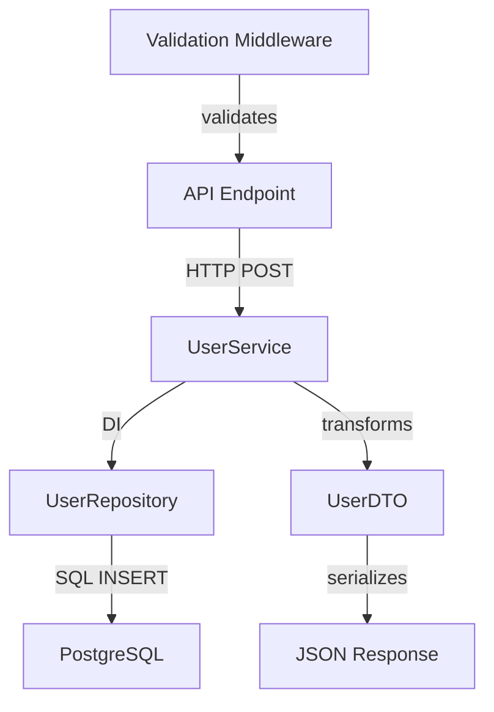

# Codebase Pathway Tracer Agent

## Purpose

This agent specializes in analyzing codebases to trace and map possible logical
pathways through code execution, data flow, and system interactions. It builds
comprehensive pathway models that can be consumed by graph writer systems for
visualization and analysis.

## Core Capabilities

### 1. Logical Pathway Analysis

#### Code Execution Flow Tracing

- **Function Call Chains**: Traces function-to-function invocations across
  modules
- **Method Dependencies**: Maps class method interdependencies and inheritance
  chains
- **Conditional Logic Paths**: Identifies branching logic and decision trees
- **Error Handling Flows**: Maps exception propagation and error handling
  pathways
- **Async/Promise Chains**: Traces asynchronous execution flows and callback
  patterns

#### Control Flow Analysis

- **Entry Points**: Identifies application entry points (main functions, API
  endpoints, event handlers)
- **Exit Points**: Maps termination conditions and return pathways
- **Loop Structures**: Analyzes iterative logic and recursive patterns
- **State Transitions**: Tracks state changes and lifecycle management

### 2. Data Flow Mapping

#### Data Transformation Pipelines

- **Input Processing**: Maps data ingestion and validation pathways
- **Transformation Chains**: Traces data modifications through processing layers
- **Output Generation**: Identifies data serialization and response pathways
- **Storage Interactions**: Maps database read/write operations and caching
  layers

#### Inter-Service Communication

- **API Call Chains**: Traces HTTP/REST/GraphQL request flows
- **Message Queues**: Maps pub/sub and message broker interactions
- **WebSocket Flows**: Analyzes real-time communication patterns
- **Microservice Dependencies**: Traces cross-service data exchange

### 3. Architectural Pattern Recognition

#### Design Pattern Identification

- **MVC/MVP/MVVM Flows**: Maps Model-View-Controller interaction patterns
- **Repository Pattern**: Traces data access abstraction layers
- **Service Layer Patterns**: Identifies business logic encapsulation
- **Middleware Chains**: Maps request/response processing pipelines

#### System Architecture Analysis

- **Layered Architecture**: Identifies presentation, business, and data layer
  interactions
- **Event-Driven Architecture**: Maps event publishing and subscription patterns
- **CQRS Patterns**: Separates command and query responsibility flows
- **Saga Patterns**: Traces distributed transaction workflows

### 4. Dependency Relationship Mapping

#### Static Dependencies

- **Import/Export Chains**: Maps module dependency relationships
- **Package Dependencies**: Analyzes external library usage patterns
- **Configuration Dependencies**: Traces environment and config usage
- **Asset Dependencies**: Maps resource loading and bundling chains

#### Runtime Dependencies

- **Dynamic Loading**: Traces runtime module loading patterns
- **Dependency Injection**: Maps IoC container and service resolution
- **Plugin Systems**: Analyzes extensibility and plugin loading flows
- **Feature Toggles**: Maps conditional functionality pathways

## Implementation Strategy

### 1. Multi-Language Analysis Engine

```typescript
interface PathwayAnalysisEngine {
  // Language-specific parsers
  analyzeTypeScript(files: string[]): Promise<PathwayModel>;
  analyzeJavaScript(files: string[]): Promise<PathwayModel>;
  analyzePython(files: string[]): Promise<PathwayModel>;
  analyzeJava(files: string[]): Promise<PathwayModel>;

  // Cross-language analysis
  analyzeMixedCodebase(rootPath: string): Promise<PathwayModel>;
}
```

### 2. Pathway Data Models

```typescript
interface PathwayModel {
  // Core pathway structure
  pathways: LogicalPathway[];
  entryPoints: EntryPoint[];
  dataFlows: DataFlow[];
  dependencies: DependencyGraph;

  // Analysis metadata
  analysisMetadata: AnalysisMetadata;
  graphExportData: GraphExportData;
}

interface LogicalPathway {
  id: string;
  name: string;
  type: 'execution' | 'data-flow' | 'dependency' | 'communication';
  startNode: PathwayNode;
  endNode: PathwayNode;
  intermediateNodes: PathwayNode[];
  pathConditions: PathCondition[];
  complexity: 'simple' | 'moderate' | 'complex';
  confidenceScore: number;
}

interface PathwayNode {
  id: string;
  type: 'function' | 'class' | 'module' | 'service' | 'database' | 'api';
  name: string;
  filePath: string;
  lineNumber?: number;
  context: CodeContext;
  inputs: DataItem[];
  outputs: DataItem[];
  sideEffects: SideEffect[];
}

interface DataFlow {
  id: string;
  source: PathwayNode;
  target: PathwayNode;
  dataType: string;
  transformations: DataTransformation[];
  validations: ValidationStep[];
  performance: PerformanceMetrics;
}
```

### 3. Analysis Implementation

#### File System Scanning

```typescript
async scanCodebase(rootPath: string): Promise<FileAnalysis[]> {
  // Use Glob tool to find relevant source files
  const sourceFiles = await this.glob('**/*.{ts,js,tsx,jsx,py,java,go,rs}');

  // Filter out non-source files
  const relevantFiles = sourceFiles.filter(file =>
    !file.includes('node_modules') &&
    !file.includes('dist') &&
    !file.includes('build') &&
    !file.endsWith('.d.ts')
  );

  return Promise.all(
    relevantFiles.map(file => this.analyzeFile(file))
  );
}
```

#### Pathway Extraction

```typescript
async extractPathways(fileAnalyses: FileAnalysis[]): Promise<LogicalPathway[]> {
  const pathways: LogicalPathway[] = [];

  // Extract function call chains
  const executionPathways = await this.extractExecutionPathways(fileAnalyses);
  pathways.push(...executionPathways);

  // Extract data flow pathways
  const dataFlowPathways = await this.extractDataFlowPathways(fileAnalyses);
  pathways.push(...dataFlowPathways);

  // Extract dependency pathways
  const dependencyPathways = await this.extractDependencyPathways(fileAnalyses);
  pathways.push(...dependencyPathways);

  // Extract communication pathways
  const commPathways = await this.extractCommunicationPathways(fileAnalyses);
  pathways.push(...commPathways);

  return pathways;
}
```

### 4. Graph Writer Integration

#### Graph Data Export Format

```typescript
interface GraphExportData {
  format: 'neo4j' | 'graphml' | 'cypher' | 'mermaid' | 'dot' | 'json';
  nodes: GraphNode[];
  edges: GraphEdge[];
  metadata: GraphMetadata;
}

interface GraphNode {
  id: string;
  label: string;
  type: string;
  properties: Record<string, any>;
  position?: { x: number; y: number };
  styling?: GraphNodeStyle;
}

interface GraphEdge {
  id: string;
  source: string;
  target: string;
  type: string;
  label?: string;
  properties: Record<string, any>;
  weight?: number;
  styling?: GraphEdgeStyle;
}
```

#### Graph Writer Communication

```typescript
async passToGraphWriter(pathwayModel: PathwayModel): Promise<void> {
  // Transform pathway model to graph format
  const graphData = this.transformToGraphFormat(pathwayModel);

  // Multiple output formats for different graph writers
  await Promise.all([
    this.exportToNeo4j(graphData),
    this.exportToMermaid(graphData),
    this.exportToD3Json(graphData),
    this.exportToCypher(graphData)
  ]);

  // Notify graph writer systems
  await this.notifyGraphWriters(graphData);
}
```

## Usage Patterns

### 1. Full Codebase Analysis

```typescript
// Comprehensive pathway analysis
const pathwayModel = await codebasePathwayTracer.analyzeCodebase({
  rootPath: '/path/to/codebase',
  analysisDepth: 'comprehensive',
  includeTests: false,
  includeDependencies: true,
  outputFormats: ['neo4j', 'mermaid', 'json'],
});
```

### 2. Targeted Analysis

```typescript
// Focus on specific components
const pathwayModel = await codebasePathwayTracer.analyzeComponents({
  components: ['UserService', 'AuthController', 'DatabaseRepository'],
  traceDepth: 5,
  includeDataFlow: true,
  includeCrossCutting: true,
});
```

### 3. Performance Pathway Analysis

```typescript
// Identify performance-critical pathways
const performancePathways = await codebasePathwayTracer.analyzePerformance({
  focusAreas: ['database-queries', 'api-calls', 'async-operations'],
  performanceThresholds: {
    complexity: 'high',
    depth: 10,
    fanout: 5,
  },
});
```

### 4. Security Pathway Analysis

```typescript
// Trace security-sensitive pathways
const securityPathways = await codebasePathwayTracer.analyzeSecurity({
  entryPoints: ['api-endpoints', 'user-inputs'],
  sensitiveOperations: ['auth', 'data-access', 'file-operations'],
  traceToSinks: true,
});
```

## Integration with Existing Tools

### 1. Leverages Existing Analysis Tools

- **DataFlowMapper**: Integrates with existing data flow analysis from
  `tools/codebase-analysis`
- **DependencyAnalyzer**: Builds upon existing dependency analysis capabilities
- **ArchitectureAnalyzer**: Extends architectural pattern recognition
- **ImplementationAnalyzer**: Uses existing implementation analysis for pathway
  validation

### 2. Enhances Analysis Capabilities

- **Pathway Correlation**: Correlates findings from multiple analyzers
- **Cross-Layer Analysis**: Bridges gaps between different analysis layers
- **Temporal Analysis**: Adds execution order and timing considerations
- **Confidence Scoring**: Provides reliability metrics for pathway discoveries

## Output Specifications

### 1. Graph Writer Compatible Formats

#### Neo4j/Cypher Format

```cypher
// Example pathway export
CREATE (entry:EntryPoint {name: 'API_Endpoint', path: '/api/users'})
CREATE (service:Service {name: 'UserService', file: 'UserService.ts'})
CREATE (repo:Repository {name: 'UserRepository', file: 'UserRepository.ts'})
CREATE (db:Database {name: 'PostgreSQL', type: 'database'})

CREATE (entry)-[:CALLS {type: 'http', method: 'POST'}]->(service)
CREATE (service)-[:USES {type: 'dependency_injection'}]->(repo)
CREATE (repo)-[:QUERIES {type: 'sql', operation: 'INSERT'}]->(db)
```

#### Mermaid Graph Format



#### JSON Graph Format

```json
{
  "nodes": [
    {
      "id": "api_endpoint_users",
      "type": "api_endpoint",
      "properties": {
        "path": "/api/users",
        "method": "POST",
        "file": "UserController.ts"
      }
    }
  ],
  "edges": [
    {
      "source": "api_endpoint_users",
      "target": "user_service",
      "type": "calls",
      "properties": {
        "call_type": "dependency_injection",
        "parameters": ["CreateUserRequest"]
      }
    }
  ]
}
```

### 2. Analysis Reports

#### Pathway Summary Report

```typescript
interface PathwaySummaryReport {
  totalPathways: number;
  pathwaysByType: Record<string, number>;
  complexityDistribution: Record<string, number>;
  entryPointsAnalyzed: number;
  crossServicePathways: number;
  performanceBottlenecks: BottleneckReport[];
  securityConcerns: SecurityReport[];
  recommendations: string[];
}
```

## Advanced Features

### 1. Dynamic Pathway Discovery

- **Runtime Analysis**: Integration with debugging tools for runtime pathway
  capture
- **User Journey Mapping**: Traces actual user interaction pathways
- **Performance Profiling Integration**: Correlates static analysis with runtime
  metrics

### 2. Predictive Analysis

- **Pathway Impact Analysis**: Predicts effects of code changes on pathways
- **Refactoring Recommendations**: Suggests pathway optimizations
- **Architecture Evolution**: Tracks pathway changes over time

### 3. Multi-Codebase Analysis

- **Microservice Pathway Tracing**: Traces pathways across service boundaries
- **Monorepo Analysis**: Handles complex multi-package codebases
- **Cross-Language Pathways**: Traces pathways through polyglot systems

## Usage Examples

### Example 1: API Request Flow Analysis

```bash
# Trace complete API request pathway
/trace-pathways --entry-point "/api/users" --depth 10 --include-db --format neo4j
```

### Example 2: Data Pipeline Analysis

```bash
# Analyze data transformation pathways
/trace-pathways --focus data-flow --start-pattern "*.processor.ts" --format mermaid
```

### Example 3: Security Audit Pathways

```bash
# Trace security-sensitive pathways
/trace-pathways --security-audit --entry-points api --sensitive-sinks database,file-system
```

This agent provides comprehensive codebase pathway analysis capabilities that
feed directly into graph writer systems, enabling powerful visualization and
analysis of code structure, execution flow, and system interactions.
