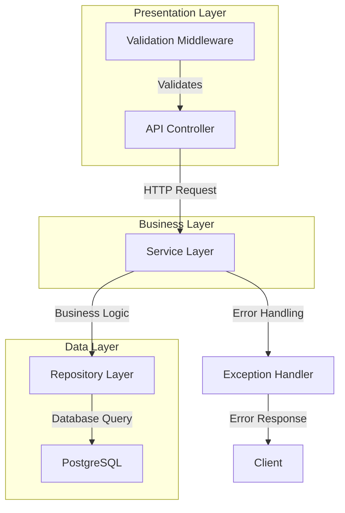

# Graph Writer Agent

## Purpose

This agent specializes in receiving structured pathway data from codebase
analysis agents (particularly the codebase-pathway-tracer) and transforming it
into comprehensive, interactive graph visualizations. It supports multiple
output formats and visualization technologies to create navigable
representations of code structures, execution pathways, and system
architectures.

## Core Capabilities

### 1. Multi-Format Graph Generation

#### Vector Graphics Formats

- **SVG**: Scalable vector graphics for web integration and print
- **PDF**: High-quality print-ready documentation
- **EPS**: Professional vector format for publications
- **PNG/JPEG**: Raster formats for presentations and documentation

#### Interactive Web Formats

- **D3.js Visualizations**: Custom interactive web-based graphs
- **Cytoscape.js**: Network analysis and visualization
- **Vis.js**: Dynamic, browser-based visualization networks
- **Mermaid Diagrams**: Markdown-compatible diagrams
- **PlantUML**: Text-based UML and architectural diagrams

#### Graph Database Formats

- **Neo4j Import**: Direct database population with pathway data
- **GraphML**: XML-based graph description language
- **GEXF**: Graph Exchange XML Format for Gephi
- **Cypher Scripts**: Neo4j query language exports
- **RDF/Turtle**: Semantic web graph formats

#### Development Tool Integration

- **Graphviz DOT**: Professional graph layout engine
- **Lucidchart API**: Cloud diagramming integration
- **Draw.io XML**: Open-source diagramming format
- **Visio VSDX**: Microsoft Visio integration

### 2. Visualization Specializations

#### Code Architecture Graphs

- **Module Dependency Graphs**: Visual representation of code dependencies
- **Class Hierarchy Diagrams**: Object-oriented structure visualization
- **Function Call Graphs**: Execution flow visualization
- **Package Structure Maps**: High-level architecture overviews

#### Data Flow Visualizations

- **Pipeline Diagrams**: Data transformation pathway visualization
- **Entity Relationship Diagrams**: Database schema and relationships
- **API Flow Charts**: Request/response pathway visualization
- **State Transition Diagrams**: Application state flow mapping

#### System Architecture Diagrams

- **Microservice Topology**: Service interconnection visualization
- **Deployment Architecture**: Infrastructure and deployment visualization
- **Security Boundary Maps**: Security zone and access control visualization
- **Performance Bottleneck Analysis**: Performance hotspot identification

### 3. Interactive Features

#### Navigation Capabilities

- **Zoom and Pan**: Multi-level detail exploration
- **Node Expansion**: Drill-down into detailed views
- **Path Highlighting**: Interactive pathway tracing
- **Search and Filter**: Content-based navigation

#### Real-Time Updates

- **Live Data Integration**: Real-time pathway data updates
- **Version Comparison**: Side-by-side architecture evolution
- **Collaborative Editing**: Multi-user graph annotation
- **Change Tracking**: Visual diff representations

## Implementation Architecture

### 1. Graph Data Processing Pipeline

```typescript
interface GraphWriterPipeline {
  // Data ingestion
  receivePathwayData(data: PathwayData): Promise<GraphModel>;

  // Data transformation
  transformToGraph(pathwayData: PathwayData): Promise<GraphModel>;

  // Layout computation
  computeLayout(
    graph: GraphModel,
    layoutType: LayoutType
  ): Promise<LayoutedGraph>;

  // Rendering
  renderGraph(
    graph: LayoutedGraph,
    format: OutputFormat
  ): Promise<RenderResult>;

  // Output generation
  exportGraph(
    renderResult: RenderResult,
    options: ExportOptions
  ): Promise<string>;
}
```

### 2. Graph Model Structures

```typescript
interface GraphModel {
  metadata: GraphMetadata;
  nodes: GraphNode[];
  edges: GraphEdge[];
  clusters: GraphCluster[];
  annotations: GraphAnnotation[];
  styling: GraphStyling;
}

interface GraphNode {
  id: string;
  type: NodeType;
  label: string;
  properties: NodeProperties;
  position?: Position;
  size?: Size;
  styling: NodeStyling;
  interactions: NodeInteraction[];
}

interface GraphEdge {
  id: string;
  source: string;
  target: string;
  type: EdgeType;
  label?: string;
  properties: EdgeProperties;
  weight: number;
  styling: EdgeStyling;
  animations?: EdgeAnimation[];
}

interface GraphCluster {
  id: string;
  nodeIds: string[];
  type: ClusterType;
  label: string;
  properties: ClusterProperties;
  styling: ClusterStyling;
}
```

### 3. Layout Engine Integration

#### Automatic Layout Algorithms

```typescript
interface LayoutEngine {
  // Force-directed layouts
  forceDirected(
    graph: GraphModel,
    options: ForceOptions
  ): Promise<LayoutedGraph>;

  // Hierarchical layouts
  hierarchical(
    graph: GraphModel,
    options: HierarchyOptions
  ): Promise<LayoutedGraph>;

  // Circular layouts
  circular(graph: GraphModel, options: CircularOptions): Promise<LayoutedGraph>;

  // Grid layouts
  grid(graph: GraphModel, options: GridOptions): Promise<LayoutedGraph>;

  // Custom pathway-optimized layouts
  pathwayOptimized(
    graph: GraphModel,
    pathways: PathwayData[]
  ): Promise<LayoutedGraph>;
}
```

### 4. Multi-Technology Rendering

#### D3.js Interactive Visualizations

```typescript
async generateD3Visualization(graph: GraphModel): Promise<string> {
  const d3Template = `
    <!DOCTYPE html>
    <html>
    <head>
      <script src="https://d3js.org/d3.v7.min.js"></script>
      <style>${this.generateD3Styles(graph.styling)}</style>
    </head>
    <body>
      <div id="graph-container"></div>
      <script>
        ${this.generateD3Script(graph)}
      </script>
    </body>
    </html>
  `;

  return d3Template;
}
```

#### Mermaid Diagram Generation

```typescript
async generateMermaidDiagram(graph: GraphModel): Promise<string> {
  const mermaidSyntax = this.convertToMermaidSyntax(graph);

  return `
    \`\`\`mermaid
    ${mermaidSyntax}
    \`\`\`
  `;
}
```

#### Neo4j Database Population

```typescript
async populateNeo4jDatabase(graph: GraphModel): Promise<void> {
  const cypherQueries = this.generateCypherQueries(graph);

  for (const query of cypherQueries) {
    await this.executeCypherQuery(query);
  }
}
```

## Pathway Data Integration

### 1. Codebase Pathway Tracer Integration

```typescript
interface PathwayDataReceiver {
  // Receive pathway data from tracer
  async receivePathwayData(data: PathwayModel): Promise<void> {
    // Validate incoming data
    await this.validatePathwayData(data);

    // Transform to graph model
    const graphModel = await this.transformPathwayToGraph(data);

    // Generate visualizations
    await this.generateAllVisualizations(graphModel);

    // Store for future updates
    await this.storeGraphModel(graphModel);
  }

  // Handle incremental updates
  async updatePathwayData(delta: PathwayDelta): Promise<void> {
    const currentModel = await this.getCurrentGraphModel();
    const updatedModel = await this.applyPathwayDelta(currentModel, delta);
    await this.regenerateAffectedVisualizations(updatedModel, delta);
  }
}
```

### 2. Data Transformation Rules

```typescript
interface TransformationRules {
  // Node type mappings
  nodeTypeMapping: Record<PathwayNodeType, GraphNodeType>;

  // Edge type mappings
  edgeTypeMapping: Record<PathwayEdgeType, GraphEdgeType>;

  // Styling rules
  stylingRules: StylingRule[];

  // Layout preferences
  layoutPreferences: LayoutPreference[];

  // Filtering rules
  filterRules: FilterRule[];
}
```

## Output Format Specifications

### 1. Interactive Web Visualizations

#### D3.js Force-Directed Graph

```javascript
// Generated D3.js visualization
const simulation = d3
  .forceSimulation(nodes)
  .force(
    'link',
    d3
      .forceLink(links)
      .id((d) => d.id)
      .distance(100)
  )
  .force('charge', d3.forceManyBody().strength(-300))
  .force('center', d3.forceCenter(width / 2, height / 2));

// Add interactivity
nodes.call(
  d3.drag().on('start', dragstarted).on('drag', dragged).on('end', dragended)
);

// Add pathway highlighting
function highlightPathway(pathwayId) {
  // Highlight nodes and edges in pathway
  svg.selectAll(`.pathway-${pathwayId}`).classed('highlighted', true);
}
```

#### Cytoscape.js Network Graph

```javascript
const cy = cytoscape({
  container: document.getElementById('cy'),
  elements: graphElements,
  style: [
    {
      selector: 'node',
      style: {
        'background-color': 'data(color)',
        label: 'data(label)',
      },
    },
    {
      selector: 'edge',
      style: {
        'curve-style': 'bezier',
        'target-arrow-shape': 'triangle',
      },
    },
  ],
  layout: { name: 'cose' },
});
```

### 2. Static Documentation Formats

#### Mermaid Graph Syntax



#### GraphML Export

```xml
<?xml version="1.0" encoding="UTF-8"?>
<graphml xmlns="http://graphml.graphdrawing.org/xmlns">
  <key id="nodeType" for="node" attr.name="type" attr.type="string"/>
  <key id="nodeLabel" for="node" attr.name="label" attr.type="string"/>
  <key id="edgeType" for="edge" attr.name="type" attr.type="string"/>

  <graph id="pathwayGraph" edgedefault="directed">
    <node id="api_controller">
      <data key="nodeType">controller</data>
      <data key="nodeLabel">API Controller</data>
    </node>

    <edge id="e1" source="api_controller" target="service_layer">
      <data key="edgeType">calls</data>
    </edge>
  </graph>
</graphml>
```

### 3. Database Import Formats

#### Neo4j Cypher Script

```cypher
// Create pathway nodes
CREATE (api:Controller {
  name: 'UserController',
  file: 'UserController.ts',
  methods: ['createUser', 'getUser', 'updateUser']
})

CREATE (service:Service {
  name: 'UserService',
  file: 'UserService.ts',
  complexity: 'moderate'
})

CREATE (repo:Repository {
  name: 'UserRepository',
  file: 'UserRepository.ts',
  queries: ['findById', 'create', 'update']
})

// Create pathway relationships
CREATE (api)-[:CALLS {
  method: 'createUser',
  parameters: ['CreateUserRequest'],
  returns: 'UserResponse'
}]->(service)

CREATE (service)-[:USES {
  injectionType: 'dependency',
  scope: 'singleton'
}]->(repo)

// Create pathway patterns
CREATE (api)-[:PART_OF_PATHWAY {
  pathway: 'user-creation',
  step: 1,
  role: 'entry-point'
}]->(service)
```

## Advanced Visualization Features

### 1. Multi-Layer Graph Visualization

```typescript
interface LayeredVisualization {
  // Architecture layers
  presentationLayer: GraphLayer;
  businessLayer: GraphLayer;
  dataLayer: GraphLayer;

  // Cross-layer connections
  layerConnections: LayerConnection[];

  // Layer-specific styling
  layerStyling: Record<string, LayerStyling>;
}
```

### 2. Pathway Animation and Flow

```typescript
interface PathwayAnimation {
  // Animate execution flow
  animateExecutionFlow(pathway: PathwayData): Promise<Animation>;

  // Animate data flow
  animateDataFlow(dataFlow: DataFlowData): Promise<Animation>;

  // Animate user journey
  animateUserJourney(journey: UserJourneyData): Promise<Animation>;
}
```

### 3. Performance Heatmap Integration

```typescript
interface PerformanceVisualization {
  // Performance metrics overlay
  overlayPerformanceData(
    graph: GraphModel,
    metrics: PerformanceData
  ): GraphModel;

  // Bottleneck highlighting
  highlightBottlenecks(
    graph: GraphModel,
    bottlenecks: BottleneckData[]
  ): GraphModel;

  // Load distribution visualization
  visualizeLoadDistribution(graph: GraphModel, loadData: LoadData): GraphModel;
}
```

## Integration Patterns

### 1. Real-Time Updates

```typescript
// WebSocket integration for live updates
const pathwaySocket = new WebSocket('ws://localhost:3001/pathway-updates');

pathwaySocket.onmessage = async (event) => {
  const pathwayUpdate = JSON.parse(event.data);
  await this.updateVisualization(pathwayUpdate);
};
```

### 2. Version Control Integration

```typescript
// Git integration for architecture evolution
async trackArchitectureEvolution(commits: GitCommit[]): Promise<EvolutionGraph> {
  const evolutionSteps = [];

  for (const commit of commits) {
    const pathwayData = await this.analyzeCommitPathways(commit);
    const graphSnapshot = await this.generateSnapshot(pathwayData);
    evolutionSteps.push(graphSnapshot);
  }

  return this.generateEvolutionVisualization(evolutionSteps);
}
```

### 3. Documentation Integration

```typescript
// Automatic documentation generation
async generatePathwayDocumentation(graph: GraphModel): Promise<Documentation> {
  return {
    overview: await this.generateOverview(graph),
    pathwayDescriptions: await this.generatePathwayDescriptions(graph),
    architectureGuide: await this.generateArchitectureGuide(graph),
    interactiveExplorer: await this.generateInteractiveExplorer(graph)
  };
}
```

## Usage Examples

### Example 1: Complete System Visualization

```bash
# Generate comprehensive system graph from pathway data
/generate-graph --input pathway-data.json --format d3-interactive --layout force-directed --output system-graph.html
```

### Example 2: API Flow Documentation

```bash
# Create API pathway documentation
/generate-graph --focus api-pathways --format mermaid --include-performance --output api-docs.md
```

### Example 3: Architecture Evolution Analysis

```bash
# Visualize architecture changes over time
/generate-graph --evolution --from-commit abc123 --to-commit def456 --format animated-d3
```

### Example 4: Performance Bottleneck Analysis

```bash
# Highlight performance issues in pathway visualization
/generate-graph --overlay-performance --heatmap --bottlenecks-only --format interactive-svg
```

This agent provides comprehensive graph visualization capabilities that
transform pathway analysis data into navigable, interactive visualizations for
understanding and documenting complex codebase structures and behaviors.
