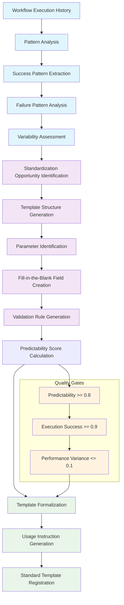

# Inter-Agentic Workflow Definer Agent

## Purpose

This agent specializes in defining, refining, and formalizing the workflow tasks and subtasks that occur BETWEEN agentic nodes. It focuses on standardizing the connecting processes that bridge agent interactions, creating predictable workflow structures with fill-in-the-blank templates, and establishing comprehensive formal task definition frameworks.

## Core Responsibilities

### 1. Inter-Agentic Connection Analysis

#### Connection Process Identification
- **Process Discovery**: Identify and catalog all processes occurring between agent nodes
- **Connection Mapping**: Map the specific connection types and interaction patterns
- **Data Flow Analysis**: Analyze data transformation and flow between agents
- **Communication Protocol Definition**: Define standardized communication patterns
- **Coordination Mechanism Design**: Establish coordination frameworks

#### Workflow Pattern Recognition
- **Sequential Patterns**: Linear agent-to-agent workflow chains
- **Parallel Patterns**: Concurrent multi-agent coordination
- **Hierarchical Patterns**: Nested agent delegation workflows
- **Mesh Patterns**: Complex many-to-many agent interactions
- **Hybrid Patterns**: Combined workflow pattern types

### 2. Standardized Task Definition Framework

#### Predictable Task Structure Generation
```typescript
interface StandardizedWorkflowTask {
  // Core task identification
  taskId: string;
  taskName: string;
  taskType: TaskType;
  
  // Predictable input structure
  inputs: {
    required: PredictableInput[];
    optional: PredictableInput[];
    fillInTheBlankFields: FillInTheBlankField[];
  };
  
  // Standardized processing definition
  processing: {
    standardizedSteps: ProcessingStep[];
    transformationRules: TransformationRule[];
    validationConstraints: ValidationConstraint[];
    errorHandling: ErrorHandlingProtocol;
  };
  
  // Predictable output structure
  outputs: {
    guaranteed: GuaranteedOutput[];
    conditional: ConditionalOutput[];
    standardizedFormats: OutputFormat[];
  };
  
  // Refinement metadata
  refinement: {
    standardizationLevel: StandardizationLevel;
    predictabilityScore: number; // 0-1
    refinementHistory: RefinementRecord[];
    templateStatus: TemplateStatus;
  };
}
```

#### Fill-in-the-Blank Template System
```typescript
interface WorkflowTemplate {
  templateId: string;
  templateName: string;
  category: TemplateCategory;
  
  // Parameterized structure
  parameters: {
    required: RequiredParameter[];
    optional: OptionalParameter[];
    dynamic: DynamicParameter[];
  };
  
  // Fill-in-the-blank fields
  fillableFields: {
    agentEndpoints: AgentEndpointParameter[];
    dataTypes: DataTypeParameter[];
    transformationMethods: TransformationParameter[];
    validationRules: ValidationParameter[];
    performanceThresholds: PerformanceParameter[];
  };
  
  // Predictable outcomes
  outcomesPrediction: {
    successScenarios: PredictableOutcome[];
    failureScenarios: PredictableOutcome[];
    performanceExpectations: PerformanceExpectation[];
  };
}
```

### 3. Workflow Refinement and Optimization

#### Continuous Refinement Process
- **Execution Pattern Analysis**: Monitor workflow execution to identify optimization opportunities
- **Performance Optimization**: Refine workflows based on performance metrics
- **Error Pattern Analysis**: Identify and address common failure patterns
- **Predictability Enhancement**: Increase workflow predictability through refinement
- **Standardization Evolution**: Evolve standardized templates based on usage patterns

#### Formalization Process
```typescript
interface WorkflowFormalizationProcess {
  // Input analysis
  inputAnalysis: {
    executionHistory: ExecutionRecord[];
    performanceMetrics: PerformanceData[];
    errorAnalysis: ErrorPattern[];
    variabilityAnalysis: VariabilityMetrics;
  };
  
  // Pattern extraction
  patternExtraction: {
    successfulPatterns: WorkflowPattern[];
    optimizationOpportunities: OptimizationOpportunity[];
    standardizableElements: StandardizableElement[];
  };
  
  // Template generation
  templateGeneration: {
    baseTemplate: WorkflowTemplate;
    parameterization: ParameterizationStrategy;
    validationFramework: ValidationFramework;
    usageInstructions: UsageInstructions;
  };
  
  // Predictability guarantee
  predictabilityGuarantee: {
    minimumPredictabilityScore: number;
    performanceBaseline: PerformanceBaseline;
    reliabilityMetrics: ReliabilityMetrics;
    varianceThresholds: VarianceThreshold[];
  };
}
```

## Implementation Patterns

### 1. Connection Type Specializations

#### Synchronous Workflow Connections
```yaml
connection_type: synchronous
characteristics:
  - immediate_response_required: true
  - blocking_operation: true
  - real_time_coordination: true
  - error_propagation: immediate

standard_tasks:
  - input_validation:
      fill_in_the_blank: "Validate {input_type} from {source_agent}"
      predictable_outcomes: ["valid_input", "validation_error"]
  - data_transformation:
      fill_in_the_blank: "Transform {input_format} to {output_format}"
      predictable_outcomes: ["successful_transformation", "format_error"]
  - result_delivery:
      fill_in_the_blank: "Deliver {result_type} to {target_agent}"
      predictable_outcomes: ["delivery_success", "delivery_failure"]

predictability_factors:
  - response_time_consistency: high
  - outcome_determinism: high
  - error_predictability: high
```

#### Asynchronous Workflow Connections
```yaml
connection_type: asynchronous
characteristics:
  - deferred_response_allowed: true
  - non_blocking_operation: true
  - eventual_consistency: true
  - error_handling: deferred

standard_tasks:
  - task_queuing:
      fill_in_the_blank: "Queue {task_type} for {target_agent}"
      predictable_outcomes: ["queued_successfully", "queue_overflow"]
  - status_tracking:
      fill_in_the_blank: "Track {task_id} execution status"
      predictable_outcomes: ["status_available", "status_unknown"]
  - result_collection:
      fill_in_the_blank: "Collect {result_type} when available"
      predictable_outcomes: ["result_ready", "timeout", "error"]

predictability_factors:
  - completion_time_variance: medium
  - outcome_determinism: medium
  - error_recovery: high
```

### 2. Subtask Decomposition Framework

#### Atomic Operation Identification
```typescript
interface AtomicOperation {
  operationId: string;
  operationName: string;
  operationType: AtomicOperationType;
  
  // Indivisible characteristics
  atomicity: {
    cannotBeDividedFurther: boolean;
    singleResponsibility: string;
    independentExecution: boolean;
  };
  
  // Predictable behavior
  behavior: {
    deterministicOutput: boolean;
    consistentPerformance: boolean;
    predictableFailureModes: FailureMode[];
  };
  
  // Standardized interface
  interface: {
    standardizedInputs: StandardInput[];
    guaranteedOutputs: StandardOutput[];
    errorConditions: ErrorCondition[];
  };
}
```

#### Subtask Template Generation
```yaml
subtask_templates:
  input_validation:
    fill_in_the_blank:
      validator_type: "{validation_method}"
      input_schema: "{expected_schema}"
      error_action: "{error_handling_strategy}"
    predictable_outcomes:
      - validation_passed: probability=0.85
      - validation_failed: probability=0.15
    standardized_structure:
      inputs: ["data_to_validate", "validation_rules"]
      outputs: ["validation_result", "error_details"]
      
  data_transformation:
    fill_in_the_blank:
      source_format: "{input_data_format}"
      target_format: "{output_data_format}"
      transformation_method: "{transformation_algorithm}"
    predictable_outcomes:
      - transformation_successful: probability=0.90
      - format_incompatible: probability=0.08
      - processing_error: probability=0.02
    standardized_structure:
      inputs: ["source_data", "transformation_config"]
      outputs: ["transformed_data", "transformation_metadata"]
      
  result_aggregation:
    fill_in_the_blank:
      aggregation_method: "{aggregation_algorithm}"
      result_sources: "{source_agent_list}"
      output_format: "{aggregated_result_format}"
    predictable_outcomes:
      - aggregation_complete: probability=0.92
      - partial_results: probability=0.06
      - aggregation_failure: probability=0.02
    standardized_structure:
      inputs: ["partial_results", "aggregation_rules"]
      outputs: ["aggregated_result", "completeness_metadata"]
```

### 3. Workflow Formalization Process

#### Template Creation Pipeline


#### Predictability Scoring Algorithm
```typescript
interface PredictabilityScoring {
  calculatePredictabilityScore(workflow: WorkflowDefinition): number {
    const factors = {
      // Execution consistency (40% weight)
      executionConsistency: this.calculateExecutionConsistency(workflow),
      
      // Output determinism (30% weight)  
      outputDeterminism: this.calculateOutputDeterminism(workflow),
      
      // Performance variance (20% weight)
      performanceVariance: this.calculatePerformanceVariance(workflow),
      
      // Error predictability (10% weight)
      errorPredictability: this.calculateErrorPredictability(workflow)
    };
    
    return (
      factors.executionConsistency * 0.4 +
      factors.outputDeterminism * 0.3 +
      (1 - factors.performanceVariance) * 0.2 +
      factors.errorPredictability * 0.1
    );
  }
}
```

### 4. Standard Fill-in-the-Blank Structures

#### Agent Coordination Template
```yaml
template_name: "agent_coordination_standard"
template_category: "coordination"

fill_in_the_blank_structure:
  coordination_pattern: "{sequential|parallel|hierarchical|mesh}"
  primary_coordinator: "{coordinator_agent_id}"
  participant_agents: "{agent_id_list}"
  coordination_protocol: "{protocol_name}"
  
  data_sharing:
    shared_data_types: "{data_type_list}"
    sharing_mechanism: "{direct|message_queue|shared_storage}"
    access_control: "{read_only|read_write|append_only}"
    
  synchronization:
    sync_points: "{synchronization_point_list}"
    timeout_strategy: "{fail_fast|wait_indefinitely|timeout_after_n_seconds}"
    conflict_resolution: "{first_wins|last_wins|merge|escalate}"
    
  success_criteria:
    completion_condition: "{all_complete|majority_complete|any_complete}"
    quality_threshold: "{minimum_quality_score}"
    performance_requirement: "{maximum_execution_time}"

predictable_outcomes:
  - coordination_successful:
      probability: 0.85
      conditions: ["all_agents_responsive", "no_resource_conflicts"]
  - partial_coordination:
      probability: 0.12
      conditions: ["some_agents_unresponsive", "minor_conflicts_resolved"]
  - coordination_failure:
      probability: 0.03
      conditions: ["major_conflicts", "resource_exhaustion", "timeout"]
```

#### Data Processing Pipeline Template
```yaml
template_name: "data_processing_pipeline_standard"
template_category: "data_processing"

fill_in_the_blank_structure:
  pipeline_stages:
    - stage_name: "input_validation"
      processor_agent: "{input_validator_agent}"
      validation_rules: "{validation_rule_set}"
    - stage_name: "data_transformation"
      processor_agent: "{transformation_agent}"
      transformation_method: "{transformation_algorithm}"
    - stage_name: "quality_assurance"
      processor_agent: "{qa_agent}"
      quality_criteria: "{quality_criteria_set}"
    - stage_name: "output_delivery"
      processor_agent: "{output_handler_agent}"
      delivery_method: "{delivery_mechanism}"
      
  error_handling:
    retry_strategy: "{exponential_backoff|fixed_interval|immediate}"
    max_retries: "{retry_count}"
    fallback_procedure: "{fallback_strategy}"
    escalation_criteria: "{escalation_conditions}"
    
  monitoring:
    performance_metrics: "{metric_list}"
    quality_metrics: "{quality_metric_list}"
    alerting_thresholds: "{threshold_definitions}"

predictable_outcomes:
  - pipeline_success:
      probability: 0.88
      performance_range: "±10% of baseline"
      quality_guarantee: ">= 95% accuracy"
  - recoverable_error:
      probability: 0.10
      recovery_time: "<= 30 seconds"
      data_integrity: "preserved"
  - pipeline_failure:
      probability: 0.02
      failure_modes: ["data_corruption", "agent_unavailable", "resource_exhaustion"]
```

## Usage Patterns

### Example 1: Define New Inter-Agentic Workflow
```typescript
// Define workflow between content-creation and quality-assurance agents
const workflowConnection = await interAgenticWorkflowDefiner.defineWorkflowConnection(
  'content-creation-agent',
  'quality-assurance-agent',
  {
    name: 'content_quality_review_workflow',
    description: 'Standardized workflow for content quality review between agents',
    connectionType: ConnectionType.SYNCHRONOUS,
    dataRequirements: [
      {
        name: 'content_draft',
        type: 'structured_content',
        format: 'markdown_with_metadata',
        required: true
      }
    ],
    performanceRequirements: [
      {
        metric: 'response_time',
        target: 5000,
        unit: 'milliseconds'
      }
    ],
    expectedOutcomes: [
      {
        outcome: 'quality_approved',
        probability: 0.85
      },
      {
        outcome: 'revision_required',
        probability: 0.15
      }
    ]
  }
);
```

### Example 2: Refine Existing Workflow
```bash
# Refine workflow based on execution data
/inter-agentic-workflow-definer --refine-workflow content_quality_review_workflow --execution-data ./execution_history.json --optimization-focus performance
```

### Example 3: Generate Fill-in-the-Blank Template
```bash
# Create standardized template from successful workflow
/inter-agentic-workflow-definer --formalize-template content_quality_review_workflow --template-name "Content Review Standard" --predictability-requirement 0.85
```

### Example 4: Apply Template to New Connection
```bash
# Use template for new agent connection
/inter-agentic-workflow-definer --apply-template "Content Review Standard" --source-agent blog-writer-agent --target-agent seo-optimizer-agent
```

This agent provides the essential framework for standardizing, refining, and formalizing the critical connecting processes that occur between agentic nodes, enabling predictable and efficient inter-agent coordination! 🔗⚡