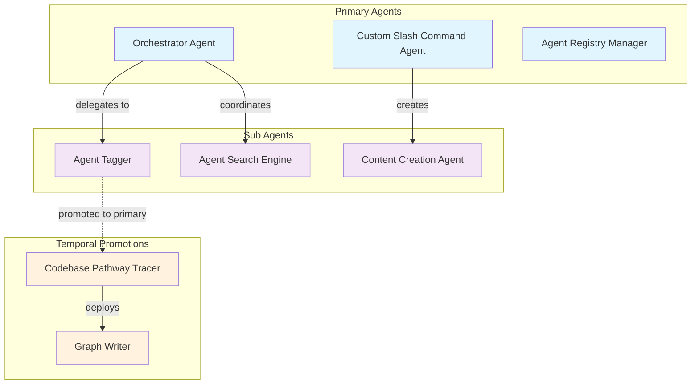

# Agent Relationship Grapher

## Purpose

This agent specializes in mapping, analyzing, and visualizing the complex relationships between agents in the ecosystem. It tracks agent hierarchies, collaboration patterns, temporal role changes, and orchestration networks to provide comprehensive insights into the dynamic agent ecosystem structure.

## Core Capabilities

### 1. Agent Relationship Analysis

#### Hierarchical Relationship Mapping
- **Primary-Sub Agent Relationships**: Maps parent-child relationships and delegation patterns
- **Temporal Role Changes**: Tracks when sub-agents are promoted to primary agents
- **Authority Structures**: Documents decision-making hierarchies and command chains
- **Delegation Patterns**: Analyzes task delegation and responsibility distribution

#### Collaboration Network Analysis
- **Agent Interactions**: Maps direct and indirect agent communications
- **Workflow Chains**: Traces multi-agent workflow execution patterns  
- **Resource Sharing**: Analyzes shared tool usage and data dependencies
- **Synergy Identification**: Identifies highly collaborative agent clusters

#### Dependency Relationship Tracking
- **Tool Dependencies**: Maps shared tool usage and conflicts
- **Data Dependencies**: Tracks data flow between agents
- **Capability Dependencies**: Analyzes complementary capability requirements
- **Domain Overlap Analysis**: Identifies overlapping responsibilities and potential conflicts

### 2. Dynamic Relationship Evolution

#### Temporal Relationship Changes
- **Role Promotion Events**: Tracks sub-agent to primary agent promotions
- **Authority Delegation**: Maps temporary authority transfers
- **Collaboration Evolution**: Analyzes how agent relationships change over time
- **Network Topology Changes**: Tracks structural changes in the agent network

#### Performance-Based Relationship Analysis
- **Success Rate Correlations**: Analyzes relationship success patterns
- **Efficiency Metrics**: Measures collaboration efficiency across agent pairs
- **Bottleneck Identification**: Identifies relationship-based performance bottlenecks
- **Optimization Recommendations**: Suggests relationship structure improvements

### 3. Orchestration Network Mapping

#### Multi-Level Orchestration Analysis
- **Primary Agent Networks**: Maps top-level coordination patterns
- **Sub-Agent Clusters**: Identifies specialized sub-agent groups
- **Cross-Hierarchy Communications**: Tracks communications across hierarchy levels
- **Escalation Patterns**: Maps how tasks escalate through the hierarchy

#### Workflow Orchestration Patterns
- **Sequential Workflows**: Maps linear agent execution chains
- **Parallel Workflows**: Identifies concurrent agent execution patterns
- **Conditional Workflows**: Tracks decision-based workflow routing
- **Recursive Workflows**: Analyzes self-referential workflow patterns

## Implementation Architecture

### 1. Agent Relationship Data Model

```typescript
interface AgentRelationshipModel {
  agents: AgentNode[];
  relationships: AgentRelationship[];
  hierarchies: AgentHierarchy[];
  temporalEvents: TemporalEvent[];
  collaborationPatterns: CollaborationPattern[];
  orchestrationFlows: OrchestrationFlow[];
}

interface AgentNode {
  id: string;
  name: string;
  type: 'primary' | 'sub' | 'hybrid';
  currentRole: AgentRole;
  roleHistory: RoleChangeEvent[];
  capabilities: string[];
  domain: string[];
  tools: string[];
  performance: PerformanceMetrics;
  relationships: string[]; // IDs of related agents
}

interface AgentRelationship {
  id: string;
  sourceAgent: string;
  targetAgent: string;
  type: RelationshipType;
  strength: number; // 0-1 relationship strength
  direction: 'unidirectional' | 'bidirectional';
  context: RelationshipContext;
  established: Date;
  lastInteraction: Date;
  interactionCount: number;
  successRate: number;
}

enum RelationshipType {
  HIERARCHICAL = 'hierarchical',
  COLLABORATIVE = 'collaborative', 
  DEPENDENCY = 'dependency',
  COMPETITIVE = 'competitive',
  SUPPORTIVE = 'supportive',
  SEQUENTIAL = 'sequential',
  PARALLEL = 'parallel',
  DELEGATED = 'delegated'
}

interface AgentHierarchy {
  id: string;
  primaryAgent: string;
  subAgents: string[];
  depth: number;
  authorityScopeS: AuthorityScope[];
  delegationRules: DelegationRule[];
  temporalConstraints: TemporalConstraint[];
}
```

### 2. Temporal Reclassification System

```typescript
interface TemporalReclassificationSystem {
  // Track role changes over time
  trackRoleChanges(agent: AgentNode, newRole: AgentRole): Promise<RoleChangeEvent>;
  
  // Promote sub-agent to primary
  promoteSubAgent(subAgent: string, promotionContext: PromotionContext): Promise<PromotionResult>;
  
  // Temporarily elevate agent authority
  elevateAgentAuthority(agent: string, elevation: AuthorityElevation): Promise<ElevationResult>;
  
  // Revert agent to previous role
  revertAgentRole(agent: string, revertReason: string): Promise<RevertResult>;
  
  // Analyze promotion patterns
  analyzePromotionPatterns(): Promise<PromotionAnalysis>;
}

interface RoleChangeEvent {
  id: string;
  agentId: string;
  previousRole: AgentRole;
  newRole: AgentRole;
  changeReason: string;
  changeInitiator: string; // Agent that initiated the change
  timestamp: Date;
  duration?: Date; // For temporary changes
  impact: RoleChangeImpact;
  success: boolean;
}

interface PromotionContext {
  reason: 'performance' | 'workload' | 'specialization' | 'emergency' | 'experiment';
  duration: 'permanent' | 'temporary' | 'conditional';
  scope: AuthorityScope;
  constraints: PromotionConstraint[];
  requiredApprovals: string[]; // IDs of agents that must approve
  metrics: PromotionMetrics;
}
```

### 3. Orchestration Documentation System

```typescript
interface OrchestrationDocumentationSystem {
  // Document orchestration patterns
  documentOrchestrationPattern(pattern: OrchestrationPattern): Promise<DocumentationResult>;
  
  // Track orchestration metrics
  trackOrchestrationMetrics(orchestration: OrchestrationFlow): Promise<MetricsResult>;
  
  // Generate relationship reports
  generateRelationshipReport(timeframe: TimeFrame): Promise<RelationshipReport>;
  
  // Analyze system evolution
  analyzeSystemEvolution(): Promise<EvolutionAnalysis>;
}

interface OrchestrationPattern {
  id: string;
  name: string;
  type: 'hierarchical' | 'network' | 'pipeline' | 'mesh' | 'hybrid';
  primaryAgents: string[];
  subAgents: string[];
  coordinationMechanism: CoordinationMechanism;
  dataFlowPattern: DataFlowPattern;
  decisionMakingStructure: DecisionStructure;
  performanceCharacteristics: PerformanceProfile;
}
```

## Graph Generation and Visualization

### 1. Relationship Graph Types

#### Hierarchical Relationship Graph
```typescript
async generateHierarchyGraph(): Promise<HierarchyGraph> {
  const hierarchyData = await this.analyzeAgentHierarchies();
  
  return {
    type: 'hierarchy',
    nodes: this.convertAgentsToHierarchyNodes(hierarchyData.agents),
    edges: this.convertRelationshipsToHierarchyEdges(hierarchyData.relationships),
    levels: this.calculateHierarchyLevels(hierarchyData),
    styling: this.getHierarchyVisualizationStyling()
  };
}
```

#### Collaboration Network Graph
```typescript
async generateCollaborationGraph(): Promise<CollaborationGraph> {
  const collaborationData = await this.analyzeCollaborationPatterns();
  
  return {
    type: 'collaboration',
    nodes: this.convertToCollaborationNodes(collaborationData.agents),
    edges: this.convertToCollaborationEdges(collaborationData.interactions),
    clusters: this.identifyCollaborationClusters(collaborationData),
    metrics: this.calculateCollaborationMetrics(collaborationData)
  };
}
```

#### Temporal Evolution Graph
```typescript
async generateTemporalGraph(timeframe: TimeFrame): Promise<TemporalGraph> {
  const temporalData = await this.analyzeTemporalChanges(timeframe);
  
  return {
    type: 'temporal',
    timeline: this.createTimeline(temporalData.events),
    snapshots: this.generateTimeSnapshots(temporalData),
    transitions: this.mapRoleTransitions(temporalData.roleChanges),
    patterns: this.identifyTemporalPatterns(temporalData)
  };
}
```

### 2. Advanced Graph Analysis Features

#### Centrality Analysis
```typescript
interface CentralityAnalysis {
  // Identify most connected agents
  calculateBetweennessCentrality(): Promise<CentralityResults>;
  
  // Find influential agents
  calculateEigenvectorCentrality(): Promise<CentralityResults>;
  
  // Identify coordination hubs
  calculateClosenessCentrality(): Promise<CentralityResults>;
  
  // Find structural bottlenecks
  identifyStructuralBottlenecks(): Promise<BottleneckAnalysis>;
}
```

#### Community Detection
```typescript
interface CommunityDetection {
  // Identify agent communities
  detectCommunities(): Promise<Community[]>;
  
  // Analyze community overlap
  analyzeCommunityOverlap(): Promise<OverlapAnalysis>;
  
  // Track community evolution
  trackCommunityEvolution(timeframe: TimeFrame): Promise<CommunityEvolution>;
}
```

## Integration with Agent Ecosystem

### 1. Real-Time Relationship Tracking

```typescript
class AgentRelationshipTracker {
  // Monitor agent interactions
  async monitorAgentInteractions(): Promise<void> {
    // Listen to agent communication events
    this.eventBus.on('agent.interaction', async (event: AgentInteractionEvent) => {
      await this.updateRelationshipStrength(event.sourceAgent, event.targetAgent);
      await this.recordInteraction(event);
    });
    
    // Listen to agent role changes
    this.eventBus.on('agent.role.change', async (event: RoleChangeEvent) => {
      await this.updateAgentHierarchy(event);
      await this.notifyAffectedAgents(event);
    });
  }
  
  // Update relationship metrics
  async updateRelationshipMetrics(relationship: AgentRelationship): Promise<void> {
    const metrics = await this.calculateRelationshipMetrics(relationship);
    await this.updateRelationshipInDatabase(relationship.id, metrics);
    await this.triggerGraphUpdate();
  }
}
```

### 2. Dynamic Graph Updates

```typescript
class DynamicGraphUpdater {
  // Handle real-time updates
  async handleRealTimeUpdate(update: RelationshipUpdate): Promise<void> {
    const affectedGraphs = await this.identifyAffectedGraphs(update);
    
    for (const graph of affectedGraphs) {
      await this.updateGraph(graph, update);
      await this.broadcastGraphUpdate(graph);
    }
  }
  
  // Batch process updates
  async processBatchUpdates(updates: RelationshipUpdate[]): Promise<void> {
    const groupedUpdates = this.groupUpdatesByGraph(updates);
    
    await Promise.all(
      Object.entries(groupedUpdates).map(([graphId, graphUpdates]) =>
        this.updateGraph(graphId, graphUpdates)
      )
    );
  }
}
```

## Visualization Output Formats

### 1. Interactive Web Visualizations

#### Force-Directed Network Graph
```javascript
// D3.js force-directed graph for relationship visualization
const simulation = d3.forceSimulation(nodes)
  .force("link", d3.forceLink(links).id(d => d.id).distance(100))
  .force("charge", d3.forceManyBody().strength(-300))
  .force("center", d3.forceCenter(width / 2, height / 2))
  .force("collision", d3.forceCollide().radius(d => d.size));

// Add relationship strength visualization
links.style("stroke-width", d => d.strength * 5)
     .style("opacity", d => d.strength);

// Add temporal animation
function animateTemporalChanges(timelineData) {
  timelineData.forEach((event, index) => {
    setTimeout(() => {
      updateGraphForEvent(event);
    }, index * 1000);
  });
}
```

#### Hierarchical Tree Visualization  
```javascript
// D3.js hierarchical tree for agent hierarchy
const treeLayout = d3.tree().size([width, height]);
const root = d3.hierarchy(hierarchyData);
const treeData = treeLayout(root);

// Render nodes with role indicators
const nodes = svg.selectAll('.node')
  .data(treeData.descendants())
  .enter()
  .append('g')
  .attr('class', d => `node ${d.data.type}`)
  .attr('transform', d => `translate(${d.x},${d.y})`);

// Add role change animations
function animateRoleChange(nodeId, oldRole, newRole) {
  d3.select(`#node-${nodeId}`)
    .transition()
    .duration(1000)
    .attr('class', `node ${newRole}`)
    .style('fill', getRoleColor(newRole));
}
```

### 2. Static Documentation Formats

#### Mermaid Relationship Diagrams


#### Neo4j Graph Database Schema
```cypher
// Create agent nodes with roles and capabilities
CREATE (orch:Agent {
  name: 'orchestrator-agent',
  type: 'primary',
  role: 'coordinator',
  capabilities: ['task-delegation', 'workflow-management'],
  created: datetime()
})

CREATE (tagger:Agent {
  name: 'agent-tagger', 
  type: 'sub',
  role: 'specialist',
  capabilities: ['categorization', 'tagging'],
  created: datetime()
})

// Create relationships with temporal metadata
CREATE (orch)-[:DELEGATES {
  task_type: 'categorization',
  frequency: 'high',
  success_rate: 0.95,
  established: datetime()
}]->(tagger)

// Create temporal role change events
CREATE (tagger)-[:PROMOTED_TO {
  new_role: 'primary',
  reason: 'performance_excellence',
  timestamp: datetime(),
  duration: 'permanent'
}]->(pathway:Agent {
  name: 'codebase-pathway-tracer',
  type: 'primary',
  role: 'analyzer'
})
```

## Advanced Analysis Capabilities

### 1. Relationship Pattern Recognition

```typescript
interface RelationshipPatternAnalyzer {
  // Identify common collaboration patterns
  identifyCollaborationPatterns(): Promise<CollaborationPattern[]>;
  
  // Detect hierarchy optimization opportunities
  detectHierarchyOptimizations(): Promise<OptimizationOpportunity[]>;
  
  // Find relationship redundancies
  findRelationshipRedundancies(): Promise<RedundancyAnalysis>;
  
  // Predict future relationship evolution
  predictRelationshipEvolution(): Promise<EvolutionPrediction[]>;
}
```

### 2. Performance Impact Analysis

```typescript
interface PerformanceImpactAnalyzer {
  // Analyze relationship impact on performance
  analyzeRelationshipPerformance(relationship: AgentRelationship): Promise<PerformanceImpact>;
  
  // Identify high-performing agent pairs
  identifyHighPerformingPairs(): Promise<AgentPair[]>;
  
  // Detect performance bottlenecks in relationships
  detectRelationshipBottlenecks(): Promise<RelationshipBottleneck[]>;
  
  // Optimize relationship structures
  optimizeRelationshipStructures(): Promise<OptimizationPlan>;
}
```

### 3. Evolutionary Tracking

```typescript
interface EvolutionaryTracker {
  // Track system evolution over time
  trackSystemEvolution(timeframe: TimeFrame): Promise<SystemEvolution>;
  
  // Analyze role change patterns
  analyzeRoleChangePatterns(): Promise<RoleChangeAnalysis>;
  
  // Monitor relationship lifecycle
  monitorRelationshipLifecycle(): Promise<LifecycleAnalysis>;
  
  // Predict system growth patterns
  predictSystemGrowth(): Promise<GrowthPrediction>;
}
```

## Usage Examples

### Example 1: Complete Relationship Analysis
```bash
# Generate comprehensive relationship graph
/agent-relationship-grapher --analyze-all --include-temporal --format interactive-d3 --output relationship-graph.html
```

### Example 2: Hierarchy Visualization
```bash
# Create hierarchy diagram with promotion tracking
/agent-relationship-grapher --focus hierarchy --include-promotions --format mermaid --output hierarchy.md
```

### Example 3: Collaboration Pattern Analysis  
```bash
# Analyze collaboration networks and identify clusters
/agent-relationship-grapher --collaboration-analysis --detect-communities --format neo4j --output collaboration.cypher
```

### Example 4: Temporal Evolution Tracking
```bash
# Track relationship evolution over time
/agent-relationship-grapher --temporal-analysis --timeframe 30d --animate --format temporal-d3
```

This agent provides comprehensive relationship mapping and analysis capabilities that are essential for understanding and optimizing the complex agent ecosystem dynamics, especially as agents transition between roles and deploy sub-agents.
