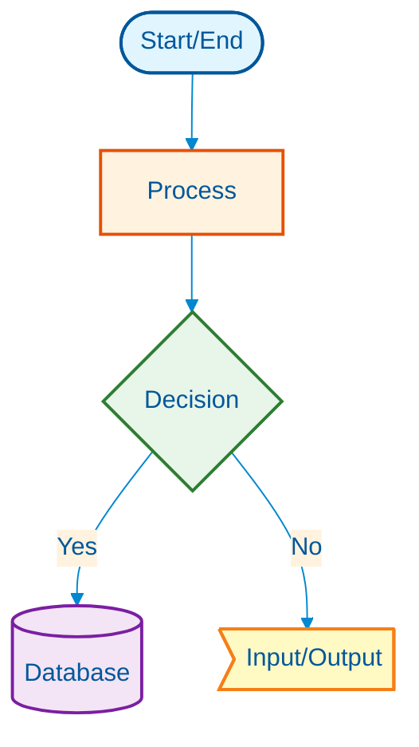
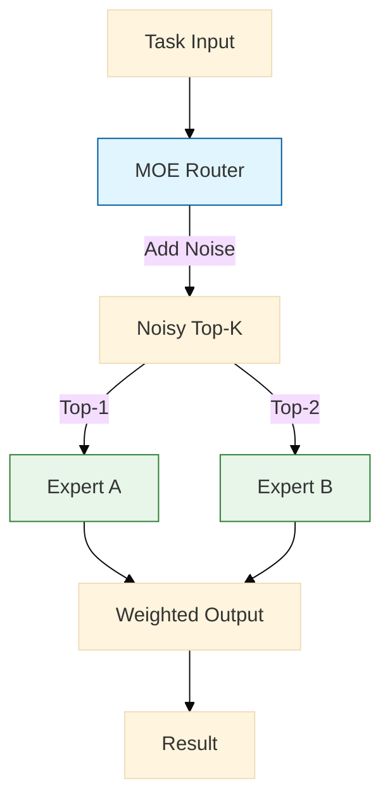

# Visual Pattern Documentation Skill

## Purpose

Store and manage orchestration pattern flow charts as visual documentation for
multimodal LLMs and human developers. This skill enables systematic storage of
complex system workflows using Mermaid diagrams embedded in skill documents.

## Self-Referential Knowledge Base

This skill provides:

1. **Visual pattern storage** for complex orchestration workflows
2. **Mermaid diagram templates** for consistent visualization
3. **Pattern discovery** through metadata tagging
4. **Multimodal LLM compatibility** (diagrams render as images for vision
   models)

## Directory Structure

```
.agent/skills/visual-patterns/
├── SKILL.md                    # This file
├── patterns/                   # Orchestration pattern definitions
│   ├── moe-routing/           # Mixture-of-Experts patterns
│   │   ├── pattern.md
│   │   └── diagram.png        # Optional pre-rendered
│   ├── agent-discovery/       # Discovery protocols
│   ├── task-distribution/     # Load balancing patterns
│   └── federation/            # Cross-system coordination
├── templates/                 # Diagram templates
│   ├── mermaid-template.md
│   └── ascii-template.md
└── registry.json             # Pattern discovery index
```

## Creating a New Visual Pattern

### Step 1: Create Pattern Directory

```bash
mkdir -p .agent/skills/visual-patterns/patterns/{pattern-name}
```

### Step 2: Define Pattern Metadata

Create `pattern.md` with this structure:

````markdown
---
id: { pattern-id }
name: { Pattern Name }
category: { routing|discovery|federation|coordination }
complexity: { simple|moderate|complex }
tech_stack: [mcp, relay, jules, a2a]
mermaid_supported: true
multimodal_compatible: true
created: { ISO-date }
version: 1.0.0
---

# {Pattern Name}

## Overview

Brief description of what this pattern solves.

## Use Cases

- When to use this pattern
- What problems it addresses
- Success metrics

## Architecture

```mermaid
[Diagram goes here - see templates below]
```
````

## Implementation

### Code Example

```typescript
// Reference to actual implementation
```

## Related Patterns

- Links to other visual patterns
- Complementary patterns
- Alternative approaches

## References

- Research papers
- Documentation links
- RFCs

````

### Step 3: Register in Registry

Update `registry.json`:

```json
{
  "patterns": [
    {
      "id": "moe-topk-routing",
      "name": "MOE Top-K Routing",
      "path": "patterns/moe-routing/pattern.md",
      "category": "routing",
      "tags": ["moe", "load-balancing", "sparse-activation"],
      "mermaid_diagrams": 2,
      "tech_stack": ["kimi-orchestrator"],
      "version": "1.0.0"
    }
  ]
}
````

## Mermaid Diagram Standards

### Style Guide



### Pattern-Specific Colors

| Pattern Type | Primary          | Secondary           | Tertiary              |
| ------------ | ---------------- | ------------------- | --------------------- |
| Routing      | Blue (#e1f5fe)   | Orange (#fff3e0)    | Green (#e8f5e9)       |
| Discovery    | Purple (#f3e5f5) | Teal (#e0f2f1)      | Amber (#fff8e1)       |
| Federation   | Indigo (#e8eaf6) | Pink (#fce4ec)      | Cyan (#e0f7fa)        |
| Coordination | Lime (#f9fbe7)   | Blue-Grey (#eceff1) | Deep Orange (#fbe9e7) |

## Example: MOE Top-K Routing Pattern

See [`patterns/moe-routing/pattern.md`](patterns/moe-routing/pattern.md) for
complete example.



## Integration with TNF

### Discovery by Agents

```typescript
// Skills MCP server exposes visual patterns
const patterns = await mcp.accessResource({
  serverName: 'skills',
  uri: 'skill://visual-patterns/registry',
});
```

### Multimodal LLM Usage

Vision-capable models can:

1. View rendered Mermaid diagrams in pattern.md files
2. Understand system architecture visually
3. Suggest modifications based on diagram structure

### VSCode Extension Integration

```typescript
// Extension can preview diagrams
const diagram = await loadVisualPattern('moe-topk-routing');
webview.postMessage({ type: 'renderMermaid', diagram });
```

## Best Practices

1. **Keep diagrams simple** - Max 10 nodes for readability
2. **Use consistent styling** - Follow color standards above
3. **Add alt text** - Describe diagram for accessibility
4. **Version control** - Bump version when patterns evolve
5. **Link to code** - Always reference actual implementations

## Testing

Verify pattern rendering:

```bash
# Use Mermaid CLI to validate
npx @mermaid-js/mermaid-cli mmdc -i pattern.md -o diagram.png
```

## Maintenance

- Monthly review for pattern accuracy
- Update when referenced implementations change
- Archive obsolete patterns with deprecation notice
