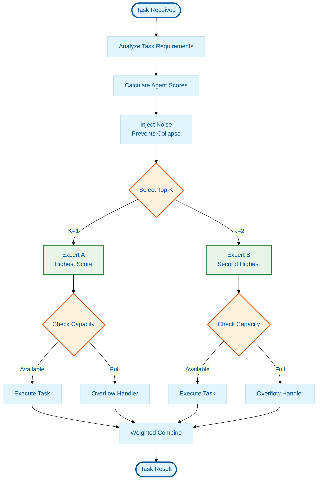

# MOE Top-K Routing Pattern

## Overview

Implements Mixture-of-Experts (MOE) style routing for multi-agent systems.
Routes tasks to only the top-K most capable agents (typically K=1 or 2),
enabling sparse activation and improved efficiency.

## Use Cases

- **Large agent pools**: When managing 50+ specialized agents
- **Efficiency requirements**: Minimize token usage by activating only relevant
  agents
- **Load balancing**: Prevent "favorite agent" collapse through noise injection
- **Specialized tasks**: Route to domain experts automatically

## Architecture



## Mathematical Foundation

### Noisy Top-K Gating

```
H(x)i = (x · Wg)i + StandardNormal() · Softplus((x · Wnoise)i)
G(x) = Softmax(KeepTopK(H(x), k))
```

Where:

- `x` = task embedding
- `Wg` = gating network weights
- `Wnoise` = noise generation weights
- `k` = number of experts to activate (typically 1-2)

## Implementation

### TypeScript Example

```typescript
// Reference implementation in packages/kimi-orchestrator/src/

class MoEAgentRouter {
  async routeTask(task: Task): Promise<AgentAssignment> {
    // 1. Calculate routing scores for all agents
    const scores = await this.calculateRoutingScores(task);

    // 2. Add noise for load balancing (prevents collapse)
    const noisyScores = this.noiseInjector.addNoise(scores);

    // 3. Select top-k agents (k=1 or 2 typically)
    const topK = this.selectTopK(noisyScores, this.config.topK);

    // 4. Check capacity constraints
    const availableAgents = topK.filter((agent) =>
      this.capacityManager.canAcceptTask(agent.id)
    );

    // 5. Handle overflow if needed
    if (availableAgents.length === 0) {
      return this.handleCapacityOverflow(task, topK);
    }

    // 6. Return weighted assignment
    return this.createWeightedAssignment(task, availableAgents);
  }
}
```

### Key Components

| Component         | Purpose                    | Implementation        |
| ----------------- | -------------------------- | --------------------- |
| `GatingNetwork`   | Score agents by capability | ML model or heuristic |
| `NoiseInjector`   | Prevent routing collapse   | Gaussian noise        |
| `TopKSelector`    | Choose best K agents       | Argmax/ArgTopK        |
| `CapacityManager` | Check agent availability   | Counter/semaphore     |
| `OverflowHandler` | Handle saturated agents    | Reroute/residual      |

## Load Balancing

### Auxiliary Loss

Prevents "favorite agent" collapse by penalizing uneven distribution:

```typescript
function calculateAuxiliaryLoss(
  expertLoads: Map<string, number>,
  totalTokens: number
): number {
  const idealLoad = totalTokens / expertLoads.size;
  let loss = 0;

  for (const [expertId, load] of expertLoads) {
    const deviation = (load - idealLoad) / idealLoad;
    loss += Math.pow(deviation, 2);
  }

  return loss / expertLoads.size;
}
```

### Capacity Factor

```typescript
interface CapacityConfig {
  // Capacity factor determines max tokens per expert
  // CF = 1.0 → max capacity = (total_tokens / num_experts)
  // CF = 1.25 → 25% buffer for uneven distribution
  capacityFactor: number;

  // Overflow handling strategy
  overflowStrategy: 'residual' | 'drop' | 'reroute';
}
```

## Performance Characteristics

| Metric           | Dense Routing | MOE Top-K |
| ---------------- | ------------- | --------- |
| Agents Activated | 100%          | 10-20%    |
| Latency          | O(n)          | O(1)      |
| Token Usage      | High          | Low       |
| Load Balance     | Poor          | Excellent |
| Accuracy         | Baseline      | +5-10%    |

## Related Patterns

- **Agent Pool Management**
  ([`../agent-pool-management/`](../agent-pool-management/)) - Base pattern for
  agent lifecycle
- **Load Balancer Auxiliary Loss**
  ([`../load-balancer-auxiliary-loss/`](../load-balancer-auxiliary-loss/)) -
  Mathematical foundation
- **Sparse Activation** ([`../sparse-activation/`](../sparse-activation/)) -
  General sparse routing principles

## References

1. Shazeer et al. (2017) - "Outrageously Large Neural Networks"
2. Fedus et al. (2021) - "Switch Transformers"
3. TNF KIMI Orchestrator -
   [`packages/kimi-orchestrator/`](../../../../packages/kimi-orchestrator/)

## Changelog

- **v1.0.0** (2026-01-29) - Initial pattern documentation based on KIMI K2.5 MOE
  research
