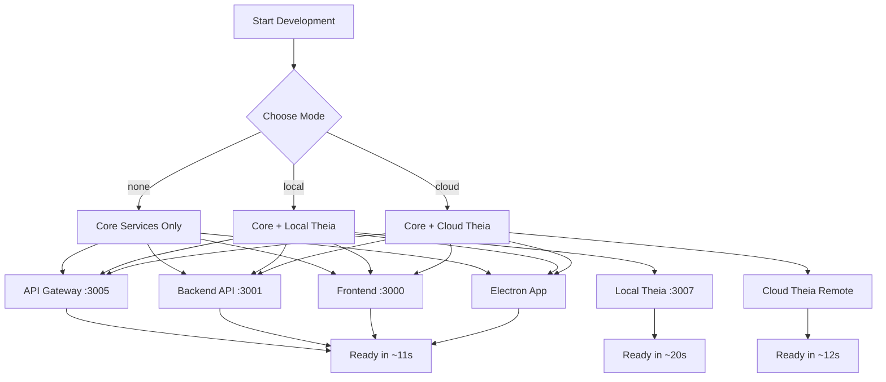

# The New Fuse - SaaS Platform

A comprehensive multi-service SaaS platform with AI-powered workflow management,
browser automation, and agent orchestration capabilities.

## Quick Start

### Prerequisites

- Node.js 20+
- pnpm 10.19.0+ (install with `npm install -g pnpm`)
- PostgreSQL 14+
- Redis 6+
- Docker (optional, for local database services)

### Installation

```bash
# Clone the repository
git clone https://github.com/whodaniel/fuse.git
cd fuse

# Install dependencies (includes automatic native module setup)
pnpm install
```

### Development

```bash
# Option 1: Fastest startup (no IDE) - RECOMMENDED FOR FIRST RUN
pnpm run dev:no-ide      # Core services ready in ~11 seconds

# Option 2: Auto-detect mode from .env
cp .env.example .env    # Configure your preferences
pnpm run dev             # Smart startup based on configuration

# Option 3: Cloud IDE (if available)
pnpm run dev:cloud-ide   # Connect to remote IDE instance
```

## Architecture

### Core Services

```bash
# With Docker Infrastructure
pnpm run docker:start && pnpm run dev:frontend

# Traditional approach (may have build issues)
pnpm run dev:legacy
```

## 🏗️ Modular Architecture

### Service Startup Flow



### Core Services (Always Available)

```
┌─────────────────┐    ┌──────────────────┐    ┌─────────────────┐
│   Frontend      │    │    Backend API   │    │ API Gateway     │
│  React + Vite   │    │  NestJS          │    │ Route + Auth    │
│  Port: 3000     │    │  Port: 3001      │    │ Port: 3005      │
└─────────────────┘    └──────────────────┘    └─────────────────┘
         │                        │                        │
         └────────────────────────┼────────────────────────┘
                                  │
                    ┌─────────────▼─────────────┐
                    │     Electron Desktop      │
                    │   Browser Hub + MCP       │
                    │    (Auto-launched)        │
                    └───────────────────────────┘
```

### Optional IDE Layer

```
┌─────────────────┐    ┌─────────────────┐    ┌─────────────────┐
│   Frontend      │    │  API Gateway    │    │   API Server    │
│   React + Vite  │◄──►│  NestJS         │◄──►│   NestJS        │
│   Port: 3000    │    │  Port: 3002     │    │   Port: 3001    │
└─────────────────┘    └─────────────────┘    └─────────────────┘
         │                      │                       │
         └──────────────────────┼───────────────────────┘
                                │
                    ┌───────────▼────────────┐
                    │   Backend Services     │
                    │   NestJS + Workers     │
                    │   Port: 3003           │
                    └────────────────────────┘
```

### Service Inventory

#### Frontend Applications

- **Frontend** (`apps/frontend`) - Main React application with Vite
- **Client** (`apps/client`) - Alternative client application

#### API Services

- **API Server** (`apps/api`) - Core API service
- **API Gateway** (`apps/api-gateway`) - Request routing and authentication
- **Backend** (`apps/backend`) - Background services and workers

#### Specialized Services

- **Browser Hub** (`apps/browser-hub`) - Browser automation and management
- **MCP Servers** (`apps/mcp-servers`) - Model Context Protocol servers
- **Relay Server** (`apps/relay-server`) - Real-time communication relay
- **Electron Desktop** (`apps/electron-desktop`) - Desktop application

## Features

### Multi-Agent Orchestration

- Agent-to-agent communication
- Intelligent task delegation
- Workflow management
- Shared context and memory

### Browser Automation

- Chrome extension integration
- Web scraping capabilities
- UI automation
- Visual element interaction

### AI Integration

- Multiple AI provider support (OpenAI, Anthropic, Google)
- Model Context Protocol (MCP) integration
- Streaming responses
- Tool integration

### Real-time Capabilities

- WebSocket support
- Live collaboration
- Real-time updates
- Event-driven architecture

## Technology Stack

### Frontend

- React 18 with TypeScript
- Vite for fast development
- Chakra UI components
- React Query for data fetching

### Backend

- NestJS framework
- TypeScript
- Prisma ORM (migrating to Drizzle ORM)
- Drizzle ORM
- PostgreSQL database
- Redis caching

### Infrastructure

- Docker containerization
- Railway deployment ready
- Nixpacks build system
- GitHub Actions CI/CD

## Package Manager

This project uses **pnpm** exclusively. Do not use npm or yarn.

```bash
# Start Docker services
pnpm run docker:start

# Check service status
pnpm run docker:status

# Test connectivity
pnpm run docker:test

# View logs
pnpm run docker:logs

# Stop services
pnpm run docker:stop
```

## Project Structure

```
fuse/
├── apps/                      # Application services
│   ├── api/                   # Main API server
│   ├── api-gateway/           # API gateway
│   ├── backend/               # Backend services
│   ├── frontend/              # React frontend
│   ├── browser-hub/           # Browser automation
│   ├── mcp-servers/           # MCP servers
│   ├── relay-server/          # Communication relay
│   └── electron-desktop/      # Desktop app
├── packages/                  # Shared packages
│   ├── a2a-core/              # Agent-to-agent core
│   ├── a2a-react/             # Agent React components
│   ├── api-client/            # API client library
│   ├── api-types/             # Shared API types
│   ├── core/                  # Core utilities
│   ├── database/              # Database schemas
│   ├── mcp-core/              # MCP core functionality
│   ├── workflow-engine/       # Workflow processing
│   └── ...                    # Other shared packages
├── scripts/                   # Build and deployment scripts
├── docs/                      # Documentation
└── railway-deploy.sh          # Railway deployment script
```

## Environment Variables

Create a `.env` file in the root directory with:

```bash
# Development
pnpm run dev                 # Start all services
pnpm run dev:frontend        # Frontend only
pnpm run dev:backend         # Backend only
pnpm run dev:hub            # Electron app only

# Docker Management
pnpm run docker:start       # Start PostgreSQL & Redis
pnpm run docker:stop        # Stop Docker services
pnpm run docker:test        # Test connectivity
pnpm run docker:status      # Check service status

# Building
pnpm run build              # Build all apps
pnpm run build:frontend     # Build frontend
pnpm run build:backend      # Build backend

# Testing
pnpm run test               # Run all tests
pnpm run test:frontend      # Frontend tests
pnpm run test:backend       # Backend tests

# Quality
pnpm run lint               # Lint all code
pnpm run type-check         # TypeScript checking
pnpm run format             # Format code

# Claude Agent Management
pnpm run claude:agents:sync     # Synchronize .claude agents
pnpm run claude:agents:register # Register agents in database
pnpm run claude:agents:search   # Search agent ecosystem
pnpm run claude:agents:status   # Agent system status
```

### Development Workflow

1. **Setup Environment**:

   ```bash
   pnpm install
   pnpm run docker:start
   pnpm run claude:agents:sync    # Initialize agent system
   ```

2. **Start Development**:

   ```bash
   pnpm run dev:frontend
   pnpm run dev:backend
   pnpm run dev:hub
   ```

3. **Access Services**:
   - Frontend: http://localhost:3000
   - Backend API: http://localhost:3004
   - Browser Hub: http://localhost:8080
   - Electron: Desktop application

4. **Monitor Services**:
   ```bash
   pnpm run docker:status
   curl http://localhost:3004/api/services/status
   ```

## 🌐 API Endpoints

### Service Management

- `GET /api/services/status` - Service health status
- `GET /api/system/metrics` - System performance metrics
- `GET /api/system/tools` - Available system tools

### Agent Management

- `POST /api/agents/register/batch` - Register all .claude agents in database
- `GET /api/agents/search` - Advanced search with multi-criteria filtering
- `GET /api/agents/:id/profile` - Complete agent profile with capabilities
- `GET /api/agents/:id/similar` - Find similar and complementary agents
- `GET /api/agents/:id/relationships` - Agent compatibility and workflows
- `POST /api/agents/:id/usage` - Record agent usage and performance metrics
- `GET /api/agents/statistics` - System-wide agent analytics and insights

## 🧪 Testing

### Unit Tests

```bash
pnpm run test
```

### Integration Tests

```bash
# Start services first
pnpm run docker:start
pnpm run dev

# Run integration tests
pnpm run test:integration
```

### Docker Integration Test

```bash
pnpm run docker:test
```

## 📚 Documentation

### Essential Documentation

- **[Documentation Map](./DOCUMENTATION_MAP.md)** - Complete map of all 1,200+ docs with navigation paths
- **[Documentation Index](./DOCUMENTATION_INDEX.md)** - Organized index by category
- **[Quick Start Guide](./QUICK_START_GUIDE.md)** - 7-day path to launch
- **[Production Readiness](./PRODUCTION_READINESS.md)** - Current production status

### Getting Started

- [Getting Started Guide](./docs/development/GETTING_STARTED.md)
- [Development Workflow](./docs/guides/development-workflow.md)
- [Build Guide](./docs/development/BUILD_GUIDE.md)
- [Build System Overview](./docs/development/BUILD_SYSTEM.md)

### Architecture & Design

- [Architecture Standards](./docs/architecture/ARCHITECTURE_STANDARDS.md)
- [Monorepo Architecture](./docs/architecture/MONOREPO_ARCHITECTURE.md)
- [Design System Documentation](./docs/DESIGN_SYSTEM_DOCUMENTATION.md)
- [System Architecture](./docs/architecture/)

### Development Guides

- [Backend Development](./apps/backend/README.md)
- [Frontend Development](./apps/frontend/README.md)
- [API Examples](./apps/backend/API_EXAMPLES.md)
- [GraphQL Guide](./apps/api/src/graphql/README.md)
- [WebSocket Integration](./apps/backend/WEBSOCKET_INTEGRATION_GUIDE.md)

### Agent System

- [Complete Agent Guide](./docs/agents/COMPLETE-AGENT-GUIDE.md)
- [Agent Communication Protocol](./docs/AGENT_COMMUNICATION_PROTOCOL.md)
- [Agent Development Guide](./docs/agents-and-protocols/AGENT_DEVELOPMENT_GUIDE.md)
- [Agent Registry API](./apps/backend/src/modules/agent-registry/API_DOCUMENTATION.md)

### Deployment & Operations

- [Deployment Guide](./docs/deployment/DEPLOYMENT_GUIDE.md)
- [Railway Deployment](./docs/deployment/RAILWAY_DEPLOYMENT_GUIDE.md)
- [Docker Setup Guide](./docs/guides/docker-setup.md)
- [Docker Best Practices](./docs/DOCKER_BEST_PRACTICES.md)
- [CI/CD Strategy](./docs/CICD_STRATEGY.md)
- [Monitoring](./docs/deployment/MONITORING.md)

### Testing & Quality

- [Testing Setup](./docs/testing/TESTING_SETUP_COMPLETE.md)
- [E2E Testing](./docs/testing/E2E_TEST_SUMMARY.md)
- [Testing Best Practices](./docs/testing/BEST_PRACTICES.md)
- [Code Quality](./docs/CODE_QUALITY.md)

### Security

- [Security Best Practices](./docs/security/SECURITY_BEST_PRACTICES.md)
- [Security Audit Report](./docs/security/SECURITY_AUDIT_REPORT.md)
- [Developer Security Checklist](./docs/security/DEVELOPER_SECURITY_CHECKLIST.md)

### Troubleshooting

- [Docker Services Issues](./docs/troubleshooting/docker-services.md)
- [Deployment Troubleshooting](./docs/deployment/TROUBLESHOOTING.md)

### API Documentation

- [API Usage Guide](./docs/API_USAGE_GUIDE.md)
- [API Documentation](./docs/api/)
- [GraphQL Examples](./apps/api/src/graphql/GRAPHQL_EXAMPLES.md)

## 🚀 Deployment

### Development

```bash
# With Docker infrastructure
pnpm run docker:start
pnpm run dev
```

### Building

```bash
# Build for production
pnpm run build

# Deploy with Docker Compose
docker-compose -f docker-compose.yml up -d
```

### Testing

```bash
pnpm run test             # Run all tests
pnpm run test:unit        # Unit tests
pnpm run test:integration # Integration tests
pnpm run test:e2e         # End-to-end tests
```

### Database

```bash
# Drizzle ORM (New)
pnpm run db:generate:drizzle # Generate Drizzle schema
pnpm run db:migrate:drizzle  # Run Drizzle migrations

# Prisma ORM (Legacy)
pnpm run db:generate      # Generate Prisma client
pnpm run db:migrate       # Run migrations
pnpm run db:studio        # Open Prisma Studio
pnpm run db:reset         # Reset database with seed data
```

### Quality

```bash
pnpm run lint             # Lint code
pnpm run type-check       # TypeScript checking
pnpm run format           # Format code
```

### Cleaning

```bash
pnpm run clean            # Clean build artifacts
pnpm run clean:cache      # Clear pnpm cache
pnpm run clean:full       # Full clean + remove node_modules
```

## Deployment

### Railway Deployment

The project is configured for easy Railway deployment:

```bash
# Deploy all services
./railway-deploy.sh

# Or deploy individual services
cd apps/frontend && railway up
cd apps/api && railway up
cd apps/backend && railway up
```

See [RAILWAY_DEPLOYMENT.md](./RAILWAY_DEPLOYMENT.md) for detailed deployment
instructions.

### Docker Deployment

```bash
# Build Docker images
docker build -t fuse-frontend -f apps/frontend/Dockerfile .
docker build -t fuse-api -f apps/api/Dockerfile .

# Run with docker-compose
docker-compose up -d
```

### Environment Setup

1. Configure environment variables in Railway dashboard
2. Add PostgreSQL and Redis plugins
3. Set up custom domains (optional)
4. Configure health checks
5. Monitor deployments

## Development Workflow

### Adding a New Feature

1. Create a new branch

   ```bash
   git checkout -b feature/your-feature-name
   ```

2. Make your changes in the appropriate package/app

3. Test locally

   ```bash
   pnpm run test
   pnpm run type-check
   ```

4. Build to verify

   ```bash
   pnpm run build
   ```

5. Commit and push
   ```bash
   git add .
   git commit -m "feat: your feature description"
   git push origin feature/your-feature-name
   ```

### Working with Workspaces

```bash
# Install dependency in specific package
pnpm --filter @the-new-fuse/api add express

# Run command in specific package
pnpm --filter @the-new-fuse/frontend run build

# Run command in all packages
pnpm -r run build
```

## Troubleshooting

### Port Already in Use

```bash
# Check what's using the port
lsof -i :3000

# Clean ports (if script exists)
pnpm run clean:ports
```

### Database Connection Issues

```bash
# Verify PostgreSQL is running
psql -U postgres -c "SELECT version();"

# Reset database
pnpm run db:reset
```

### Build Failures

```bash
# Clean and reinstall
pnpm run clean:full
pnpm install
pnpm run build
```

### Type Errors

```bash
# Regenerate Prisma client
pnpm run db:generate

# Run type check
pnpm run type-check
```

## Related Documentation

### Core Documentation
- [Documentation Map](./DOCUMENTATION_MAP.md) - Complete navigation guide for all 1,200+ docs
- [Quick Start Guide](./QUICK_START_GUIDE.md) - 7-day path to production
- [Production Readiness](./PRODUCTION_READINESS.md) - Current status and roadmap

### Developer Resources
- [Architecture Standards](./docs/architecture/ARCHITECTURE_STANDARDS.md)
- [API Usage Guide](./docs/API_USAGE_GUIDE.md)
- [Agent Development Guide](./docs/agents-and-protocols/AGENT_DEVELOPMENT_GUIDE.md)
- [Testing Best Practices](./docs/testing/BEST_PRACTICES.md)

### Deployment Resources
- [Deployment Guide](./docs/deployment/DEPLOYMENT_GUIDE.md)
- [Railway Deployment](./docs/deployment/RAILWAY_DEPLOYMENT_GUIDE.md)
- [Docker Best Practices](./docs/DOCKER_BEST_PRACTICES.md)
- [CI/CD Strategy](./docs/CICD_STRATEGY.md)

## Contributing

1. Fork the repository
2. Create a feature branch
3. Make your changes
4. Add tests
5. Ensure all tests pass
6. Submit a pull request

### Development Setup for Contributors

```bash
# Clone your fork
git clone <your-fork-url>
cd the-new-fuse

# Install dependencies
pnpm install

# Start development environment
pnpm run docker:start
pnpm run dev

# Run tests
pnpm run test
pnpm run docker:test
```

## 📋 Requirements

### System Requirements

- **Node.js**: 18+
- **Docker**: Latest stable version
- **Memory**: 4GB+ recommended
- **Storage**: 2GB+ available space

### Development Requirements

- **TypeScript**: Latest version
- **Git**: Version control
- **Docker Desktop**: For database services
- **Code Editor**: VS Code recommended

## 🐛 Troubleshooting

### Common Issues

**Native Module Build Errors:**

```bash
# Automatic fix (recommended)
pnpm run setup:native-modules

# Manual fix
pnpm run fix:native-modules

# Complete reinstall
rm -rf node_modules && pnpm install
```

**Docker services won't start:**

```bash
# Check Docker status
docker info

# Restart Docker services
pnpm run docker:stop
pnpm run docker:start
```

**Port conflicts:**

```bash
# Check port usage
lsof -i :3000
lsof -i :3004
lsof -i :5433
lsof -i :6380
```

**Connection issues:**

```bash
# Test connectivity
pnpm run docker:test

# Check logs
pnpm run docker:logs
```

For detailed troubleshooting, see:

- [Native Modules Guide](./docs/guides/native-modules-guide.md)
- [Docker Services Troubleshooting](./docs/troubleshooting/docker-services.md)

## 📝 License

[Add your license here]

## 🙏 Acknowledgments

- Built with pnpm for fast and reliable dependency management
- [Docker](https://docker.com) for containerization
- [NestJS](https://nestjs.com) for backend framework
- [React](https://react.dev) for frontend framework
- [Electron](https://electronjs.org) for desktop integration

## 📞 Support

- **Issues**: [GitHub Issues](https://github.com/whodaniel/fuse/issues)
- **Discussions**:
  [GitHub Discussions](https://github.com/whodaniel/fuse/discussions)
- **Documentation**: Check the `docs/` directory

## License

[Add your license information here]

---

**Ready to launch your SaaS platform!** 🚀

For deployment instructions, see
[RAILWAY_DEPLOYMENT.md](./RAILWAY_DEPLOYMENT.md)
