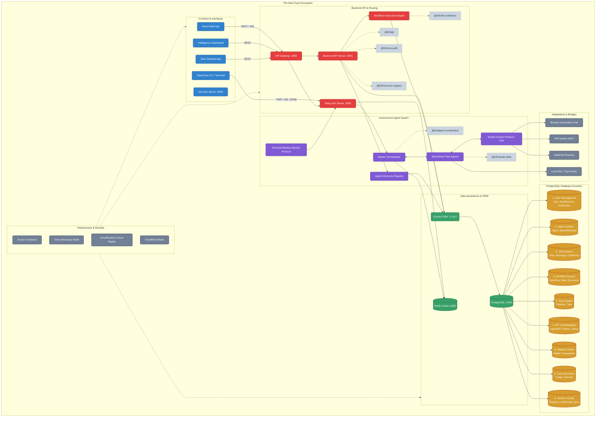

# The New Fuse (TNF) - Master Architecture Schema

This document contains the unified architectural schema and database relationships for The New Fuse ecosystem. It is formatted as an interactive Mermaid graph, optimized for ingestion by NotebookLM and other visual mind-mapping tools.

## Schema Domains Overview

1. **User Management**: Manages human identities, authentication sessions, and RBAC roles.
2. **Agent System**: Manages AI personas, capabilities, and system prompts.
3. **Chat System**: Handles threads, human-to-agent, and agent-to-agent ephemeral/persistent messages.
4. **Workflow & Task Systems**: Orchestrates step-by-step logic, pipeline tasks, and tracks execution states.
5. **Blockchain & Marketplace**: On-chain fractional ownership (NFTs), wallets, and agent revenue distributions.
6. **System & Code Execution**: Tracks LLM quotas, registers safe compute environments, and logs sandbox usage. 
