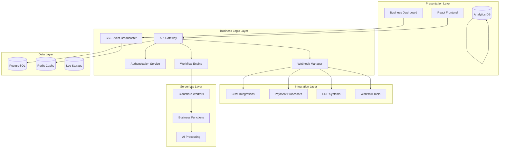

# Webhooks, SSE & Serverless Architecture Plan

## Business Automation Integration for The New Fuse

### Table of Contents

1. [Enhanced High-Level Architecture](#enhanced-high-level-architecture)
2. [Comprehensive Business Integrations](#comprehensive-business-integrations)
3. [Real-Time Business Intelligence via SSE](#real-time-business-intelligence-via-sse)
4. [Security and Compliance Frameworks](#security-and-compliance-frameworks)
5. [Serverless Business Process Functions](#serverless-business-process-functions)
6. [Advanced Business Analytics and AI Integration](#advanced-business-analytics-and-ai-integration)
7. [Implementation Roadmap](#implementation-roadmap)
8. [Technical Architecture Components](#technical-architecture-components)
9. [Monitoring and Observability](#monitoring-and-observability)
10. [Success Criteria](#success-criteria)

---

## Enhanced High-Level Architecture

### Business Automation Layers



### Core TypeScript Interfaces

```typescript
// Core Business Event Interface
interface BusinessEvent {
  id: string;
  type: BusinessEventType;
  source: IntegrationSource;
  timestamp: Date;
  data: Record<string, any>;
  metadata: EventMetadata;
  processing_status: ProcessingStatus;
}

enum BusinessEventType {
  LEAD_CREATED = 'lead_created',
  PAYMENT_RECEIVED = 'payment_received',
  INVOICE_GENERATED = 'invoice_generated',
  WORKFLOW_TRIGGERED = 'workflow_triggered',
  CUSTOMER_UPDATED = 'customer_updated',
  PRODUCT_SOLD = 'product_sold',
  SUBSCRIPTION_CHANGED = 'subscription_changed'
}

enum IntegrationSource {
  SALESFORCE = 'salesforce',
  HUBSPOT = 'hubspot',
  PIPEDRIVE = 'pipedrive',
  STRIPE = 'stripe',
  PAYPAL = 'paypal',
  SQUARE = 'square',
  NETSUITE = 'netsuite',
  SAP = 'sap',
  QUICKBOOKS = 'quickbooks',
  ZAPIER = 'zapier',
  WORKATO = 'workato',
  POWER_AUTOMATE = 'power_automate'
}

interface EventMetadata {
  correlation_id: string;
  user_id?: string;
  organization_id: string;
  priority: EventPriority;
  retry_count: number;
  max_retries: number;
}

enum EventPriority {
  LOW = 'low',
  MEDIUM = 'medium',
  HIGH = 'high',
  CRITICAL = 'critical'
}

enum ProcessingStatus {
  PENDING = 'pending',
  PROCESSING = 'processing',
  COMPLETED = 'completed',
  FAILED = 'failed',
  RETRYING = 'retrying'
}
```

---

## Comprehensive Business Integrations

### CRM Systems Integration

#### Salesforce Integration

```typescript
interface SalesforceWebhookPayload {
  Id: string;
  ObjectType: 'Lead' | 'Opportunity' | 'Account' | 'Contact';
  EventType: 'created' | 'updated' | 'deleted';
  NewValue: Record<string, any>;
  OldValue?: Record<string, any>;
  EventDate: string;
}

class SalesforceIntegration {
  async handleWebhook(payload: SalesforceWebhookPayload): Promise<void> {
    const businessEvent: BusinessEvent = {
      id: generateId(),
      type: this.mapSalesforceEvent(payload.EventType, payload.ObjectType),
      source: IntegrationSource.SALESFORCE,
      timestamp: new Date(payload.EventDate),
      data: payload.NewValue,
      metadata: {
        correlation_id: payload.Id,
        organization_id: this.extractOrgId(payload),
        priority: this.determinePriority(payload.ObjectType),
        retry_count: 0,
        max_retries: 3
      },
      processing_status: ProcessingStatus.PENDING
    };
    
    await this.queueEvent(businessEvent);
  }
  
  private mapSalesforceEvent(eventType: string, objectType: string): BusinessEventType {
    const mapping = {
      'Lead_created': BusinessEventType.LEAD_CREATED,
      'Opportunity_created': BusinessEventType.LEAD_CREATED,
      'Account_updated': BusinessEventType.CUSTOMER_UPDATED
    };
    return mapping[`${objectType}_${eventType}`] || BusinessEventType.LEAD_CREATED;
  }
}
```

#### HubSpot Integration

```typescript
interface HubSpotWebhookPayload {
  objectId: number;
  propertyName?: string;
  propertyValue?: string;
  changeSource: string;
  eventId: number;
  subscriptionId: number;
  portalId: number;
  appId: number;
  occurredAt: number;
  subscriptionType: string;
  attemptNumber: number;
}

class HubSpotIntegration {
  async handleWebhook(payload: HubSpotWebhookPayload): Promise<void> {
    const contactData = await this.fetchContactData(payload.objectId);
    
    const businessEvent: BusinessEvent = {
      id: generateId(),
      type: this.mapHubSpotEvent(payload.subscriptionType),
      source: IntegrationSource.HUBSPOT,
      timestamp: new Date(payload.occurredAt),
      data: contactData,
      metadata: {
        correlation_id: payload.objectId.toString(),
        organization_id: payload.portalId.toString(),
        priority: EventPriority.MEDIUM,
        retry_count: 0,
        max_retries: 3
      },
      processing_status: ProcessingStatus.PENDING
    };
    
    await this.queueEvent(businessEvent);
  }
}
```

#### Pipedrive Integration

```typescript
interface PipedriveWebhookPayload {
  v: number;
  matches_filters: {
    current: number[];
    previous: number[];
  };
  meta: {
    v: number;
    object: string;
    action: string;
    id: number;
    company_id: number;
    user_id: number;
    host: string;
    timestamp: number;
    timestamp_micro: number;
    permitted_user_ids: number[];
    trans_pending: boolean;
    is_bulk_update: boolean;
  };
  current: Record<string, any>;
  previous?: Record<string, any>;
}

class PipedriveIntegration {
  async handleWebhook(payload: PipedriveWebhookPayload): Promise<void> {
    const businessEvent: BusinessEvent = {
      id: generateId(),
      type: this.mapPipedriveEvent(payload.meta.object, payload.meta.action),
      source: IntegrationSource.PIPEDRIVE,
      timestamp: new Date(payload.meta.timestamp * 1000),
      data: payload.current,
      metadata: {
        correlation_id: payload.meta.id.toString(),
        organization_id: payload.meta.company_id.toString(),
        user_id: payload.meta.user_id.toString(),
        priority: EventPriority.MEDIUM,
        retry_count: 0,
        max_retries: 3
      },
      processing_status: ProcessingStatus.PENDING
    };
    
    await this.queueEvent(businessEvent);
  }
}
```

### Payment Processors Integration

#### Stripe Integration

```typescript
interface StripeWebhookPayload {
  id: string;
  object: 'event';
  api_version: string;
  created: number;
  data: {
    object: Record<string, any>;
    previous_attributes?: Record<string, any>;
  };
  livemode: boolean;
  pending_webhooks: number;
  request: {
    id: string | null;
    idempotency_key: string | null;
  };
  type: string;
}

class StripeIntegration {
  async handleWebhook(payload: StripeWebhookPayload): Promise<void> {
    const businessEvent: BusinessEvent = {
      id: generateId(),
      type: this.mapStripeEvent(payload.type),
      source: IntegrationSource.STRIPE,
      timestamp: new Date(payload.created * 1000),
      data: payload.data.object,
      metadata: {
        correlation_id: payload.id,
        organization_id: this.extractOrgFromStripe(payload.data.object),
        priority: this.getStripeEventPriority(payload.type),
        retry_count: 0,
        max_retries: 5
      },
      processing_status: ProcessingStatus.PENDING
    };
    
    await this.queueEvent(businessEvent);
  }
  
  private mapStripeEvent(stripeEventType: string): BusinessEventType {
    const mapping = {
      'payment_intent.succeeded': BusinessEventType.PAYMENT_RECEIVED,
      'invoice.payment_succeeded': BusinessEventType.PAYMENT_RECEIVED,
      'customer.subscription.updated': BusinessEventType.SUBSCRIPTION_CHANGED,
      'invoice.created': BusinessEventType.INVOICE_GENERATED
    };
    return mapping[stripeEventType] || BusinessEventType.PAYMENT_RECEIVED;
  }
}
```

#### PayPal Integration

```typescript
interface PayPalWebhookPayload {
  id: string;
  event_version: string;
  create_time: string;
  resource_type: string;
  resource_version: string;
  event_type: string;
  summary: string;
  resource: Record<string, any>;
  links: Array<{
    href: string;
    rel: string;
    method: string;
  }>;
}

class PayPalIntegration {
  async handleWebhook(payload: PayPalWebhookPayload): Promise<void> {
    const businessEvent: BusinessEvent = {
      id: generateId(),
      type: this.mapPayPalEvent(payload.event_type),
      source: IntegrationSource.PAYPAL,
      timestamp: new Date(payload.create_time),
      data: payload.resource,
      metadata: {
        correlation_id: payload.id,
        organization_id: this.extractOrgFromPayPal(payload.resource),
        priority: EventPriority.HIGH,
        retry_count: 0,
        max_retries: 3
      },
      processing_status: ProcessingStatus.PENDING
    };
    
    await this.queueEvent(businessEvent);
  }
}
```

### ERP Systems Integration

#### NetSuite Integration

```typescript
interface NetSuiteWebhookPayload {
  recordType: string;
  recordId: string;
  operation: 'create' | 'update' | 'delete';
  timestamp: string;
  companyId: string;
  userId: string;
  data: Record<string, any>;
}

class NetSuiteIntegration {
  async handleWebhook(payload: NetSuiteWebhookPayload): Promise<void> {
    const businessEvent: BusinessEvent = {
      id: generateId(),
      type: this.mapNetSuiteEvent(payload.recordType, payload.operation),
      source: IntegrationSource.NETSUITE,
      timestamp: new Date(payload.timestamp),
      data: payload.data,
      metadata: {
        correlation_id: payload.recordId,
        organization_id: payload.companyId,
        user_id: payload.userId,
        priority: EventPriority.HIGH,
        retry_count: 0,
        max_retries: 3
      },
      processing_status: ProcessingStatus.PENDING
    };
    
    await this.queueEvent(businessEvent);
  }
}
```

### Workflow Tools Integration

#### Zapier Integration

```typescript
interface ZapierWebhookPayload {
  zap_id: string;
  trigger_id: string;
  data: Record<string, any>;
  timestamp: string;
  user_id: string;
}

class ZapierIntegration {
  async handleWebhook(payload: ZapierWebhookPayload): Promise<void> {
    const businessEvent: BusinessEvent = {
      id: generateId(),
      type: BusinessEventType.WORKFLOW_TRIGGERED,
      source: IntegrationSource.ZAPIER,
      timestamp: new Date(payload.timestamp),
      data: payload.data,
      metadata: {
        correlation_id: payload.trigger_id,
        organization_id: payload.user_id,
        priority: EventPriority.MEDIUM,
        retry_count: 0,
        max_retries: 3
      },
      processing_status: ProcessingStatus.PENDING
    };
    
    await this.queueEvent(businessEvent);
  }
}
```

---

## Real-Time Business Intelligence via SSE

### SSE Event Broadcasting System

```typescript
interface SSEClient {
  id: string;
  userId: string;
  organizationId: string;
  subscriptions: EventSubscription[];
  response: Response;
  lastHeartbeat: Date;
}

interface EventSubscription {
  eventTypes: BusinessEventType[];
  filters: Record<string, any>;
  priority: EventPriority;
}

class SSEEventBroadcaster {
  private clients: Map<string, SSEClient> = new Map();
  private redis: Redis;
  
  constructor(redis: Redis) {
    this.redis = redis;
    this.setupRedisSubscriptions();
  }
  
  async addClient(client: SSEClient): Promise<void> {
    this.clients.set(client.id, client);
    await this.sendHeartbeat(client);
    
    // Send initial connection confirmation
    await this.sendEvent(client, {
      type: 'connection',
      data: { status: 'connected', timestamp: new Date().toISOString() }
    });
  }
  
  async removeClient(clientId: string): Promise<void> {
    const client = this.clients.get(clientId);
    if (client) {
      client.response.close();
      this.clients.delete(clientId);
    }
  }
  
  async broadcastBusinessEvent(event: BusinessEvent): Promise<void> {
    const relevantClients = this.getRelevantClients(event);
    
    const sseEvent = {
      type: 'business_event',
      data: {
        id: event.id,
        type: event.type,
        source: event.source,
        timestamp: event.timestamp,
        data: event.data,
        priority: event.metadata.priority
      }
    };
    
    await Promise.all(
      relevantClients.map(client => this.sendEvent(client, sseEvent))
    );
    
    // Store in Redis for replay capability
    await this.redis.lpush(
      `events:${event.metadata.organization_id}`,
      JSON.stringify(sseEvent)
    );
    await this.redis.ltrim(`events:${event.metadata.organization_id}`, 0, 1000);
  }
  
  private getRelevantClients(event: BusinessEvent): SSEClient[] {
    return Array.from(this.clients.values()).filter(client => {
      return client.organizationId === event.metadata.organization_id &&
             client.subscriptions.some(sub => 
               sub.eventTypes.includes(event.type) &&
               this.matchesFilters(event, sub.filters)
             );
    });
  }
  
  private async sendEvent(client: SSEClient, event: any): Promise<void> {
    try {
      const data = `data: ${JSON.stringify(event)}\n\n`;
      await client.response.write(data);
    } catch (error) {
      console.error(`Failed to send event to client ${client.id}:`, error);
      await this.removeClient(client.id);
    }
  }
}
```

### Real-Time Analytics Dashboard

```typescript
interface AnalyticsMetrics {
  totalEvents: number;
  eventsByType: Record<BusinessEventType, number>;
  eventsBySource: Record<IntegrationSource, number>;
  processingLatency: {
    avg: number;
    p95: number;
    p99: number;
  };
  errorRate: number;
  activeIntegrations: number;
  revenueMetrics: {
    totalRevenue: number;
    revenueBySource: Record<string, number>;
    conversionRate: number;
  };
}

class RealTimeAnalytics {
  private redis: Redis;
  private analyticsDB: AnalyticsDatabase;
  
  async generateMetrics(organizationId: string, timeRange: string): Promise<AnalyticsMetrics> {
    const events = await this.getEventsInTimeRange(organizationId, timeRange);
    
    return {
      totalEvents: events.length,
      eventsByType: this.groupEventsByType(events),
      eventsBySource: this.groupEventsBySource(events),
      processingLatency: await this.calculateLatencyMetrics(events),
      errorRate: this.calculateErrorRate(events),
      activeIntegrations: await this.countActiveIntegrations(organizationId),
      revenueMetrics: await this.calculateRevenueMetrics(events)
    };
  }
  
  async streamMetrics(organizationId: string): Promise<ReadableStream> {
    return new ReadableStream({
      start: async (controller) => {
        const interval = setInterval(async () => {
          const metrics = await this.generateMetrics(organizationId, '1h');
          controller.enqueue(`data: ${JSON.stringify(metrics)}\n\n`);
        }, 5000); // Update every 5 seconds
        
        // Cleanup on stream close
        controller.closed.then(() => clearInterval(interval));
      }
    });
  }
}
```

---

## Security and Compliance Frameworks

### Webhook Security

```typescript
interface WebhookSecurityConfig {
  signatureHeader: string;
  secret: string;
  algorithm: 'sha256' | 'sha1';
  tolerance: number; // seconds
}

class WebhookSecurityValidator {
  async validateSignature(
    payload: string,
    signature: string,
    config: WebhookSecurityConfig
  ): Promise<boolean> {
    const expectedSignature = crypto
      .createHmac(config.algorithm, config.secret)
      .update(payload)
      .digest('hex');
    
    const providedSignature = signature.replace(/^(sha256=|sha1=)/, '');
    
    return crypto.timingSafeEqual(
      Buffer.from(expectedSignature, 'hex'),
      Buffer.from(providedSignature, 'hex')
    );
  }
  
  async validateTimestamp(timestamp: number, tolerance: number): Promise<boolean> {
    const now = Math.floor(Date.now() / 1000);
    return Math.abs(now - timestamp) <= tolerance;
  }
  
  async rateLimitCheck(source: string, limit: number, window: number): Promise<boolean> {
    const key = `rate_limit:${source}`;
    const current = await this.redis.incr(key);
    
    if (current === 1) {
      await this.redis.expire(key, window);
    }
    
    return current <= limit;
  }
}
```

### Data Privacy and Compliance

```typescript
interface ComplianceConfig {
  gdprEnabled: boolean;
  ccpaEnabled: boolean;
  hipaaEnabled: boolean;
  pciDssEnabled: boolean;
  dataRetentionDays: number;
  encryptionRequired: boolean;
}

class ComplianceManager {
  async encryptSensitiveData(data: Record<string, any>): Promise<Record<string, any>> {
    const sensitiveFields = ['email', 'phone', 'ssn', 'credit_card', 'bank_account'];
    const encrypted = { ...data };
    
    for (const field of sensitiveFields) {
      if (encrypted[field]) {
        encrypted[field] = await this.encrypt(encrypted[field]);
      }
    }
    
    return encrypted;
  }
  
  async anonymizeData(data: Record<string, any>): Promise<Record<string, any>> {
    const piiFields = ['email', 'phone', 'name', 'address'];
    const anonymized = { ...data };
    
    for (const field of piiFields) {
      if (anonymized[field]) {
        anonymized[field] = this.hash(anonymized[field]);
      }
    }
    
    return anonymized;
  }
  
  async auditDataAccess(
    userId: string,
    dataType: string,
    action: string,
    details: Record<string, any>
  ): Promise<void> {
    const auditLog = {
      timestamp: new Date(),
      userId,
      dataType,
      action,
      details,
      ipAddress: details.ipAddress,
      userAgent: details.userAgent
    };
    
    await this.auditDB.insert('data_access_logs', auditLog);
  }
}
```

---

## Serverless Business Process Functions

### Cloudflare Workers Architecture

```typescript
// Cloudflare Worker for Lead Processing
export default {
  async fetch(request: Request, env: Env): Promise<Response> {
    const url = new URL(request.url);
    const path = url.pathname;
    
    if (path === '/process-lead' && request.method === 'POST') {
      return await this.processLead(request, env);
    }
    
    if (path === '/enrich-customer' && request.method === 'POST') {
      return await this.enrichCustomer(request, env);
    }
    
    if (path === '/calculate-metrics' && request.method === 'POST') {
      return await this.calculateMetrics(request, env);
    }
    
    return new Response('Not Found', { status: 404 });
  },
  
  async processLead(request: Request, env: Env): Promise<Response> {
    try {
      const leadData = await request.json();
      
      // Lead scoring algorithm
      const score = await this.calculateLeadScore(leadData);
      
      // Enrich lead data
      const enrichedLead = await this.enrichLeadData(leadData, env);
      
      // Determine routing
      const routing = await this.determineLeadRouting(score, enrichedLead);
      
      // Trigger follow-up actions
      await this.triggerFollowUpActions(enrichedLead, routing, env);
      
      return new Response(JSON.stringify({
        success: true,
        leadId: enrichedLead.id,
        score,
        routing
      }), {
        headers: { 'Content-Type': 'application/json' }
      });
    } catch (error) {
      return new Response(JSON.stringify({
        success: false,
        error: error.message
      }), {
        status: 500,
        headers: { 'Content-Type': 'application/json' }
      });
    }
  },
  
  async calculateLeadScore(leadData: any): Promise<number> {
    let score = 0;
    
    // Company size scoring
    if (leadData.company_size) {
      const sizeScores = {
        'enterprise': 100,
        'mid-market': 75,
        'small': 50,
        'startup': 25
      };
      score += sizeScores[leadData.company_size] || 0;
    }
    
    // Industry scoring
    if (leadData.industry) {
      const industryScores = {
        'technology': 90,
        'finance': 85,
        'healthcare': 80,
        'retail': 70
      };
      score += industryScores[leadData.industry] || 50;
    }
    
    // Engagement scoring
    if (leadData.engagement_level) {
      score += leadData.engagement_level * 10;
    }
    
    // Budget scoring
    if (leadData.budget && leadData.budget > 10000) {
      score += Math.min(leadData.budget / 1000, 50);
    }
    
    return Math.min(score, 100);
  },
  
  async enrichLeadData(leadData: any, env: Env): Promise<any> {
    // Call external enrichment services
    const companyData = await this.fetchCompanyData(leadData.company, env);
    const socialData = await this.fetchSocialData(leadData.email, env);
    
    return {
      ...leadData,
      id: crypto.randomUUID(),
      enrichment: {
        company: companyData,
        social: socialData,
        enriched_at: new Date().toISOString()
      }
    };
  }
};
```

### Business Process Automation Functions

```typescript
// Invoice Processing Function
export class InvoiceProcessor {
  async processInvoice(invoiceData: any, env: Env): Promise<any> {
    // Extract invoice data using AI/OCR
    const extractedData = await this.extractInvoiceData(invoiceData);
    
    // Validate invoice data
    const validation = await this.validateInvoiceData(extractedData);
    
    if (!validation.valid) {
      return {
        success: false,
        errors: validation.errors
      };
    }
    
    // Match with purchase orders
    const matchedPO = await this.matchPurchaseOrder(extractedData);
    
    // Calculate taxes and totals
    const calculations = await this.calculateInvoiceTotals(extractedData);
    
    // Route for approval if needed
    const approvalRequired = await this.checkApprovalRequirements(calculations);
    
    if (approvalRequired) {
      await this.routeForApproval(extractedData, calculations);
    } else {
      await this.autoApproveInvoice(extractedData, calculations);
    }
    
    return {
      success: true,
      invoiceId: extractedData.id,
      status: approvalRequired ? 'pending_approval' : 'approved',
      calculations
    };
  }
}

// Customer Onboarding Function
export class CustomerOnboardingProcessor {
  async processOnboarding(customerData: any, env: Env): Promise<any> {
    // Create customer profile
    const customer = await this.createCustomerProfile(customerData);
    
    // Setup billing
    await this.setupBilling(customer);
    
    // Provision services
    await this.provisionServices(customer);
    
    // Send welcome emails
    await this.sendWelcomeSequence(customer);
    
    // Create onboarding tasks
    await this.createOnboardingTasks(customer);
    
    return {
      success: true,
      customerId: customer.id,
      status: 'onboarding_started'
    };
  }
}
```

---

## Advanced Business Analytics and AI Integration

### AI-Powered Insights Engine

```typescript
interface AIInsight {
  type: InsightType;
  confidence: number;
  description: string;
  data: Record<string, any>;
  recommendations: string[];
  impact: ImpactLevel;
}

enum InsightType {
  REVENUE_OPPORTUNITY = 'revenue_opportunity',
  CHURN_RISK = 'churn_risk',
  PROCESS_OPTIMIZATION = 'process_optimization',
  ANOMALY_DETECTION = 'anomaly_detection',
  CUSTOMER_BEHAVIOR = 'customer_behavior'
}

enum ImpactLevel {
  LOW = 'low',
  MEDIUM = 'medium',
  HIGH = 'high',
  CRITICAL = 'critical'
}

class AIInsightsEngine {
  async generateInsights(organizationId: string, timeframe: string): Promise<AIInsight[]> {
    const insights: AIInsight[] = [];
    
    // Revenue opportunity analysis
    const revenueInsights = await this.analyzeRevenueOpportunities(organizationId, timeframe);
    insights.push(...revenueInsights);
    
    // Churn risk analysis
    const churnInsights = await this.analyzeChurnRisk(organizationId, timeframe);
    insights.push(...churnInsights);
    
    // Process optimization analysis
    const processInsights = await this.analyzeProcessEfficiency(organizationId, timeframe);
    insights.push(...processInsights);
    
    // Anomaly detection
    const anomalies = await this.detectAnomalies(organizationId, timeframe);
    insights.push(...anomalies);
    
    return insights.sort((a, b) => this.getImpactScore(b.impact) - this.getImpactScore(a.impact));
  }
  
  private async analyzeRevenueOpportunities(organizationId: string, timeframe: string): Promise<AIInsight[]> {
    const customerData = await this.getCustomerData(organizationId, timeframe);
    const insights: AIInsight[] = [];
    
    // Identify upsell opportunities
    const upsellOpportunities = customerData.filter(customer => 
      customer.usage > customer.plan_limit * 0.8 && 
      customer.next_plan_tier_available
    );
    
    if (upsellOpportunities.length > 0) {
      insights.push({
        type: InsightType.REVENUE_OPPORTUNITY,
        confidence: 0.85,
        description: `${upsellOpportunities.length} customers are approaching their plan limits and may be ready for upgrades`,
        data: { customers: upsellOpportunities },
        recommendations: [
          'Send targeted upgrade campaigns to high-usage customers',
          'Offer limited-time upgrade incentives',
          'Schedule account manager calls for enterprise prospects'
        ],
        impact: ImpactLevel.HIGH
      });
    }
    
    return insights;
  }
  
  private async analyzeChurnRisk(organizationId: string, timeframe: string): Promise<AIInsight[]> {
    const customerBehaviorData = await this.getCustomerBehaviorData(organizationId, timeframe);
    const insights: AIInsight[] = [];
    
    // ML model for churn prediction
    const churnPredictions = await this.predictChurn(customerBehaviorData);
    const highRiskCustomers = churnPredictions.filter(pred => pred.churn_probability > 0.7);
    
    if (highRiskCustomers.length > 0) {
      insights.push({
        type: InsightType.CHURN_RISK,
        confidence: 0.9,
        description: `${highRiskCustomers.length} customers are at high risk of churning`,
        data: { customers: highRiskCustomers },
        recommendations: [
          'Implement immediate retention campaigns',
          'Schedule success manager check-ins',
          'Offer product training or support',
          'Provide temporary discounts or incentives'
        ],
        impact: ImpactLevel.CRITICAL
      });
    }
    
    return insights;
  }
}
```

### Predictive Analytics Models

```typescript
class PredictiveAnalytics {
  async predictCustomerLifetimeValue(customerId: string): Promise<number> {
    const customer = await this.getCustomerData(customerId);
    const historicalData = await this.getCustomerHistory(customerId);
    
    // Simple CLV calculation (can be enhanced with ML models)
    const avgMonthlyRevenue = this.calculateAverageMonthlyRevenue(historicalData);
    const retentionRate = this.calculateRetentionRate(historicalData);
    const grossMargin = 0.8; // 80% gross margin
    
    // CLV = (Average Monthly Revenue × Gross Margin) × (1 / Churn Rate)
    const churnRate = 1 - retentionRate;
    const clv = (avgMonthlyRevenue * grossMargin) * (1 / churnRate);
    
    return clv;
  }
  
  async predictDemand(productId: string, timeframe: string): Promise<DemandForecast> {
    const historicalSales = await this.getHistoricalSales(productId, timeframe);
    const seasonalityFactors = this.calculateSeasonality(historicalSales);
    const trendFactor = this.calculateTrend(historicalSales);
    
    // Simple demand forecasting (can be enhanced with time series models)
    const baseDemand = this.calculateBaseDemand(historicalSales);
    const forecastedDemand = baseDemand * trendFactor * seasonalityFactors;
    
    return {
      productId,
      forecastedDemand,
      confidence: this.calculateConfidence(historicalSales),
      factors: {
        seasonality: seasonalityFactors,
        trend: trendFactor,
        base: baseDemand
      }
    };
  }
}

interface DemandForecast {
  productId: string;
  forecastedDemand: number;
  confidence: number;
  factors: {
    seasonality: number;
    trend: number;
    base: number;
  };
}
```

---

## Implementation Roadmap

### Phase 1: Foundation Setup (Weeks 1-3)

#### Week 1: Core Infrastructure

- [ ] Set up PostgreSQL database with business events schema
- [ ] Implement Redis for caching and SSE event storage
- [ ] Create base webhook endpoint infrastructure
- [ ] Set up authentication and authorization system
- [ ] Implement basic logging and monitoring

#### Week 2: Webhook Framework

- [ ] Build webhook security validation system
- [ ] Create event queue management system
- [ ] Implement retry mechanism for failed events
- [ ] Set up rate limiting for webhook endpoints
- [ ] Create webhook registration and management API

#### Week 3: SSE Infrastructure

- [ ] Implement SSE event broadcasting system
- [ ] Create client subscription management
- [ ] Build event filtering and routing logic
- [ ] Set up Redis pub/sub for scalability
- [ ] Implement connection management and heartbeat

### Phase 2: Business Integrations (Weeks 4-6)

#### Week 4: CRM Integrations

- [ ] Implement Salesforce webhook integration
- [ ] Build HubSpot webhook handler
- [ ] Create Pipedrive integration
- [ ] Set up CRM data normalization
- [ ] Test and validate CRM event processing

#### Week 5: Payment Integrations

- [ ] Implement Stripe webhook integration
- [ ] Build PayPal webhook handler
- [ ] Create Square integration
- [ ] Set up payment event processing
- [ ] Implement financial data security measures

#### Week 6: ERP and Workflow Integrations

- [ ] Build NetSuite integration
- [ ] Implement QuickBooks webhook handler
- [ ] Create Zapier integration
- [ ] Set up workflow automation triggers
- [ ] Test end-to-end integration flows

### Phase 3: Serverless and Analytics (Weeks 7-9)

#### Week 7: Cloudflare Workers

- [ ] Deploy lead processing worker
- [ ] Implement invoice processing function
- [ ] Create customer onboarding automation
- [ ] Set up serverless function monitoring
- [ ] Optimize function performance

#### Week 8: Analytics Engine

- [ ] Build real-time analytics system
- [ ] Implement business metrics calculation
- [ ] Create custom dashboard components
- [ ] Set up analytics data pipeline
- [ ] Implement data visualization

#### Week 9: AI and Insights

- [ ] Deploy AI insights engine
- [ ] Implement predictive analytics models
- [ ] Create automated recommendation system
- [ ] Set up ML model monitoring
- [ ] Build insight delivery system

### Phase 4: Production Deployment (Weeks 10-12)

#### Week 10: Security and Compliance

- [ ] Implement comprehensive security audit
- [ ] Set up compliance monitoring
- [ ] Create data privacy controls
- [ ] Implement encryption for sensitive data
- [ ] Set up security incident response

#### Week 11: Performance Optimization

- [ ] Optimize database queries and indexes
- [ ] Implement caching strategies
- [ ] Set up auto-scaling for high load
- [ ] Optimize Cloudflare Worker performance
- [ ] Conduct load testing

#### Week 12: Go-Live and Monitoring

- [ ] Deploy to production environment
- [ ] Set up comprehensive monitoring
- [ ] Implement alerting and incident response
- [ ] Create operational runbooks
- [ ] Conduct final testing and validation

---

## Technical Architecture Components

### Database Schema

```sql
-- Business Events Table
CREATE TABLE business_events (
    id UUID PRIMARY KEY DEFAULT gen_random_uuid(),
    type VARCHAR(50) NOT NULL,
    source VARCHAR(50) NOT NULL,
    organization_id UUID NOT NULL,
    user_id UUID,
    correlation_id VARCHAR(255),
    data JSONB NOT NULL,
    metadata JSONB NOT NULL,
    processing_status VARCHAR(20) NOT NULL DEFAULT 'pending',
    retry_count INTEGER NOT NULL DEFAULT 0,
    created_at TIMESTAMP WITH TIME ZONE DEFAULT NOW(),
    updated_at TIMESTAMP WITH TIME ZONE DEFAULT NOW(),
    processed_at TIMESTAMP WITH TIME ZONE
);

-- Indexes for performance
CREATE INDEX idx_business_events_org_type ON business_events(organization_id, type);
CREATE INDEX idx_business_events_status ON business_events(processing_status);
CREATE INDEX idx_business_events_created ON business_events(created_at);
CREATE INDEX idx_business_events_correlation ON business_events(correlation_id);

-- Webhook Configurations Table
CREATE TABLE webhook_configurations (
    id UUID PRIMARY KEY DEFAULT gen_random_uuid(),
    organization_id UUID NOT NULL,
    source VARCHAR(50) NOT NULL,
    endpoint_url VARCHAR(500) NOT NULL,
    secret_key VARCHAR(255) NOT NULL,
    is_active BOOLEAN NOT NULL DEFAULT true,
    configuration JSONB NOT NULL,
    created_at TIMESTAMP WITH TIME ZONE DEFAULT NOW(),
    updated_at TIMESTAMP WITH TIME ZONE DEFAULT NOW()
);

-- SSE Subscriptions Table
CREATE TABLE sse_subscriptions (
    id UUID PRIMARY KEY DEFAULT gen_random_uuid(),
    client_id VARCHAR(255) NOT NULL,
    user_id UUID NOT NULL,
    organization_id UUID NOT NULL,
    event_types TEXT[] NOT NULL,
    filters JSONB,
    created_at TIMESTAMP WITH TIME ZONE DEFAULT NOW(),
    last_heartbeat TIMESTAMP WITH TIME ZONE DEFAULT NOW()
);

-- Business Analytics Table
CREATE TABLE business_analytics (
    id UUID PRIMARY KEY DEFAULT gen_random_uuid(),
    organization_id UUID NOT NULL,
    metric_type VARCHAR(50) NOT NULL,
    metric_value DECIMAL(15,2) NOT NULL,
    dimensions JSONB,
    timestamp TIMESTAMP WITH TIME ZONE NOT NULL,
    created_at TIMESTAMP WITH TIME ZONE DEFAULT NOW()
);

-- AI Insights Table
CREATE TABLE ai_insights (
    id UUID PRIMARY KEY DEFAULT gen_random_uuid(),
    organization_id UUID NOT NULL,
    type VARCHAR(50) NOT NULL,
    confidence DECIMAL(3,2) NOT NULL,
    description TEXT NOT NULL,
    data JSONB NOT NULL,
    recommendations TEXT[] NOT NULL,
    impact VARCHAR(20) NOT NULL,
    status VARCHAR(20) NOT NULL DEFAULT 'active',
    created_at TIMESTAMP WITH TIME ZONE DEFAULT NOW(),
    expires_at TIMESTAMP WITH TIME ZONE
);
```

### API Endpoints

```typescript
// Webhook Management API
interface WebhookAPI {
  // Register a new webhook
  'POST /api/webhooks/register': {
    body: {
      source: IntegrationSource;
      endpoint_url: string;
      secret_key: string;
      configuration: Record<string, any>;
    };
    response: {
      id: string;
      status: 'registered' | 'error';
      webhook_url: string;
    };
  };
  
  // Receive webhook events
  'POST /api/webhooks/:source': {
    headers: {
      'X-Webhook-Signature': string;
      'X-Webhook-Timestamp': string;
    };
    body: any;
    response: {
      received: boolean;
      event_id?: string;
    };
  };
  
  // Get webhook status
  'GET /api/webhooks/:id/status': {
    response: {
      id: string;
      status: 'active' | 'inactive' | 'error';
      last_received: string;
      event_count: number;
    };
  };
}

// SSE Event Streaming API
interface SSEAPI {
  // Subscribe to events
  'GET /api/events/stream': {
    headers: {
      'Authorization': string;
    };
    query: {
      event_types?: string;
      filters?: string;
    };
    response: ReadableStream;
  };
  
  // Get event history
  'GET /api/events/history': {
    query: {
      start_date: string;
      end_date: string;
      event_types?: string;
      limit?: number;
    };
    response: {
      events: BusinessEvent[];
      total: number;
      has_more: boolean;
    };
  };
}

// Analytics API
interface AnalyticsAPI {
  // Get business metrics
  'GET /api/analytics/metrics': {
    query: {
      timeframe: string;
      metric_types?: string;
    };
    response: AnalyticsMetrics;
  };
  
  // Get AI insights
  'GET /api/analytics/insights': {
    query: {
      types?: string;
      impact?: string;
      limit?: number;
    };
    response: {
      insights: AIInsight[];
      total: number;
    };
  };
  
  // Generate custom report
  'POST /api/analytics/reports': {
    body: {
      name: string;
      timeframe: string;
      metrics: string[];
      filters: Record<string, any>;
    };
    response: {
      report_id: string;
      status: 'generating' | 'ready';
      download_url?: string;
    };
  };
}
```

---

## Monitoring and Observability

### Metrics and KPIs

```typescript
interface SystemMetrics {
  // Performance Metrics
  webhook_processing_time: {
    avg: number;
    p95: number;
    p99: number;
  };
  event_throughput: {
    events_per_second: number;
    peak_throughput: number;
  };
  sse_connection_count: number;
  active_subscriptions: number;
  
  // Reliability Metrics
  webhook_success_rate: number;
  event_processing_success_rate: number;
  system_uptime: number;
  error_rate: number;
  
  // Business Metrics
  total_integrations: number;
  active_organizations: number;
  events_processed_today: number;
  revenue_processed: number;
}

class MetricsCollector {
  async collectSystemMetrics(): Promise<SystemMetrics> {
    return {
      webhook_processing_time: await this.getWebhookLatencyMetrics(),
      event_throughput: await this.getEventThroughputMetrics(),
      sse_connection_count: await this.getSSEConnectionCount(),
      active_subscriptions: await this.getActiveSubscriptionCount(),
      webhook_success_rate: await this.getWebhookSuccessRate(),
      event_processing_success_rate: await this.getEventProcessingSuccessRate(),
      system_uptime: await this.getSystemUptime(),
      error_rate: await this.getErrorRate(),
      total_integrations: await this.getTotalIntegrations(),
      active_organizations: await this.getActiveOrganizations(),
      events_processed_today: await this.getEventsProcessedToday(),
      revenue_processed: await this.getRevenueProcessed()
    };
  }
}
```

### Alerting System

```typescript
interface Alert {
  id: string;
  type: AlertType;
  severity: AlertSeverity;
  message: string;
  metadata: Record<string, any>;
  triggered_at: Date;
  resolved_at?: Date;
}

enum AlertType {
  HIGH_ERROR_RATE = 'high_error_rate',
  WEBHOOK_FAILURE = 'webhook_failure',
  HIGH_LATENCY = 'high_latency',
  SYSTEM_DOWN = 'system_down',
  QUOTA_EXCEEDED = 'quota_exceeded',
  SECURITY_INCIDENT = 'security_incident'
}

enum AlertSeverity {
  INFO = 'info',
  WARNING = 'warning',
  ERROR = 'error',
  CRITICAL = 'critical'
}

class AlertingSystem {
  private alertRules: Map<string, AlertRule> = new Map();
  
  async checkAlertConditions(): Promise<void> {
    const metrics = await this.metricsCollector.collectSystemMetrics();
    
    for (const [ruleId, rule] of this.alertRules) {
      const shouldAlert = await rule.evaluate(metrics);
      
      if (shouldAlert && !rule.isTriggered) {
        await this.triggerAlert(rule, metrics);
        rule.isTriggered = true;
      } else if (!shouldAlert && rule.isTriggered) {
        await this.resolveAlert(rule);
        rule.isTriggered = false;
      }
    }
  }
  
  private async triggerAlert(rule: AlertRule, metrics: SystemMetrics): Promise<void> {
    const alert: Alert = {
      id: generateId(),
      type: rule.type,
      severity: rule.severity,
      message: rule.generateMessage(metrics),
      metadata: { rule_id: rule.id, metrics },
      triggered_at: new Date()
    };
    
    await this.sendAlert(alert);
    await this.storeAlert(alert);
  }
}
```

---

## Success Criteria

### Technical Success Metrics

1. **Performance Benchmarks**
   - Webhook processing latency < 100ms (p95)
   - Event throughput > 10,000 events/second
   - SSE connection establishment < 500ms
   - 99.9% system uptime

2. **Reliability Targets**
   - Webhook success rate > 99.5%
   - Event processing success rate > 99.9%
   - Zero data loss tolerance
   - Recovery time < 5 minutes

3. **Scalability Goals**
   - Support 1,000+ concurrent SSE connections
   - Handle 100+ webhook sources per organization
   - Process 1M+ events per day
   - Auto-scale during traffic spikes

### Business Success Metrics

1. **Integration Adoption**
   - 50+ organizations using the platform
   - 500+ active webhook integrations
   - 90% customer satisfaction score
   - 25% reduction in manual processes

2. **Revenue Impact**
   - 20% increase in customer retention
   - 15% improvement in lead conversion
   - 30% faster invoice processing
   - $1M+ in automated transaction processing

3. **Operational Efficiency**
   - 50% reduction in manual data entry
   - 75% faster issue resolution
   - 90% automated event processing
   - 60% improvement in data accuracy

### Compliance and Security Goals

1. **Security Standards**
   - SOC 2 Type II compliance
   - GDPR compliance for EU customers
   - Zero security incidents
   - 100% encrypted data transmission

2. **Data Protection**
   - PII encryption at rest and in transit
   - Audit trail for all data access
   - Data retention policy compliance
   - Right to deletion implementation

---

## Conclusion

This comprehensive architecture plan provides a robust foundation for implementing webhooks, SSE, and serverless integration with advanced business automation features. The phased approach ensures systematic development and deployment, while the technical specifications provide clear implementation guidance.

The integration of AI-powered insights, real-time analytics, and comprehensive business process automation will transform The New Fuse into a powerful business intelligence and automation platform, driving significant value for users and stakeholders.

### Next Steps

1. Review and approve the architectural plan
2. Set up development environment and infrastructure
3. Begin Phase 1 implementation according to the roadmap
4. Establish monitoring and success metrics tracking
5. Regular progress reviews and plan adjustments as needed

---

*This document serves as the master reference for the webhooks, SSE, and serverless architecture implementation. All development teams should refer to this document for guidance and ensure alignment with the specified architecture and implementation plan.*
