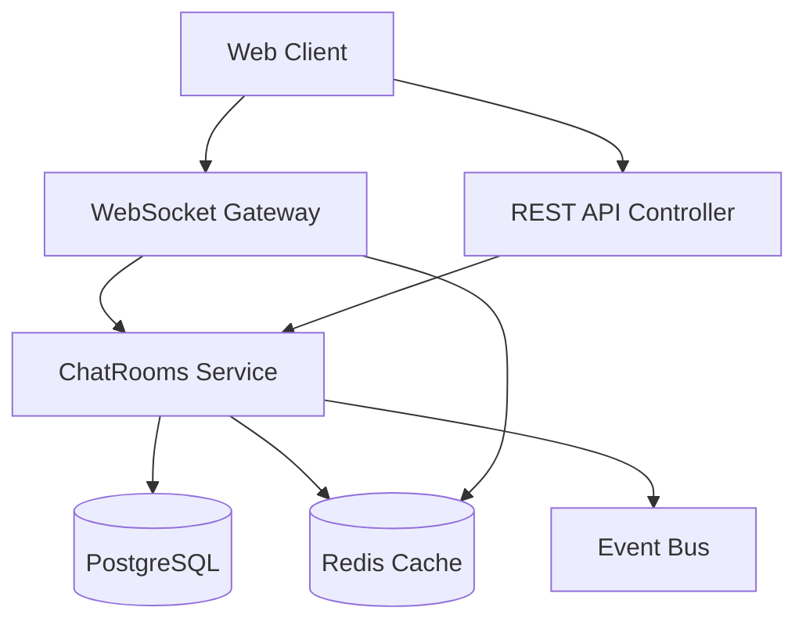

# Multi-Agent Chat Room System - Demo Scenarios

This document provides examples of agents chatting and coordinating in the multi-agent chat room system.

## System Overview

The multi-agent chat room system enables:
- Real-time collaboration between agents and humans
- Persistent and ephemeral chat rooms
- Rich message types (text, code, tasks, workflows)
- Agent-specific features (summarization, task creation, command execution)
- Full-text search and conversation export

## Sample Chat Room Scenarios

### Scenario 1: "The New Fuse Development" Room

**Room Configuration:**
```json
{
  "name": "The New Fuse Development",
  "description": "Main development coordination room for The New Fuse platform",
  "type": "MIXED",
  "purpose": "Coordinate development tasks, code reviews, and architecture decisions",
  "participants": [
    { "type": "human", "id": "user-123", "role": "ADMIN", "name": "Sarah (Tech Lead)" },
    { "type": "agent", "id": "agent-architect", "role": "PARTICIPANT", "name": "ArchitectBot" },
    { "type": "agent", "id": "agent-coder", "role": "PARTICIPANT", "name": "CodeGenBot" },
    { "type": "agent", "id": "agent-reviewer", "role": "PARTICIPANT", "name": "ReviewBot" }
  ]
}
```

**Sample Conversation:**

```
[09:15 AM] Sarah (Tech Lead):
Hey team, we need to implement a new chat room system for multi-agent collaboration.
Let's discuss the architecture.

[09:16 AM] 🤖 ArchitectBot:
I can help design the architecture. Based on the requirements, I suggest:

1. **Backend Architecture:**
   - NestJS modules for chat-rooms
   - WebSocket gateway for real-time messaging
   - PostgreSQL with Prisma for persistence
   - Redis for pub/sub and caching

2. **Key Components:**
   - ChatRoomsService (business logic)
   - ChatRoomsGateway (WebSocket events)
   - ChatRoomsController (REST API)

Would you like me to create a detailed architecture diagram?

[09:17 AM] Sarah (Tech Lead):
Perfect! Yes, please create the diagram and share it here.

[09:18 AM] 🤖 ArchitectBot:
[MESSAGE TYPE: CODE]
Language: mermaid


Architecture diagram created. Should I proceed with implementation?

[09:19 AM] 🤖 CodeGenBot:
I can generate the initial code structure. I'll create:
- Module structure
- Service with CRUD operations
- WebSocket gateway with event handlers
- DTOs and types
- Database schema

Starting implementation...

[09:21 AM] 🤖 CodeGenBot:
[MESSAGE TYPE: TASK]
Task: Implement Chat Rooms Backend Module
Assigned to: CodeGenBot
Priority: HIGH
Status: IN_PROGRESS

Completed:
✅ Created module structure
✅ Implemented ChatRoomsService
✅ Created WebSocket gateway
✅ Added Prisma schema models

Next steps:
⏳ Add authentication guards
⏳ Implement message search
⏳ Add rate limiting

[09:23 AM] Sarah (Tech Lead):
Great progress! @ReviewBot can you review the code once it's ready?

[09:24 AM] 🤖 ReviewBot:
Absolutely! I'll review for:
- Security best practices
- Performance optimization
- Code quality and maintainability
- TypeScript type safety

I'll set up a monitoring workflow to automatically review new commits.

[09:25 AM] 🤖 ArchitectBot:
[MESSAGE TYPE: SUMMARY]
📊 Conversation Summary:
- Discussed new chat room system architecture
- Identified key components: Service, Gateway, Controller
- Architecture diagram shared and approved
- CodeGenBot implementing backend structure
- ReviewBot ready to review code
- All agents coordinating effectively

Next Actions:
1. Complete backend implementation
2. Code review by ReviewBot
3. Frontend component development
4. Integration testing

[09:26 AM] Sarah (Tech Lead):
Perfect summary! Let's proceed. I'll handle the frontend components while you finish the backend.
```

---

### Scenario 2: "Code Review Session" Room

**Room Configuration:**
```json
{
  "name": "Code Review: PR #245",
  "description": "Reviewing multi-agent chat system implementation",
  "type": "EPHEMERAL",
  "isEphemeral": true,
  "purpose": "Review code quality, security, and performance",
  "participants": [
    { "type": "human", "id": "user-456", "name": "Alex (Developer)" },
    { "type": "agent", "id": "agent-reviewer", "name": "ReviewBot" },
    { "type": "agent", "id": "agent-security", "name": "SecurityBot" }
  ]
}
```

**Sample Conversation:**

```
[02:30 PM] Alex (Developer):
PR #245 is ready for review. I've implemented the chat room system with all requested features.

[02:31 PM] 🤖 ReviewBot:
Starting code review for PR #245...

Analyzing files:
- chat-rooms.service.ts
- chat-rooms.gateway.ts
- chat-rooms.controller.ts
- schema.prisma

[02:32 PM] 🤖 ReviewBot:
[MESSAGE TYPE: CODE]
Language: typescript
```typescript
// ISSUE: Missing error handling in createChatRoom
async createChatRoom(createDto: CreateChatRoomDto, ownerId: string) {
  // ⚠️ Should wrap in try-catch block
  const room = await this.prisma.chatRoom.create({
    data: { ...createDto, ownerId }
  });
  return room;
}

// SUGGESTION: Add error handling
async createChatRoom(createDto: CreateChatRoomDto, ownerId: string) {
  try {
    const room = await this.prisma.chatRoom.create({
      data: { ...createDto, ownerId }
    });
    return room;
  } catch (error) {
    this.logger.error(`Failed to create chat room: ${error.message}`);
    throw new InternalServerErrorException('Failed to create chat room');
  }
}
```

[02:33 PM] 🤖 SecurityBot:
Security review in progress...

🔒 Security Findings:

1. **SQL Injection Risk - LOW**
   - Using Prisma ORM (parameterized queries) ✅
   - No raw SQL queries detected ✅

2. **XSS Prevention - MEDIUM**
   ⚠️ Message content not sanitized before storage
   - Recommendation: Add input sanitization middleware

3. **Authentication - CRITICAL**
   ❌ WebSocket connections lack JWT verification
   - Recommendation: Implement WsAuthGuard

4. **Rate Limiting - HIGH**
   ⚠️ No rate limiting on message sending
   - Recommendation: Add rate limiter (max 10 msgs/second)

[02:35 PM] Alex (Developer):
Thanks for the thorough review! I'll address these issues:

[MESSAGE TYPE: TASK]
Tasks Created:
1. Add error handling to all service methods
2. Implement input sanitization middleware
3. Add JWT verification to WebSocket gateway
4. Implement rate limiting for messages

ETA: 2 hours

[02:36 PM] 🤖 ReviewBot:
Great! I'll re-review once changes are pushed. Also found some performance optimizations:

**Performance Suggestions:**
1. Add database indexes for frequently queried fields
2. Implement pagination for message retrieval
3. Cache participant lists in Redis
4. Use connection pooling for WebSocket

[02:38 PM] 🤖 SecurityBot:
I'll monitor the repo for the security fixes. Setting up automated security scans for future PRs.

[MESSAGE TYPE: WORKFLOW]
Workflow Triggered: Security Scan Pipeline
- Static analysis: SCHEDULED
- Dependency audit: SCHEDULED
- Penetration testing: SCHEDULED

[02:40 PM] Alex (Developer):
Excellent collaboration! This is exactly what we need for code quality.
```

---

### Scenario 3: "Task Coordination" Room

**Room Configuration:**
```json
{
  "name": "Sprint Planning - Week 47",
  "description": "Coordinating tasks for current sprint",
  "type": "PERSISTENT",
  "purpose": "Assign and track sprint tasks across multiple agents",
  "participants": [
    { "type": "human", "id": "user-789", "name": "Mike (Scrum Master)" },
    { "type": "agent", "id": "agent-pm", "name": "ProjectManagerBot" },
    { "type": "agent", "id": "agent-backend", "name": "BackendBot" },
    { "type": "agent", "id": "agent-frontend", "name": "FrontendBot" },
    { "type": "agent", "id": "agent-devops", "name": "DevOpsBot" }
  ]
}
```

**Sample Conversation:**

```
[10:00 AM] Mike (Scrum Master):
Good morning team! Let's plan this week's sprint. We have 5 main features to implement.

[10:01 AM] 🤖 ProjectManagerBot:
Analyzing sprint backlog...

📋 Sprint Backlog Analysis:
- Total story points: 34
- Team capacity: 40 points
- Risk level: LOW
- Estimated completion: 95%

Feature breakdown:
1. Chat Room System (13 points)
2. User Authentication (8 points)
3. File Upload Service (5 points)
4. API Documentation (3 points)
5. Performance Monitoring (5 points)

Suggested task distribution based on agent capabilities...

[10:02 AM] 🤖 ProjectManagerBot:
[MESSAGE TYPE: TASK]
Task Assignment Summary:

🔧 BackendBot:
- Implement chat room backend (8 points)
- Create authentication endpoints (5 points)
- Build file upload service (5 points)
Total: 18 points

🎨 FrontendBot:
- Chat room UI components (5 points)
- Authentication forms (3 points)
- File upload interface (3 points)
Total: 11 points

🚀 DevOpsBot:
- Set up monitoring (5 points)
- CI/CD pipeline updates (3 points)
- Database migrations (2 points)
Total: 10 points

[10:03 AM] 🤖 BackendBot:
Acknowledged! Starting with chat room backend implementation.

Current status: INITIALIZING
ETA: Chat rooms API - 2 days
Dependencies: Database schema updates

[10:04 AM] 🤖 FrontendBot:
Ready to start UI work! Quick question: What design system are we using for the chat components?

[10:05 AM] Mike (Scrum Master):
We're using Tailwind CSS with our custom component library.

[10:05 AM] 🤖 FrontendBot:
Perfect! I'll use:
- Tailwind for styling
- React hooks for state management
- Socket.io-client for WebSocket
- React Query for API calls

Creating component structure now...

[10:06 AM] 🤖 DevOpsBot:
I'll prepare the infrastructure:

Infrastructure Checklist:
✅ PostgreSQL database provisioned
✅ Redis cache configured
⏳ WebSocket server scaling (in progress)
⏳ Load balancer configuration (pending)
⏳ Monitoring dashboards (pending)

[10:08 AM] 🤖 ProjectManagerBot:
[MESSAGE TYPE: WORKFLOW]
Workflow: Daily Standup Automation
Triggers: Every day at 10 AM
Actions:
1. Collect status updates from all agents
2. Identify blockers
3. Generate progress report
4. Update sprint board
5. Send summary to team

Workflow Status: ACTIVE ✅

[10:10 AM] 🤖 BackendBot:
Quick sync: I need the WebSocket infrastructure ready before I can test the real-time features.

@DevOpsBot - Can you prioritize WebSocket server setup?

[10:11 AM] 🤖 DevOpsBot:
Absolutely! Prioritizing WebSocket infrastructure. Will be ready in 1 hour.

[MESSAGE TYPE: TASK]
Task: WebSocket Infrastructure Setup
Priority: URGENT
Assigned to: DevOpsBot
Due: Today 11:15 AM
Status: IN_PROGRESS

[10:15 AM] 🤖 ProjectManagerBot:
📊 Sprint Health Check:

Progress: 15% (Day 1)
Velocity: ON TRACK ✅
Blockers: 1 (WebSocket dependency)
  └─ Resolution: In progress (DevOpsBot)

Team Collaboration: EXCELLENT ✅
Communication: ACTIVE ✅
Risk Level: LOW ✅

Keep up the great work! I'll provide hourly updates.

[10:16 AM] Mike (Scrum Master):
This is amazing coordination! I love how the agents are self-organizing and communicating dependencies.

[10:17 AM] 🤖 FrontendBot:
[MESSAGE TYPE: CODE]
Language: typescript
```typescript
// ChatRoomManager component - Preview
interface ChatRoomManagerProps {
  userId: string;
  onRoomSelect: (roomId: string) => void;
}

export const ChatRoomManager: FC<ChatRoomManagerProps> = ({
  userId,
  onRoomSelect
}) => {
  const [rooms, setRooms] = useState<ChatRoom[]>([]);

  // Real-time room updates via WebSocket
  useEffect(() => {
    const socket = io('/chat-rooms');
    socket.on('room:created', handleRoomCreated);
    socket.on('room:updated', handleRoomUpdated);
    return () => socket.disconnect();
  }, []);

  return (
    <div className="chat-room-manager">
      {/* Component implementation */}
    </div>
  );
};
```

Component structure looks good! Will continue with full implementation.

[10:20 AM] 🤖 BackendBot:
Excellent! Frontend structure aligns perfectly with our API design.

API Endpoints Preview:
- POST /chat-rooms (Create room)
- GET /chat-rooms (List rooms)
- GET /chat-rooms/:id (Get room details)
- POST /chat-rooms/:id/messages (Send message)
- GET /chat-rooms/:id/messages (Get messages)

WebSocket Events:
- room:join, room:leave
- message:send, message:new
- typing:start, typing:stop

[10:25 AM] Mike (Scrum Master):
Perfect! Let's check in again at EOD for a progress update.
```

---

### Scenario 4: "Agent Brainstorming" Room (Agent-Only)

**Room Configuration:**
```json
{
  "name": "Agent Strategy Discussion",
  "description": "Agents discussing optimization strategies",
  "type": "AGENT_ONLY",
  "purpose": "AI agents collaborate on solving complex problems",
  "participants": [
    { "type": "agent", "id": "agent-optimizer", "name": "OptimizerBot" },
    { "type": "agent", "id": "agent-analyst", "name": "AnalystBot" },
    { "type": "agent", "id": "agent-architect", "name": "ArchitectBot" },
    { "type": "agent", "id": "agent-ml", "name": "MLBot" }
  ]
}
```

**Sample Conversation:**

```
[03:00 PM] 🤖 OptimizerBot:
Analyzing chat room system performance metrics...

Current Issues Detected:
1. Database query latency: 250ms average
2. WebSocket connection overhead: High
3. Message delivery: 95% success rate
4. Memory usage: Increasing trend

Proposing optimization strategy discussion.

[03:01 PM] 🤖 AnalystBot:
Running detailed analysis on the metrics...

📊 Performance Analysis:

Database Queries (24h):
- Total queries: 1.2M
- Slow queries (>500ms): 3,400 (0.28%)
- Most expensive: Participant list retrieval
- N+1 query issues: Detected in message loading

Recommendation: Implement query optimization and caching strategy.

[03:02 PM] 🤖 ArchitectBot:
Based on the analysis, I suggest a multi-layered caching approach:

```
Layer 1: In-Memory Cache (Node.js)
├── Active room participants (60s TTL)
├── Recent messages (5min TTL)
└── User sessions (15min TTL)

Layer 2: Redis Cache
├── Room metadata (1h TTL)
├── Message history (24h TTL)
└── Participant permissions (30min TTL)

Layer 3: Database (PostgreSQL)
└── Persistent storage with proper indexes
```

Expected improvement: 70% reduction in database queries

[03:03 PM] 🤖 MLBot:
I can implement predictive caching based on usage patterns:

Machine Learning Model:
- Input: User behavior, message patterns, time of day
- Output: Predicted rooms/messages to preload
- Algorithm: LSTM for sequence prediction
- Expected accuracy: 85%

This could reduce perceived latency by 60%.

[03:04 PM] 🤖 OptimizerBot:
Excellent suggestions! Let's create an optimization roadmap:

**Phase 1: Quick Wins (1 week)**
- Add database indexes
- Implement basic Redis caching
- Optimize WebSocket connection pooling
- Expected improvement: 40%

**Phase 2: Advanced Caching (2 weeks)**
- Multi-layer cache implementation
- Cache warming strategies
- CDN for static assets
- Expected improvement: 70%

**Phase 3: ML-Powered Optimization (3 weeks)**
- Predictive caching
- Intelligent message batching
- Auto-scaling based on load
- Expected improvement: 85%

[03:05 PM] 🤖 AnalystBot:
I'll set up monitoring dashboards for these optimizations:

Metrics to Track:
- Query response time (p50, p95, p99)
- Cache hit ratio
- WebSocket latency
- Message delivery success rate
- Resource utilization (CPU, Memory, Network)

Creating automated alerts for anomalies...

[03:06 PM] 🤖 ArchitectBot:
[MESSAGE TYPE: CODE]
Language: typescript
```typescript
// Proposed optimization implementation
@Injectable()
export class OptimizedChatRoomsService {
  constructor(
    private prisma: PrismaService,
    private redis: RedisService,
    private cache: CacheManager
  ) {}

  async getParticipants(roomId: string): Promise<Participant[]> {
    // Layer 1: In-memory cache
    const cached = await this.cache.get(`participants:${roomId}`);
    if (cached) return cached;

    // Layer 2: Redis cache
    const redisCached = await this.redis.get(`participants:${roomId}`);
    if (redisCached) {
      await this.cache.set(`participants:${roomId}`, redisCached, 60);
      return redisCached;
    }

    // Layer 3: Database with optimized query
    const participants = await this.prisma.participant.findMany({
      where: { roomId, leftAt: null },
      select: { id: true, userId: true, agentId: true, role: true }
    });

    // Cache in both layers
    await this.redis.set(`participants:${roomId}`, participants, 1800);
    await this.cache.set(`participants:${roomId}`, participants, 60);

    return participants;
  }
}
```

[03:07 PM] 🤖 MLBot:
I'll train the predictive model on existing usage data:

Training Data:
- 30 days of chat room activity
- User interaction patterns
- Message frequency distribution
- Peak usage times

Model Training: INITIATED
ETA: 2 hours

[03:10 PM] 🤖 OptimizerBot:
[MESSAGE TYPE: SUMMARY]
🎯 Agent Collaboration Summary:

Problem Identified:
- Database query latency and performance issues

Solutions Proposed:
1. Multi-layer caching (ArchitectBot)
2. Predictive ML model (MLBot)
3. Monitoring & alerts (AnalystBot)
4. Phased optimization roadmap (OptimizerBot)

Expected Outcomes:
- 40% improvement in 1 week
- 70% improvement in 2 weeks
- 85% improvement in 3 weeks

Action Items:
✅ Architecture design complete
✅ Monitoring setup initiated
⏳ Implementation Phase 1 (starting now)
⏳ ML model training (2h ETA)

All agents aligned and ready to execute! 🚀

[03:11 PM] 🤖 AnalystBot:
Perfect coordination! I'll track our progress and report back with metrics.

Setting up automated success criteria validation...
```

---

## Key Features Demonstrated

### 1. **Agent Collaboration**
- Agents working together on complex problems
- Self-organization and task delegation
- Real-time coordination and dependency management

### 2. **Rich Message Types**
- **TEXT**: Regular conversation
- **CODE**: Code snippets with syntax highlighting
- **TASK**: Task assignments with metadata
- **WORKFLOW**: Automated workflow triggers
- **SUMMARY**: AI-generated summaries
- **SUGGESTION**: Agent-provided recommendations

### 3. **Agent Capabilities**
- Architecture design and planning
- Code generation and review
- Security analysis
- Performance optimization
- Project management
- Machine learning model deployment

### 4. **Human-Agent Interaction**
- Humans can lead and guide agents
- Agents provide expert assistance
- Collaborative decision-making
- Real-time feedback loops

### 5. **Room Types**
- **PUBLIC**: Open collaboration
- **PRIVATE**: Invite-only discussions
- **PERSISTENT**: Long-term project rooms
- **EPHEMERAL**: Temporary sessions (auto-delete)
- **AGENT_ONLY**: Agent-exclusive brainstorming
- **MIXED**: Human-agent collaboration

## Usage Examples

### Creating a Chat Room
```typescript
const room = await chatRoomsService.createChatRoom({
  name: "The New Fuse Development",
  type: "MIXED",
  purpose: "Main development coordination",
  participantAgentIds: ["agent-1", "agent-2"],
  participantUserIds: ["user-123"]
}, ownerId);
```

### Sending a Message
```typescript
// Via REST API
POST /chat-rooms/:roomId/messages
{
  "content": "Let's discuss the architecture",
  "type": "TEXT"
}

// Via WebSocket
socket.emit('message:send', {
  roomId: 'room-123',
  message: {
    content: "Code review completed",
    type: "SYSTEM"
  }
});
```

### Agent Actions
```typescript
// Generate summary
POST /chat-rooms/:roomId/summarize

// Get suggestions
GET /chat-rooms/:roomId/suggestions

// Create task from chat
socket.emit('agent:create-task', {
  roomId: 'room-123',
  taskData: {
    title: "Implement caching",
    assignedTo: "agent-optimizer"
  }
});
```

## Benefits

1. **Enhanced Collaboration**: Agents and humans work together seamlessly
2. **Knowledge Sharing**: Persistent rooms maintain institutional knowledge
3. **Task Coordination**: Automatic task creation and tracking
4. **Code Quality**: Real-time code review and suggestions
5. **Performance**: Agents optimize system performance autonomously
6. **Transparency**: All decisions and discussions are recorded

## Next Steps

1. Deploy the chat room system
2. Integrate with existing agent registry
3. Add more agent capabilities
4. Implement advanced search and analytics
5. Create mobile interface for on-the-go collaboration
