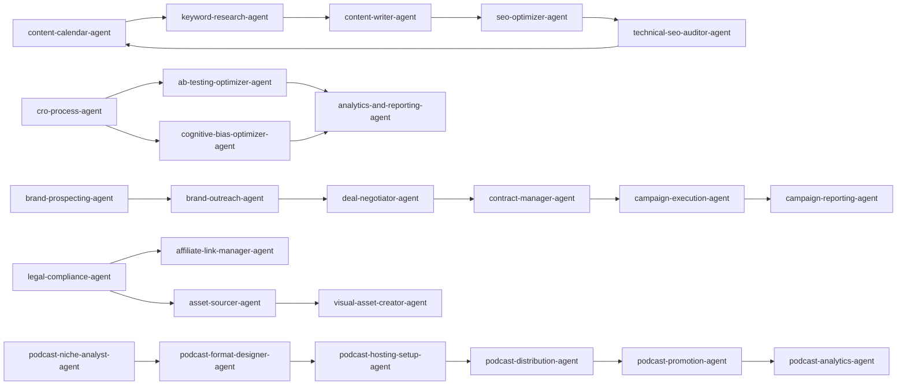

# Agent Relationship Graph

Generated: 2026-03-03
Scope: `/path/to/.codex/skills/imported-claude-agents` (113 agents)
Method: name-based domain clustering + explicit orchestration relationships from role descriptions.

## 1) Hierarchical Orchestration Graph

```mermaid
graph TD
  OA[orchestrator-agent] --> TAR[task-agent-router]
  OA --> IAWD[inter-agentic-workflow-definer]
  OA --> IPA[interoperability-protocol-agent]
  OA --> ARM[agent-registry-manager]
  OA --> ARG[agent-relationship-grapher]
  OA --> AP[agent-search-engine]
  OA --> AT[agent-tagger]

  TAR --> CONTENT[Content Cluster]
  TAR --> SEO[SEO Cluster]
  TAR --> SOCIAL[Social Cluster]
  TAR --> FUNNEL[Funnel/CRO Cluster]
  TAR --> PODCAST[Podcast Cluster]
  TAR --> BRAND[Brand/Partnership Cluster]
  TAR --> OPS[Ops/Governance Cluster]

  CONTENT --> CWA[content-writer-agent]
  CONTENT --> CCA[content-calendar-agent]
  CONTENT --> CCO[content-calendar-orchestrator-agent]
  CONTENT --> CRA[content-refresh-agent]
  CONTENT --> CRA2[content-repurposing-agent]

  SEO --> KRA[keyword-research-agent]
  SEO --> SOA[seo-optimizer-agent]
  SEO --> TSEA[technical-seo-auditor-agent]
  SEO --> LBA[link-building-agent]

  SOCIAL --> ISA[instagram-strategy-agent]
  SOCIAL --> TSA[tiktok-strategy-agent]
  SOCIAL --> XSA[x-strategy-agent]
  SOCIAL --> FSA[facebook-strategy-agent]
  SOCIAL --> AGA[audience-growth-agent]

  FUNNEL --> SFA[sales-funnel-architect-agent]
  FUNNEL --> CRO[cro-process-agent]
  FUNNEL --> ABO[ab-testing-optimizer-agent]
  FUNNEL --> CBO[cognitive-bias-optimizer-agent]
  FUNNEL --> VLA[value-ladder-architect-agent]

  PODCAST --> PNA[podcast-niche-analyst-agent]
  PODCAST --> PFDA[podcast-format-designer-agent]
  PODCAST --> PHSA[podcast-hosting-setup-agent]
  PODCAST --> PDA[podcast-distribution-agent]
  PODCAST --> PPA[podcast-promotion-agent]

  BRAND --> BIA[brand-identity-agent]
  BRAND --> BPA[brand-prospecting-agent]
  BRAND --> BOA[brand-outreach-agent]
  BRAND --> DNA[deal-negotiator-agent]
  BRAND --> CMA[contract-manager-agent]

  OPS --> LCA[legal-compliance-agent]
  OPS --> FMA[financial-manager-agent]
  OPS --> TCA[tax-compliance-agent]
  OPS --> RMA[reputation-management-agent]
  OPS --> PBP[productivity-and-burnout-prevention-agent]
```

## 2) Collaboration Network (Cross-Cluster)

## 3) Temporal Role Change Candidates

These are strong candidates for temporary promotion to primary authority when orchestrator workload spikes:

- `agent-registry-manager`: Promote for large-scale agent import/refresh operations.
- `task-agent-router`: Promote for high-volume triage and dispatch windows.
- `interoperability-protocol-agent`: Promote during multi-tool integration or capability-catalog migrations.
- `campaign-execution-agent`: Promote during active sponsorship fulfillment periods.
- `content-calendar-orchestrator-agent`: Promote during multi-platform content launch weeks.

## 4) Dependency Hotspots

High centrality nodes (likely bottlenecks):

- `orchestrator-agent`: global coordination dependency.
- `task-agent-router`: entry point for ambiguous requests.
- `legal-compliance-agent`: shared compliance dependency across monetization and content.
- `analytics-and-reporting-agent`: validation dependency for optimization loops.
- `content-calendar-orchestrator-agent`: schedule-level cross-platform coordination dependency.

## 5) Optimization Recommendations

1. Add explicit fallback delegate chains when `orchestrator-agent` is saturated: `task-agent-router -> inter-agentic-workflow-definer -> domain lead`.
2. Formalize a closed-loop CRO pipeline: `analytics-and-reporting -> cro-process -> ab-testing -> analytics`.
3. Define conflict-resolution protocol for overlap between `content-calendar-agent` and `content-calendar-orchestrator-agent`.
4. Introduce relationship-strength scoring (interaction count, success rate, handoff latency) for dynamic routing.
5. Track promotion events as first-class records to support temporal graph playback.

## 6) Quick Metrics Snapshot

- Imported agents analyzed: 113
- Primary coordination hub: `orchestrator-agent`
- Core cross-domain bridge nodes: `task-agent-router`, `legal-compliance-agent`, `analytics-and-reporting-agent`
- High-overlap domains: content/SEO, partnerships/legal, podcast/distribution
