# Agent Relationship Graph

Generated: 2026-04-07
Scope: registry-driven typed graph synthesis
Method: curated seed relationships + similarity expansion + typed routing heuristics.

## 1) Snapshot

- Nodes: 120
- Edges: 437
- Registry coverage: 65.93%

### Cluster Distribution

- funnel: 22
- brand: 17
- orchestration: 17
- podcast: 17
- social: 15
- content: 14
- ops: 11
- seo: 7

### Relationship Type Distribution

- fallback: 172
- depends_on: 155
- delegates: 54
- feeds: 24
- routes_to: 10
- handoff: 5
- measured_by: 3
- governs: 2
- orchestrates: 2
- analyzes: 1
- enables: 1
- enriches: 1
- feedback: 1
- gates: 1
- indexes_for: 1
- overlaps_with: 1
- requires: 1
- supplies: 1
- validated_by: 1

## 2) Top Connectivity Hubs

- task-agent-router: 26
- orchestrator-agent: 20
- legal-compliance-agent: 13
- seo-optimizer-agent: 13
- sponsorship-outreach-agent: 13
- podcast-hosting-setup-agent: 12
- podcast-promotion-agent: 12
- campaign-execution-agent: 11
- contract-manager-agent: 11
- keyword-research-agent: 11
- link-building-agent: 11
- personal-archaeology-source-team-orchestrator: 11
- ab-testing-optimizer-agent: 10
- analytics-and-reporting-agent: 10
- asset-sourcer-agent: 10
- competitive-intelligence-agent: 10
- content-calendar-agent: 10
- content-writer-agent: 10
- deal-negotiator-agent: 10
- niche-analyst-agent: 10

## 3) Representative Relationship Slice

```mermaid
graph TD
  orchestrator_agent[orchestrator-agent] -->|delegates| task_agent_router[task-agent-router]
  brand_outreach_agent[brand-outreach-agent] -->|fallback| brand_prospecting_agent[brand-prospecting-agent]
  brand_outreach_agent[brand-outreach-agent] -->|fallback| personal_brand_architect_agent[personal-brand-architect-agent]
  brand_prospecting_agent[brand-prospecting-agent] -->|fallback| personal_brand_architect_agent[personal-brand-architect-agent]
  episode_planner_agent[episode-planner-agent] -->|depends_on| equipment_recommendation_agent[equipment-recommendation-agent]
  local_ai_claude_code_cli[local-ai-claude-code-cli] -->|fallback| local_ai_gemini_cli[local-ai-gemini-cli]
  notes_ledger_investigator[notes-ledger-investigator] -->|fallback| repo_lineage_investigator[repo-lineage-investigator]
  notes_ledger_investigator[notes-ledger-investigator] -->|fallback| timeline_synthesis_investigator[timeline-synthesis-investigator]
  podcast_format_designer_agent[podcast-format-designer-agent] -->|depends_on| twip_orchestration_bridge[twip-orchestration-bridge]
  repo_lineage_investigator[repo-lineage-investigator] -->|fallback| timeline_synthesis_investigator[timeline-synthesis-investigator]
  podcast_hosting_setup_agent[podcast-hosting-setup-agent] -->|feeds| podcast_distribution_agent[podcast-distribution-agent]
  podcast_hosting_setup_agent[podcast-hosting-setup-agent] -->|handoff| podcast_distribution_agent[podcast-distribution-agent]
  cro_process_agent[cro-process-agent] -->|delegates| ab_testing_optimizer_agent[ab-testing-optimizer-agent]
  cro_process_agent[cro-process-agent] -->|orchestrates| ab_testing_optimizer_agent[ab-testing-optimizer-agent]
  deal_negotiator_agent[deal-negotiator-agent] -->|depends_on| contract_manager_agent[contract-manager-agent]
  deal_negotiator_agent[deal-negotiator-agent] -->|requires| contract_manager_agent[contract-manager-agent]
  content_writer_agent[content-writer-agent] -->|feeds| seo_optimizer_agent[seo-optimizer-agent]
  content_writer_agent[content-writer-agent] -->|handoff| seo_optimizer_agent[seo-optimizer-agent]
  contract_manager_agent[contract-manager-agent] -->|depends_on| campaign_execution_agent[campaign-execution-agent]
  contract_manager_agent[contract-manager-agent] -->|gates| campaign_execution_agent[campaign-execution-agent]
  brand_prospecting_agent[brand-prospecting-agent] -->|feeds| brand_outreach_agent[brand-outreach-agent]
  legal_compliance_agent[legal-compliance-agent] -->|delegates| affiliate_link_manager_agent[affiliate-link-manager-agent]
  legal_compliance_agent[legal-compliance-agent] -->|governs| affiliate_link_manager_agent[affiliate-link-manager-agent]
  ab_testing_optimizer_agent[ab-testing-optimizer-agent] -->|depends_on| analytics_and_reporting_agent[analytics-and-reporting-agent]
  ab_testing_optimizer_agent[ab-testing-optimizer-agent] -->|measured_by| analytics_and_reporting_agent[analytics-and-reporting-agent]
  legal_compliance_agent[legal-compliance-agent] -->|delegates| asset_sourcer_agent[asset-sourcer-agent]
  legal_compliance_agent[legal-compliance-agent] -->|governs| asset_sourcer_agent[asset-sourcer-agent]
  campaign_execution_agent[campaign-execution-agent] -->|feeds| campaign_reporting_agent[campaign-reporting-agent]
  campaign_execution_agent[campaign-execution-agent] -->|handoff| campaign_reporting_agent[campaign-reporting-agent]
  keyword_research_agent[keyword-research-agent] -->|feeds| content_writer_agent[content-writer-agent]
  podcast_distribution_agent[podcast-distribution-agent] -->|enables| podcast_promotion_agent[podcast-promotion-agent]
  podcast_distribution_agent[podcast-distribution-agent] -->|feeds| podcast_promotion_agent[podcast-promotion-agent]
  agent_tagger[agent-tagger] -->|enriches| agent_search_engine[agent-search-engine]
  brand_outreach_agent[brand-outreach-agent] -->|feeds| deal_negotiator_agent[deal-negotiator-agent]
  brand_outreach_agent[brand-outreach-agent] -->|handoff| deal_negotiator_agent[deal-negotiator-agent]
  content_calendar_agent[content-calendar-agent] -->|depends_on| keyword_research_agent[keyword-research-agent]
  orchestrator_agent[orchestrator-agent] -->|delegates| agent_registry_manager[agent-registry-manager]
  orchestrator_agent[orchestrator-agent] -->|delegates| agent_relationship_grapher[agent-relationship-grapher]
  orchestrator_agent[orchestrator-agent] -->|delegates| agent_search_engine[agent-search-engine]
  orchestrator_agent[orchestrator-agent] -->|delegates| agent_tagger[agent-tagger]
  orchestrator_agent[orchestrator-agent] -->|delegates| content_calendar_orchestrator_agent[content-calendar-orchestrator-agent]
  orchestrator_agent[orchestrator-agent] -->|delegates| gemini[gemini]
  orchestrator_agent[orchestrator-agent] -->|delegates| inter_agentic_workflow_definer[inter-agentic-workflow-definer]
  orchestrator_agent[orchestrator-agent] -->|delegates| interoperability_protocol_agent[interoperability-protocol-agent]
  orchestrator_agent[orchestrator-agent] -->|delegates| orchestrator_agent_copy[orchestrator-agent-copy]
  orchestrator_agent[orchestrator-agent] -->|delegates| personal_archaeology_integrity_team_orchestrator[personal-archaeology-integrity-team-orchestrator]
  orchestrator_agent[orchestrator-agent] -->|delegates| personal_archaeology_master_orchestrator[personal-archaeology-master-orchestrator]
  orchestrator_agent[orchestrator-agent] -->|delegates| personal_archaeology_narrative_team_orchestrator[personal-archaeology-narrative-team-orchestrator]
  orchestrator_agent[orchestrator-agent] -->|delegates| personal_archaeology_source_team_orchestrator[personal-archaeology-source-team-orchestrator]
  orchestrator_agent[orchestrator-agent] -->|delegates| personal_historical_archaeologist[personal-historical-archaeologist]
  orchestrator_agent[orchestrator-agent] -->|delegates| print_on_demand_manager_agent[print-on-demand-manager-agent]
  podcast_niche_analyst_agent[podcast-niche-analyst-agent] -->|feeds| podcast_format_designer_agent[podcast-format-designer-agent]
  algorithm_adaptation_agent[algorithm-adaptation-agent] -->|depends_on| yt_niche_strategy_agent[yt-niche-strategy-agent]
  keyword_research_agent[keyword-research-agent] -->|depends_on| niche_analyst_agent[niche-analyst-agent]
  monetization_strategy_agent[monetization-strategy-agent] -->|feeds| scriptwriter_agent[scriptwriter-agent]
  oto_sequence_architect_agent[oto-sequence-architect-agent] -->|fallback| value_ladder_architect_agent[value-ladder-architect-agent]
  podcast_affiliate_agent[podcast-affiliate-agent] -->|fallback| podcast_niche_analyst_agent[podcast-niche-analyst-agent]
  podcast_promotion_agent[podcast-promotion-agent] -->|depends_on| podcast_analytics_agent[podcast-analytics-agent]
  podcast_promotion_agent[podcast-promotion-agent] -->|measured_by| podcast_analytics_agent[podcast-analytics-agent]
  cro_process_agent[cro-process-agent] -->|delegates| cognitive_bias_optimizer_agent[cognitive-bias-optimizer-agent]
  cro_process_agent[cro-process-agent] -->|orchestrates| cognitive_bias_optimizer_agent[cognitive-bias-optimizer-agent]
  asset_sourcer_agent[asset-sourcer-agent] -->|feeds| visual_asset_creator_agent[visual-asset-creator-agent]
  asset_sourcer_agent[asset-sourcer-agent] -->|supplies| visual_asset_creator_agent[visual-asset-creator-agent]
  cognitive_bias_optimizer_agent[cognitive-bias-optimizer-agent] -->|depends_on| analytics_and_reporting_agent[analytics-and-reporting-agent]
  cognitive_bias_optimizer_agent[cognitive-bias-optimizer-agent] -->|measured_by| analytics_and_reporting_agent[analytics-and-reporting-agent]
  task_agent_router[task-agent-router] -->|delegates| analytics_and_reporting_agent[analytics-and-reporting-agent]
  task_agent_router[task-agent-router] -->|delegates| campaign_execution_agent[campaign-execution-agent]
  task_agent_router[task-agent-router] -->|delegates| community_manager_agent[community-manager-agent]
  task_agent_router[task-agent-router] -->|delegates| content_repurposing_agent[content-repurposing-agent]
  task_agent_router[task-agent-router] -->|delegates| cro_process_agent[cro-process-agent]
  task_agent_router[task-agent-router] -->|delegates| keyword_research_agent[keyword-research-agent]
  task_agent_router[task-agent-router] -->|delegates| legal_compliance_agent[legal-compliance-agent]
  task_agent_router[task-agent-router] -->|delegates| podcast_promotion_agent[podcast-promotion-agent]
  code_fossil_investigator[code-fossil-investigator] -->|depends_on| media_evidence_investigator[media-evidence-investigator]
  code_fossil_investigator[code-fossil-investigator] -->|depends_on| notes_ledger_investigator[notes-ledger-investigator]
  code_fossil_investigator[code-fossil-investigator] -->|depends_on| repo_lineage_investigator[repo-lineage-investigator]
  facebook_strategy_agent[facebook-strategy-agent] -->|fallback| social_selling_agent[social-selling-agent]
  media_evidence_investigator[media-evidence-investigator] -->|depends_on| notes_ledger_investigator[notes-ledger-investigator]
  media_evidence_investigator[media-evidence-investigator] -->|depends_on| repo_lineage_investigator[repo-lineage-investigator]
  media_evidence_investigator[media-evidence-investigator] -->|depends_on| timeline_synthesis_investigator[timeline-synthesis-investigator]
```

