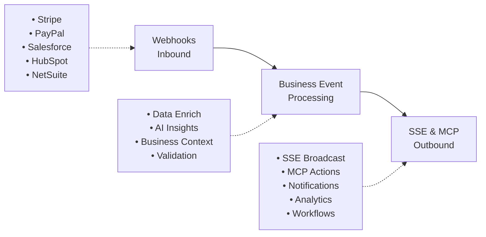

# Business Events Cloudflare Worker

A serverless Cloudflare Worker implementation for processing business events, handling webhooks, and providing real-time SSE (Server-Sent Events) capabilities with MCP (Model Context Protocol) integration.

## Features

- **Multi-Platform Webhook Processing**: Handles webhooks from Stripe, PayPal, Salesforce, HubSpot, and NetSuite
- **Business Intelligence**: Converts raw webhook data into enriched business events with AI-powered insights
- **Real-time SSE Broadcasting**: Streams events to connected clients in real-time
- **MCP Action Triggers**: Automatically triggers external actions based on business rules
- **Comprehensive Logging**: Structured logging with multiple severity levels
- **Type Safety**: Full TypeScript implementation with comprehensive type definitions

## Architecture



## Project Structure

```text
cloudflare-worker/
├── src/
│   ├── index.ts                    # Main worker entry point
│   ├── types/
│   │   ├── env.ts                  # Environment variables types
│   │   └── business-events.ts      # Business event type definitions
│   ├── processors/
│   │   ├── BusinessEventProcessor.ts      # Main event processor
│   │   ├── StripeBusinessProcessor.ts     # Stripe webhook handler
│   │   ├── PayPalBusinessProcessor.ts     # PayPal webhook handler
│   │   ├── SalesforceBusinessProcessor.ts # Salesforce webhook handler
│   │   ├── HubSpotBusinessProcessor.ts    # HubSpot webhook handler
│   │   └── NetSuiteBusinessProcessor.ts   # NetSuite webhook handler
│   ├── services/
│   │   ├── SSEBroadcaster.ts       # Real-time event broadcasting
│   │   └── MCPActionTrigger.ts     # External action triggering
│   └── utils/
│       ├── helpers.ts              # Utility functions
│       └── Logger.ts               # Structured logging
├── package.json
├── wrangler.toml                   # Cloudflare Worker configuration
├── tsconfig.json                   # TypeScript configuration
└── README.md
```

## Quick Start

### Prerequisites

- Node.js 18+ and npm
- Cloudflare account with Workers access
- Wrangler CLI installed globally

### Installation

1. **Clone and setup**:

   ```bash
   cd cloudflare-worker
   npm install
   ```

2. **Configure Wrangler**:

   ```bash
   # Login to Cloudflare
   wrangler login
   
   # Update wrangler.toml with your account details
   # Replace 'your-kv-namespace-id' with actual KV namespace ID
   ```

3. **Set up secrets**:

   ```bash
   # Webhook secrets
   wrangler secret put STRIPE_WEBHOOK_SECRET
   wrangler secret put PAYPAL_WEBHOOK_SECRET
   wrangler secret put SALESFORCE_WEBHOOK_SECRET
   wrangler secret put HUBSPOT_WEBHOOK_SECRET
   wrangler secret put NETSUITE_WEBHOOK_SECRET
   
   # API keys
   wrangler secret put SENDGRID_API_KEY
   wrangler secret put CRM_API_KEY
   wrangler secret put ANALYTICS_API_KEY
   wrangler secret put SLACK_WEBHOOK_URL
   ```

4. **Create KV namespace**:

   ```bash
   wrangler kv:namespace create "BUSINESS_EVENTS"
   # Update the namespace ID in wrangler.toml
   ```

### Development

```bash
# Start development server
npm run dev

# Type checking
npm run type-check

# Linting
npm run lint
npm run lint:fix

# Testing
npm test
npm run test:watch
```

### Deployment

```bash
# Deploy to staging
wrangler publish --env staging

# Deploy to production
wrangler publish --env production
```

## API Endpoints

### Webhook Endpoints

- `POST /webhooks/stripe` - Stripe webhook handler
- `POST /webhooks/paypal` - PayPal webhook handler
- `POST /webhooks/salesforce` - Salesforce webhook handler
- `POST /webhooks/hubspot` - HubSpot webhook handler
- `POST /webhooks/netsuite` - NetSuite webhook handler

### SSE Endpoints

- `GET /sse/connect` - Establish SSE connection
- `GET /sse/events/:connectionId` - Polling endpoint for events
- `POST /sse/subscribe` - Update subscription preferences

### Management Endpoints

- `GET /health` - Health check
- `GET /metrics` - System metrics
- `GET /mcp/actions` - List configured MCP actions
- `POST /mcp/actions` - Create new MCP action

## Configuration

### Environment Variables

Set via `wrangler.toml` or as secrets:

```toml
[env.production.vars]
ENVIRONMENT = "production"
LOGGING_LEVEL = "WARN"
METRICS_ENDPOINT = "https://api.yourdomain.com/metrics"
CRM_API_ENDPOINT = "https://crm.yourdomain.com/api"
ANALYTICS_ENDPOINT = "https://analytics.yourdomain.com/api"
```

### Webhook Configuration

Each webhook source requires:

1. Webhook secret for signature verification
2. Endpoint configuration in the source system
3. Event type mapping in the processor

Example webhook URL: `https://your-worker.your-subdomain.workers.dev/webhooks/stripe`

## Business Event Processing

### Event Flow

1. **Webhook Received**: Raw webhook payload validated and parsed
2. **Business Processing**: Event enriched with business context and AI insights
3. **SSE Broadcasting**: Real-time event streaming to connected clients
4. **MCP Actions**: Automated actions triggered based on business rules

### Event Types

- `payment_received` - Payment processed successfully
- `subscription_changed` - Subscription created, updated, or cancelled
- `customer_updated` - Customer data changed
- `lead_created` - New lead or opportunity created
- `invoice_generated` - Invoice created or updated
- `product_sold` - Product purchase completed

### Business Context Enhancement

Each event is enriched with:

- **Customer Intelligence**: Segmentation, lifetime value, health scores
- **Predictive Analytics**: Churn probability, conversion likelihood
- **Actionable Insights**: Recommended next steps and automation triggers
- **Risk Assessment**: Payment, security, and business risk factors

## MCP Actions

Automated actions triggered by business events:

### Email Actions

- Welcome emails for new customers
- Payment confirmations
- Subscription notifications
- Churn prevention emails

### CRM Integration

- Contact creation and updates
- Lead scoring and routing
- Opportunity management
- Account health monitoring

### Notifications

- Slack/Teams alerts for high-value transactions
- Sales team notifications for qualified leads
- Support ticket creation for failed payments
- Executive dashboards for key metrics

### Analytics

- Event tracking for business intelligence
- Custom metrics and KPIs
- Funnel analysis and conversion tracking
- Revenue forecasting data

## Real-time SSE

### Connection Management

```javascript
// Client-side SSE connection
const eventSource = new EventSource('/sse/connect?org=123&subscriptions=payment_*,customer_*');

eventSource.onmessage = function(event) {
  const businessEvent = JSON.parse(event.data);
  console.log('Business event received:', businessEvent);
};
```

### Subscription Patterns

- `*` - All events
- `payment_*` - All payment events
- `customer_updated` - Specific event type
- `stripe` - All events from specific source

## Monitoring and Observability

### Logging

Structured JSON logging with levels:

- `DEBUG` - Detailed execution information
- `INFO` - Business events and operations
- `WARN` - Unusual conditions
- `ERROR` - Failures and exceptions

### Metrics

Key metrics tracked:

- Webhook processing latency
- Business event throughput
- SSE connection count
- MCP action success rates
- Error rates by source

### Health Checks

```bash
curl https://your-worker.your-subdomain.workers.dev/health
```

Returns system status, connection counts, and performance metrics.

## Security

### Webhook Verification

All webhooks verify signatures using platform-specific methods:

- Stripe: HMAC-SHA256 signature verification
- PayPal: Certificate-based verification
- Salesforce: OAuth and IP allowlisting
- HubSpot: Signature verification
- NetSuite: Custom authentication

### Rate Limiting

Built-in rate limiting per organization:

- 1000 requests per minute per organization
- Exponential backoff for exceeded limits
- Priority queuing for critical events

### Data Privacy

- No sensitive data stored permanently
- PII handling follows GDPR guidelines
- Automatic data expiration policies
- Audit logging for compliance

## Troubleshooting

### Common Issues

1. **Webhook verification failures**:
   - Check webhook secrets are correctly set
   - Verify endpoint URLs in source systems
   - Review request headers and payload format

2. **SSE connection drops**:
   - Check network connectivity
   - Verify connection keep-alive settings
   - Review client-side error handling

3. **MCP action failures**:
   - Verify external API credentials
   - Check action configuration and triggers
   - Review rate limiting and timeouts

### Debug Mode

Enable verbose logging:

```bash
wrangler secret put LOGGING_LEVEL DEBUG
```

### Performance Optimization

- Use KV storage for caching
- Implement request batching
- Monitor CPU usage limits
- Optimize payload sizes

## Contributing

1. Follow TypeScript best practices
2. Add comprehensive type definitions
3. Include unit tests for new features
4. Update documentation for API changes
5. Ensure security best practices

## License

MIT License - see LICENSE file for details
