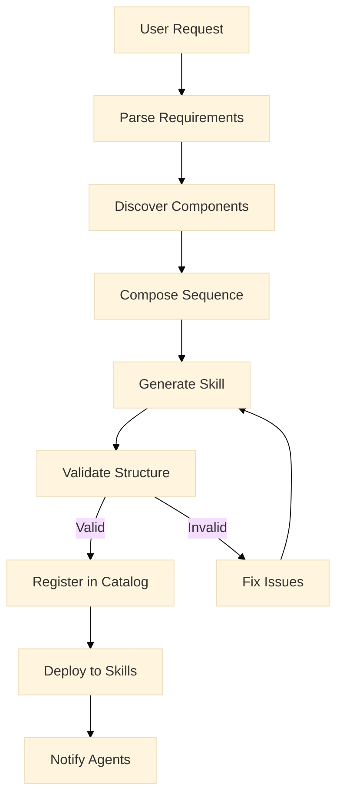

# TNF Meta-Skill Architecture

## Overview

The Meta-Skill system enables automatic generation of TNF skills based on
technology patterns, procedural sequences, and evolving best practices. This
architecture defines how skills are created, evolved, and maintained.

## Core Concepts

### What is a Meta-Skill?

A meta-skill is a skill that creates other skills. It:

- Understands the skill structure and format
- Maintains a catalog of technology components
- Generates procedural sequences
- Validates generated skills
- Manages skill evolution

### Technology Palette

The Technology Palette is the knowledge base of available components:

```yaml
palette:
  version: '2026.01'
  domains:
    orchestration:
      - name: 'MOE Top-K Routing'
        pattern_id: 'moe-topk-routing'
        maturity: 'stable'
        implementation: 'packages/kimi-orchestrator/src/'

      - name: 'Agent Pool Management'
        pattern_id: 'agent-pool-management'
        maturity: 'stable'

    communication:
      - name: 'A2A Protocol'
        spec: 'docs/agents-and-protocols/a2a-specification.md'
        maturity: 'beta'

      - name: 'MCP Integration'
        spec: 'docs/MCP-COMPLETE-API-WRAPPING.md'
        maturity: 'stable'

    database:
      - name: 'Drizzle ORM'
        version: '0.30+'
        maturity: 'stable'

      - name: 'PostgreSQL with pg_vector'
        version: '15+'
        maturity: 'stable'
```

## Architecture Components

### 1. Skill Generator

The Skill Generator creates new skills from templates and specifications:

```typescript
interface SkillGenerator {
  generate(input: SkillGenerationInput): Promise<GeneratedSkill>;
  validate(skill: GeneratedSkill): ValidationResult;
  register(skill: GeneratedSkill): Promise<void>;
}

interface SkillGenerationInput {
  domain: string;
  goal: string;
  requiredCapabilities: string[];
  techStack: string[];
  complexity: 'simple' | 'moderate' | 'complex';
  proceduralSteps?: ProceduralStep[];
}
```

### 2. Technology Catalog

Maintains the evolving palette of technologies:

```typescript
interface TechnologyCatalog {
  components: Map<string, TechnologyComponent>;
  patterns: Map<string, DesignPattern>;
  templates: Map<string, SkillTemplate>;

  addComponent(component: TechnologyComponent): void;
  deprecateComponent(id: string, replacement?: string): void;
  search(query: TechnologyQuery): TechnologyComponent[];
}

interface TechnologyComponent {
  id: string;
  name: string;
  domain: string;
  version: string;
  maturity: 'experimental' | 'beta' | 'stable' | 'deprecated';
  implementation?: string;
  documentation?: string;
  dependencies?: string[];
}
```

### 3. Procedural Sequence Engine

Generates step-by-step procedures from high-level goals:

```typescript
interface ProceduralSequenceEngine {
  composeSequence(
    goal: string,
    availableComponents: TechnologyComponent[]
  ): ProceduralSequence;

  optimizeSequence(
    sequence: ProceduralSequence,
    constraints: OptimizationConstraints
  ): ProceduralSequence;
}

interface ProceduralSequence {
  name: string;
  description: string;
  steps: ProceduralStep[];
  estimatedDuration: number;
  requiredTools: string[];
  errorHandling: ErrorHandler[];
}

interface ProceduralStep {
  order: number;
  title: string;
  description: string;
  command?: string;
  verification?: string;
  rollback?: string;
}
```

### 4. Evolution Manager

Handles versioning and migration of skills:

```typescript
interface EvolutionManager {
  versionSkill(skillId: string): VersionedSkill;
  migrateSkill(skillId: string, targetVersion: string): MigrationResult;
  notifySubscribers(skillId: string, change: SkillChange): void;
}
```

## Workflow

### Creating a New Skill



### Example: Generating MOE-Based Skill

Input: "Create a skill for routing tasks in large agent pools"

Process:

1. **Parse Requirements**
   - Domain: orchestration
   - Goal: route tasks efficiently
   - Scale: large (50+ agents)
   - Pattern match: MOE Top-K Routing

2. **Discover Components**
   - Pattern: MOE Top-K Routing
   - Implementation: packages/kimi-orchestrator/src/
   - Related: Agent Pool Management

3. **Compose Sequence**

   ```yaml
   steps:
     - Initialize MoE Router
     - Configure capacity factors
     - Set up noise injection
     - Implement overflow handling
     - Test load balancing
   ```

4. **Generate Skill** Creates `.agent/skills/moe-task-routing/SKILL.md`

## Skill Template

```markdown
---
id: { skill-id }
generated_by: meta-skill v{version}
created: { timestamp }
tech_stack: { components }
patterns: { patterns }
---

# {Skill Name}

## Purpose

{Generated from goal description}

## Technology Stack

{List of components from palette}

## Procedural Sequence

{Generated steps}

## Implementation

{References to actual code}

## Integration

{How this fits into TNF}
```

## Integration Points

### 1. Skills MCP Server

```typescript
// Expose meta-skill capabilities
server.resource(
  'skill-generator',
  'skill://meta-skill/generator',
  async (uri) => {
    return {
      capabilities: ['generate', 'validate', 'migrate'],
      catalog_version: catalog.version,
    };
  }
);

server.tool(
  'generate-skill',
  {
    domain: z.string(),
    goal: z.string(),
    complexity: z.enum(['simple', 'moderate', 'complex']),
  },
  async (params) => {
    const skill = await metaSkill.generate(params);
    return { skill_id: skill.id, path: skill.path };
  }
);
```

### 2. VSCode Extension

```typescript
// Command: TNF: Generate Skill
vscode.commands.registerCommand('tnf.generateSkill', async () => {
  const domain = await vscode.window.showQuickPick([
    'orchestration',
    'communication',
    'database',
    'security',
  ]);

  const goal = await vscode.window.showInputBox({
    prompt: 'Describe what this skill should do',
  });

  const result = await generateSkill({ domain, goal });

  vscode.window.showInformationMessage(`Generated skill: ${result.skill_id}`);
});
```

### 3. CI/CD Integration

```yaml
# Auto-generate skills from feature requests
name: Skill Generation
on:
  issues:
    types: [labeled]

jobs:
  generate:
    if: contains(github.event.issue.labels.*.name, 'skill-request')
    steps:
      - name: Parse Request
        id: parse
        run: echo "goal=${{ github.event.issue.body }}" >> $GITHUB_OUTPUT

      - name: Generate Skill
        run: |
          node .agent/skills/meta-skill/scripts/generate.js \
            --goal "${{ steps.parse.outputs.goal }}" \
            --output ./generated/

      - name: Create PR
        uses: peter-evans/create-pull-request@v5
```

## Technology Palette Maintenance

### Adding New Technology

```typescript
// When new tech is adopted
catalog.addComponent({
  id: 'new-framework',
  name: 'New Framework',
  domain: 'frontend',
  version: '1.0.0',
  maturity: 'beta',
  implementation: 'packages/new-framework/',
  documentation: 'docs/new-framework/',
});
```

### Deprecating Old Technology

```typescript
// When tech becomes obsolete
catalog.deprecateComponent('old-framework', {
  replacement: 'new-framework',
  migrationPath: 'docs/migrations/old-to-new.md',
  sunsetDate: '2026-06-01',
});
```

## Best Practices

1. **Semantic Versioning** - Skills follow semver
2. **Backward Compatibility** - Maintain migration paths
3. **Documentation** - Every skill must have clear docs
4. **Testing** - Generated skills include test templates
5. **Security Review** - New skills pass security audit

## Future Enhancements

1. **AI-Powered Generation** - Use LLMs for skill composition
2. **Community Contributions** - Crowdsource pattern library
3. **Auto-Evolution** - Skills self-update based on usage
4. **Cross-Platform** - Export to other AI platforms
5. **Visual Editor** - GUI for skill creation

## Implementation Plan

### Phase 1 (Weeks 1-2): Foundation

- [ ] Create Technology Catalog structure
- [ ] Implement Skill Generator core
- [ ] Define skill validation rules

### Phase 2 (Weeks 3-4): Integration

- [ ] Integrate with Skills MCP server
- [ ] Add VSCode extension commands
- [ ] Create skill generation UI

### Phase 3 (Weeks 5-6): Evolution

- [ ] Implement versioning system
- [ ] Add migration tools
- [ ] Create update notifications

### Phase 4 (Weeks 7-8): Intelligence

- [ ] AI-assisted skill generation
- [ ] Pattern recognition from existing skills
- [ ] Automated optimization suggestions
