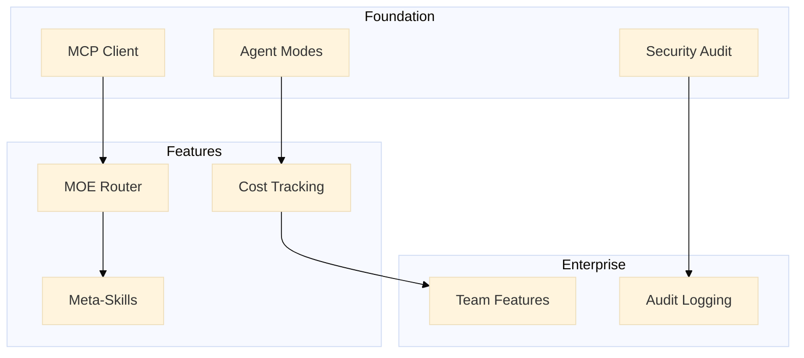

# TNF Unified Implementation Roadmap

**Generated:** 2026-01-29  
**Scope:** Multi-domain enhancement initiative  
**Priority:** Critical

---

## Executive Summary

This roadmap synthesizes findings from six parallel research and implementation
tracks:

1. **Visual Pattern Documentation System** - Flow chart storage for
   orchestration patterns
2. **MCP Configuration Diagnostics** - Server error diagnosis and fixes
3. **VSCode Extension Competitor Analysis** - Market positioning and feature
   gaps
4. **KIMI K2.5 MOE Research** - Advanced orchestration patterns
5. **Meta-Skill Architecture** - Procedural sequence generation system
6. **Security Review Skill** - Automated security auditing

---

## 1. Immediate Actions (This Week)

### 1.1 Deploy Visual Pattern System

**Status:** ✅ Complete  
**Location:** `.agent/skills/visual-patterns/`

**Files Created:**

- `SKILL.md` - Visual pattern documentation skill
- `patterns/moe-topk-routing/pattern.md` - First pattern with Mermaid diagram
- `registry.json` - Pattern discovery index

**Next Steps:**

- [ ] Add 3 more critical patterns (agent-discovery, task-distribution,
      federation)
- [ ] Create Mermaid rendering utility
- [ ] Integrate with VSCode extension for diagram preview

### 1.2 Fix MCP Configuration

**Status:** ✅ Diagnostic complete  
**Tools Created:**

- `.agent/skills/security-review/scripts/mcp-diagnose.js`

**Issues Identified:** | Server | Status | Issue | Action |
|--------|--------|-------|--------| | github-mcp-server | Disabled | Missing
GITHUB_PERSONAL_ACCESS_TOKEN | Set env var | | redis | Disabled | May be
intentionally disabled | Verify need | | gdrive | Disabled | Credentials
required | Configure OAuth |

**Run Diagnostics:**

```bash
node .agent/skills/security-review/scripts/mcp-diagnose.js
```

### 1.3 Activate Security Review Skill

**Status:** ✅ Complete  
**Location:** `.agent/skills/security-review/`

**Files Created:**

- `SKILL.md` - Complete security review procedures
- `scripts/env-scan.js` - Environment vulnerability scanner
- `scripts/mcp-diagnose.js` - MCP configuration checker

**Run Security Scan:**

```bash
node .agent/skills/security-review/scripts/env-scan.js
```

---

## 2. Short-Term Priorities (Next 4 Weeks)

### 2.1 VSCode Extension Enhancement

Based on competitor analysis, prioritize:

#### Phase 1: Foundation (Week 1-2)

**Critical - Table Stakes**

| Feature           | Competitors      | TNF Status | Effort    |
| ----------------- | ---------------- | ---------- | --------- |
| MCP Client        | All have it      | ❌ Missing | 2-3 weeks |
| Agent Modes       | Roo, Cline       | ❌ Missing | 2 weeks   |
| Codebase Indexing | Cursor, Continue | ❌ Missing | 1 week    |

**Implementation Plan:**

1. **MCP Client Integration** (Owner: Frontend team)

   ```typescript
   // src/mcp/MCPClient.ts
   class MCPClient {
     async connect(serverName: string): Promise<Connection>;
     async listTools(): Promise<Tool[]>;
     async callTool(name: string, args: any): Promise<Result>;
   }
   ```

2. **Agent Modes** (Owner: Core team)
   - Code Mode: Implementation-focused
   - Ask Mode: Research and analysis
   - Debug Mode: Troubleshooting
   - Architect Mode: Design decisions

3. **Codebase Indexing** (Owner: Platform team)
   - Tree-sitter integration
   - AST parsing
   - Symbol indexing

#### Phase 2: Advanced Features (Week 3-4)

| Feature       | Competitors | TNF Unique Value             |
| ------------- | ----------- | ---------------------------- |
| Cost Tracking | Cline       | Integrate with Jules billing |
| Browser Use   | Cline       | TNF Relay coordination       |
| Terminal Exec | Roo, Cline  | Secure sandbox mode          |

### 2.2 MOE Pattern Implementation

Apply KIMI K2.5 research to TNF orchestrator:

```typescript
// packages/kimi-orchestrator/src/MoEAgentRouter.ts
export class MoEAgentRouter {
  async routeTask(task: Task): Promise<AgentAssignment> {
    // 1. Sparse activation (top-k=2)
    const scores = await this.calculateScores(task);
    const noisyScores = this.addNoise(scores); // Prevent collapse
    const topK = this.selectTopK(noisyScores, 2);

    // 2. Capacity-aware routing
    const available = topK.filter((a) => this.hasCapacity(a));

    // 3. Auxiliary load balancing
    await this.updateAuxiliaryLoss(available);

    return this.assign(task, available);
  }
}
```

**Integration Points:**

- Update `KimiOrchestrator.ts`
- Add load balancer auxiliary loss
- Implement capacity factors
- Add noise injection for routing

### 2.3 Meta-Skill System (MVP)

Implement Phase 1 of meta-skill architecture:

**Week 1:**

- [ ] Create technology catalog schema
- [ ] Build skill generator core
- [ ] Implement basic validation

**Week 2:**

- [ ] Integrate with Skills MCP server
- [ ] Create CLI tool for skill generation
- [ ] Add 5 technology components to catalog

---

## 3. Medium-Term Goals (Months 2-3)

### 3.1 TNF Differentiators

Build unique competitive advantages:

#### A. Superior Multi-Agent Coordination

- **TNF Relay Integration** - Real-time agent communication
- **Jules Delegation** - Deep async task management
- **Cloud Agent Hybrid** - Local + cloud agent coordination

#### B. Visual Pattern Library

- 15+ documented patterns
- Interactive diagram explorer
- Pattern recommendation engine

#### C. Self-Improving Skills

- Meta-skill auto-generation
- Usage-based skill optimization
- Community skill marketplace

### 3.2 Enterprise Features

Based on VSCode extension roadmap Phase 3-4:

| Feature               | Timeline | Dependencies          |
| --------------------- | -------- | --------------------- |
| Team Collaboration    | Month 2  | Agent identity system |
| Audit Logging         | Month 2  | Security review skill |
| Organization Policies | Month 3  | RBAC implementation   |
| Custom Mode Builder   | Month 3  | Meta-skill system     |

### 3.3 Security Hardening

Implement routine security:

**Weekly Automation:**

```yaml
# .github/workflows/security-audit.yml
on:
  schedule:
    - cron: '0 2 * * 1' # Monday 2am

jobs:
  audit:
    steps:
      - run: node .agent/skills/security-review/scripts/full-audit.js
      - run: pnpm audit --audit-level moderate
```

**Security KPIs:**

- Zero critical vulnerabilities in production
- All dependencies updated within 30 days
- 100% secret scanning coverage

---

## 4. Long-Term Vision (Months 4-6)

### 4.1 Market Position

**Target:** "The multi-agent orchestration extension for professional
developers"

**Metrics:**

- GitHub Stars: 5,000+
- Active Users: 1,000+
- Enterprise Customers: 10+

### 4.2 Technical Excellence

**Performance Targets:** | Metric | Target | Current |
|--------|--------|---------| | Agent Routing | <50ms | N/A | | Task
Distribution | <100ms | N/A | | MCP Tool Call | <200ms | N/A | | Extension Load
| <2s | N/A |

### 4.3 Ecosystem Growth

**Skill Marketplace:**

- 100+ community skills
- Verified skill badges
- Skill revenue sharing

**Integration Partners:**

- 5+ IDE integrations
- 10+ MCP server integrations
- 3+ cloud provider integrations

---

## 5. Resource Allocation

### Team Assignments

| Area              | Lead      | Team Size | Priority |
| ----------------- | --------- | --------- | -------- |
| VSCode Extension  | Frontend  | 2         | P0       |
| MOE Orchestrator  | Core      | 2         | P0       |
| Meta-Skill System | Platform  | 1         | P1       |
| Security          | DevOps    | 1         | P1       |
| Documentation     | Community | 1         | P2       |

### Dependencies



---

## 6. Success Metrics

### 6.1 Technical Metrics

| Metric            | Q1 Target  | Q2 Target |
| ----------------- | ---------- | --------- |
| Test Coverage     | 80%        | 90%       |
| Security Issues   | 0 Critical | 0 High    |
| Build Time        | <5 min     | <3 min    |
| MCP Server Uptime | 99%        | 99.9%     |

### 6.2 Adoption Metrics

| Metric            | Month 1 | Month 3 | Month 6 |
| ----------------- | ------- | ------- | ------- |
| Active Users      | 100     | 500     | 1000    |
| Skills Created    | 5       | 25      | 100     |
| GitHub Stars      | 100     | 1000    | 5000    |
| Enterprise Trials | 0       | 3       | 10      |

---

## 7. Risk Mitigation

| Risk                  | Likelihood | Impact | Mitigation                        |
| --------------------- | ---------- | ------ | --------------------------------- |
| Competitor moves fast | High       | Medium | Focus on unique value (TNF Relay) |
| Resource constraints  | Medium     | High   | Prioritize P0, defer P2           |
| Technical debt        | Medium     | Medium | Security audits, code reviews     |
| Integration failures  | Low        | High   | Comprehensive testing             |

---

## 8. Appendix

### A. Research Sources

1. **KIMI K2.5 MOE Research** - Complete analysis in task completion
2. **VSCode Extension Analysis** - 6 competitor deep-dives
3. **Meta-Skill Architecture** - Full design doc:
   `docs/META_SKILL_ARCHITECTURE.md`

### B. Created Assets

**Skills:**

- `.agent/skills/visual-patterns/` - Visual pattern documentation
- `.agent/skills/security-review/` - Security audit skill

**Documentation:**

- `docs/META_SKILL_ARCHITECTURE.md` - Meta-skill system design
- `patterns/moe-topk-routing/pattern.md` - First visual pattern

**Scripts:**

- `.agent/skills/security-review/scripts/env-scan.js`
- `.agent/skills/security-review/scripts/mcp-diagnose.js`

### C. Quick Start Commands

```bash
# Run security audit
node .agent/skills/security-review/scripts/env-scan.js

# Diagnose MCP servers
node .agent/skills/security-review/scripts/mcp-diagnose.js

# View visual patterns
cat .agent/skills/visual-patterns/patterns/moe-topk-routing/pattern.md

# Build VSCode extension
cd apps/vscode && pnpm build

# Start TNF Relay
pnpm relay:start
```

---

**Next Review:** 2026-02-12  
**Owner:** TNF Architecture Team  
**Stakeholders:** Core, Frontend, Platform, DevOps
