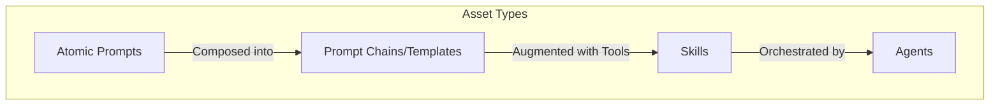

# Unified AI Asset Architecture

## Vision: The Compositional Hierarchy

The New Fuse (TNF) ecosystem is built on a unified, compositional asset
hierarchy where atomic units (Prompts) are assembled into functional modules
(Skills), which are then orchestrated by autonomous entities (Agents).



## 1. The Atomic Unit: Prompt Blocks & Snippets

The fundamental building block is the **Prompt Block**. These are not just
strings, but structured data objects.

### Data Structure (`PromptBlock`)

Defined in `packages/prompt-templating/src/types.ts`:

```typescript
interface PromptBlock {
  id: string;
  type:
    | 'system' // System instructions
    | 'user' // User input patterns
    | 'assistant' // Few-shot examples
    | 'variable' // Dynamic slots {{variable}}
    | 'function' // Tool definition hints
    | 'condition' // Logic (if/else) for prompt rendering
    | 'group'; // Container for other blocks

  content: string; // The raw text or template
  metadata?: {
    name?: string;
    description?: string;
    parameters?: Record<string, any>; // For variables
  };

  // Recursion for Grouping
  children?: PromptBlock[];
  locked: boolean; // If true, cannot be edited in the builder
}
```

### The "Drag and Drop" Builder UX

The Prompt Builder acts as a **Menu Builder** (similar to a visual CMS or block
editor) rather than just a text editor.

1.  **Snippet Library**: A side panel containing reusable `PromptSnippet`s.
    - Categories: "Personas", "Constraints", "Output Formats", "Thinking
      Styles".
    - User can drag a snippet (e.g., "Chain of Thought V2") onto the canvas.
2.  **Visual Canvas**: A linear (or nested) list of blocks.
    - **Grouping**: Users can select multiple blocks and "Group" them into a
      cohesive unit (e.g., "Security Guardrails").
    - **Variables**: Variables are automatically detected and exposed as input
      fields in the "Preview" mode.
3.  **Compilation**: The builder "compiles" the sequence of blocks into a
    single, cohesive `PromptTemplate` string at runtime, handling:
    - Deduplication of system instructions.
    - Resolution of conditional logic.
    - Variable substitution.

## 2. The Functional Module: Skills

A **Skill** is a sequence of Prompts + Actions (Tool Calls). It transforms a
static Prompt Template into an executable workflow.

### Data Structure (`Skill`)

```typescript
interface Skill {
  id: string;
  name: string;

  // The Prompt Template that drives this skill
  promptTemplateId: string;

  // The capabilities required
  tools: string[]; // IDs of MCP Tools or local functions

  // Execution Logic
  executionPattern:
    | 'linear' // Prompt -> Tool -> Response
    | 'loop' // ReAct loop (Think -> Act -> Observe)
    | 'parallel'; // Fan-out execution

  // Progressive Disclosure
  // Definitions of how the skill reveals information or asks for it
  flowDefinition: {
    steps: SkillStep[];
  };
}
```

### Skill Composition

- Skills can import other Skills.
- Example: A "Code Review Skill" might import a "Git Diff Skill" and a "Linter
  Analysis Skill".

## 3. The Autonomous Entity: Agents

An **Agent** is a top-level orchestrator that possesses a collection of Skills
and a core "Personality" (System Prompt).

### Data Structure (`Agent`)

```typescript
interface Agent extends MarketplaceAsset {
  type: 'AGENT';

  // Core Identity
  systemPromptId: string; // References a high-level Prompt Template

  // Capabilities
  skills: string[]; // List of Skill IDs this agent possesses

  // Memory & Context
  memoryConfig: {
    type: 'vector' | 'redis' | 'local';
    persistence: boolean;
  };

  // Marketplace Attributes
  pricing: PricingModel;
  nft?: NFTInfo; // Ownership and validaton
}
```

## Unified Marketplace Integration

All three levels (Prompts, Skills, Agents) are first-class citizens in the
Marketplace.

1.  **Prompt Marketplace**:
    - Users sell "Prompt Packs" (collections of Snippets).
    - Example: "SEO Writer Pro Pack" containing snippets for "Keyword
      Injection", "Tone Matching", and "Meta Description Gen".
2.  **Skill Marketplace**:
    - Users sell executable Skills (Prompts + Tool Configs).
    - Example: "Github PR Auto-Merger" (Requires GitHub MCP).

3.  **Agent Marketplace**:
    - Users sell complete, verified Agents.
    - Example: "DevOps Engineer Bot" (Includes Docker, K8s, and Git skills).

## Implementation Strategy

### Step 1: Enhance `packages/prompt-templating`

- Update `PromptBlock` to fully support the "Menu Builder" requirements (groups,
  conditions).
- Implement the `Compiler` that turns blocks into a final string.

### Step 2: Build the UI (`apps/frontend`)

- Create `PromptBuilder` component using `dnd-kit` (for vertical lists) or
  `reactflow` (if branching is needed, but vertical list is better for prompt
  sequences).
- Implement the "Snippet Library" sidebar.

### Step 3: Define Skill Schema (`packages/agent`)

- Formalize the `Skill` interface to link explicitly to `PromptTemplate`s.
- Ensure the Agent Executor can dynamically load these Skills.

### Step 4: Marketplace Integration

- Expose these assets via the `marketplace-gateway`.
