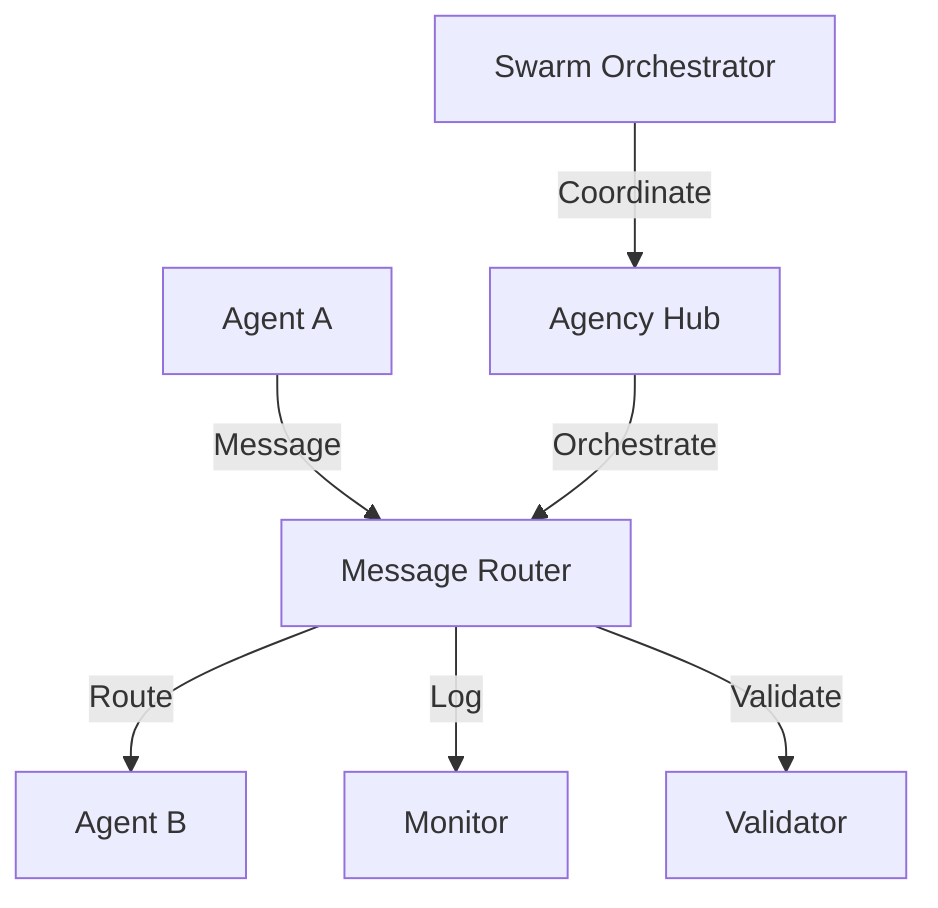

# Agent Communication Guide

This guide provides comprehensive documentation for implementing and managing agent communication within the multi-agent system. It covers communication protocols, message structures, orchestration patterns, and best practices for inter-agent collaboration.

## Table of Contents

1. [Communication Architecture](#communication-architecture)
2. [Message Protocol Specification](#message-protocol-specification)
3. [Agent Registration and Discovery](#agent-registration-and-discovery)
4. [Swarm Orchestration](#swarm-orchestration)
5. [Authentication and Security](#authentication-and-security)
6. [Error Handling and Recovery](#error-handling-and-recovery)
7. [Monitoring and Debugging](#monitoring-and-debugging)
8. [Best Practices](#best-practices)
9. [API Reference](#api-reference)
10. [TNF Agent Relay System](#tnf-agent-relay-system)

## Communication Architecture

### Core Components

The agent communication system is built on several key components:

- **Agency Hub**: Central orchestration service managing agent lifecycle
- **Message Router**: Routes messages between agents and services
- **Protocol Handlers**: Implement specific communication protocols (WebSocket, HTTP, MCP)
- **Swarm Orchestrator**: Manages collaborative agent workflows
- **Authentication Service**: Handles agent identity and permissions

### Communication Flow



## Message Protocol Specification

### Base Message Structure

All inter-agent messages follow a standardized structure:

```typescript
interface BaseMessage {
  id: string;                    // Unique message identifier
  type: MessageType;             // Message type enum
  timestamp: number;             // Unix timestamp
  sender: AgentIdentifier;       // Sending agent information
  recipient: AgentIdentifier;    // Target agent information
  payload: any;                  // Message-specific data
  metadata?: MessageMetadata;    // Optional metadata
  protocol: ProtocolType;        // Communication protocol used
}

interface AgentIdentifier {
  id: string;
  name: string;
  role: string;
  capabilities: string[];
}

interface MessageMetadata {
  priority: Priority;
  retryCount?: number;
  maxRetries?: number;
  timeout?: number;
  correlationId?: string;
  parentMessageId?: string;
}
```

### Message Types

#### System Messages

- `AGENT_REGISTER`: Register agent with hub
- `AGENT_DEREGISTER`: Remove agent from hub
- `HEARTBEAT`: Keep-alive signal
- `STATUS_UPDATE`: Agent status changes

#### Task Messages

- `TASK_REQUEST`: Request task execution
- `TASK_RESPONSE`: Task execution result
- `TASK_DELEGATE`: Delegate task to another agent
- `TASK_PROGRESS`: Progress update

#### Coordination Messages

- `SWARM_JOIN`: Join collaborative effort
- `SWARM_LEAVE`: Leave swarm
- `COORDINATION_REQUEST`: Request coordination
- `COORDINATION_RESPONSE`: Coordination response

#### Data Messages

- `DATA_SHARE`: Share data with other agents
- `DATA_REQUEST`: Request data from agent
- `DATA_SYNC`: Synchronize shared state

### Protocol Implementation

#### WebSocket Protocol

Real-time bidirectional communication for active agents:

```typescript
class WebSocketProtocol implements CommunicationProtocol {
  async send(message: BaseMessage): Promise<void> {
    const serialized = JSON.stringify(message);
    this.socket.send(serialized);
  }

  onMessage(callback: (message: BaseMessage) => void): void {
    this.socket.onmessage = (event) => {
      const message = JSON.parse(event.data);
      callback(message);
    };
  }
}
```

#### HTTP REST Protocol

Request-response communication for stateless interactions:

```typescript
class HTTPProtocol implements CommunicationProtocol {
  async send(message: BaseMessage): Promise<MessageResponse> {
    const response = await fetch(`/api/agents/${message.recipient.id}/messages`, {
      method: 'POST',
      headers: { 'Content-Type': 'application/json' },
      body: JSON.stringify(message)
    });
    return response.json();
  }
}
```

#### Model Context Protocol (MCP)

Structured communication for AI model interactions:

```typescript
class MCPProtocol implements CommunicationProtocol {
  async send(message: BaseMessage): Promise<MCPResponse> {
    const mcpMessage = this.transformToMCP(message);
    return this.mcpClient.request(mcpMessage);
  }
}
```

## Agent Registration and Discovery

### Registration Process

Agents must register with the Agency Hub before participating in communication:

```typescript
interface AgentRegistration {
  agentId: string;
  name: string;
  role: string;
  capabilities: Capability[];
  endpoints: EndpointConfig[];
  metadata: AgentMetadata;
}

interface Capability {
  name: string;
  description: string;
  inputSchema: JSONSchema;
  outputSchema: JSONSchema;
}
```

### Discovery Service

Agents can discover other agents and their capabilities:

```typescript
class AgentDiscoveryService {
  async findAgentsByCapability(capability: string): Promise<AgentInfo[]> {
    return this.registry.query({ capability });
  }

  async findAgentsByRole(role: string): Promise<AgentInfo[]> {
    return this.registry.query({ role });
  }

  async getAgentInfo(agentId: string): Promise<AgentInfo> {
    return this.registry.get(agentId);
  }
}
```

## Swarm Orchestration

### Swarm Formation

Agents can form swarms for collaborative tasks:

```typescript
interface SwarmConfiguration {
  swarmId: string;
  purpose: string;
  coordinatorId: string;
  members: SwarmMember[];
  coordination: CoordinationStrategy;
  communication: CommunicationPattern;
}

interface SwarmMember {
  agentId: string;
  role: SwarmRole;
  responsibilities: string[];
  priority: number;
}
```

### Coordination Strategies

#### Centralized Coordination

- Single coordinator manages all interactions
- Clear hierarchy and decision-making
- Efficient for simple tasks

#### Distributed Coordination

- Peer-to-peer collaboration
- Fault-tolerant and scalable
- Suitable for complex, adaptive tasks

#### Hybrid Coordination

- Mixed approach based on task requirements
- Dynamic role assignment
- Optimal for varied workloads

### Communication Patterns

#### Broadcast Pattern

```typescript
class BroadcastPattern {
  async broadcast(message: BaseMessage, swarmId: string): Promise<void> {
    const members = await this.getSwarmMembers(swarmId);
    const promises = members.map(member => 
      this.sendMessage(message, member.agentId)
    );
    await Promise.all(promises);
  }
}
```

#### Request-Response Pattern

```typescript
class RequestResponsePattern {
  async request(message: BaseMessage, timeout: number = 5000): Promise<BaseMessage> {
    return new Promise((resolve, reject) => {
      const timeoutId = setTimeout(() => reject(new Error('Timeout')), timeout);
      
      this.sendMessage(message).then(() => {
        this.onResponse(message.id, (response) => {
          clearTimeout(timeoutId);
          resolve(response);
        });
      });
    });
  }
}
```

#### Publish-Subscribe Pattern

```typescript
class PubSubPattern {
  async subscribe(topic: string, callback: MessageHandler): Promise<void> {
    this.subscriptions.set(topic, callback);
  }

  async publish(topic: string, message: BaseMessage): Promise<void> {
    const subscribers = this.getSubscribers(topic);
    subscribers.forEach(callback => callback(message));
  }
}
```

## Authentication and Security

### Agent Authentication

All agents must authenticate before communication:

```typescript
interface AuthenticationCredentials {
  agentId: string;
  apiKey: string;
  signature: string;
  timestamp: number;
}

class AuthenticationService {
  async authenticate(credentials: AuthenticationCredentials): Promise<AuthToken> {
    // Verify API key and signature
    const isValid = await this.verifyCredentials(credentials);
    if (!isValid) {
      throw new Error('Authentication failed');
    }
    
    return this.generateToken(credentials.agentId);
  }
}
```

### Message Security

#### Message Signing

```typescript
class MessageSigner {
  sign(message: BaseMessage, privateKey: string): string {
    const payload = JSON.stringify(message);
    return crypto.createSign('RSA-SHA256')
      .update(payload)
      .sign(privateKey, 'base64');
  }

  verify(message: BaseMessage, signature: string, publicKey: string): boolean {
    const payload = JSON.stringify(message);
    return crypto.createVerify('RSA-SHA256')
      .update(payload)
      .verify(publicKey, signature, 'base64');
  }
}
```

#### Message Encryption

```typescript
class MessageEncryption {
  encrypt(message: BaseMessage, recipientPublicKey: string): EncryptedMessage {
    const serialized = JSON.stringify(message);
    const encrypted = crypto.publicEncrypt(recipientPublicKey, Buffer.from(serialized));
    return {
      encryptedPayload: encrypted.toString('base64'),
      algorithm: 'RSA-OAEP'
    };
  }

  decrypt(encryptedMessage: EncryptedMessage, privateKey: string): BaseMessage {
    const decrypted = crypto.privateDecrypt(privateKey, 
      Buffer.from(encryptedMessage.encryptedPayload, 'base64'));
    return JSON.parse(decrypted.toString());
  }
}
```

## Error Handling and Recovery

### Error Types

```typescript
enum CommunicationError {
  NETWORK_ERROR = 'NETWORK_ERROR',
  TIMEOUT_ERROR = 'TIMEOUT_ERROR',
  AUTHENTICATION_ERROR = 'AUTHENTICATION_ERROR',
  PROTOCOL_ERROR = 'PROTOCOL_ERROR',
  AGENT_UNAVAILABLE = 'AGENT_UNAVAILABLE',
  MESSAGE_REJECTED = 'MESSAGE_REJECTED'
}
```

### Retry Mechanisms

```typescript
class RetryManager {
  async retryWithBackoff<T>(
    operation: () => Promise<T>,
    maxRetries: number = 3,
    baseDelay: number = 1000
  ): Promise<T> {
    for (let attempt = 0; attempt <= maxRetries; attempt++) {
      try {
        return await operation();
      } catch (error) {
        if (attempt === maxRetries) throw error;
        
        const delay = baseDelay * Math.pow(2, attempt);
        await this.delay(delay);
      }
    }
    throw new Error('Max retries exceeded');
  }
}
```

### Circuit Breaker Pattern

```typescript
class CircuitBreaker {
  private failures = 0;
  private lastFailureTime = 0;
  private state: 'CLOSED' | 'OPEN' | 'HALF_OPEN' = 'CLOSED';

  async execute<T>(operation: () => Promise<T>): Promise<T> {
    if (this.state === 'OPEN') {
      if (Date.now() - this.lastFailureTime > this.timeout) {
        this.state = 'HALF_OPEN';
      } else {
        throw new Error('Circuit breaker is OPEN');
      }
    }

    try {
      const result = await operation();
      this.onSuccess();
      return result;
    } catch (error) {
      this.onFailure();
      throw error;
    }
  }
}
```

## Monitoring and Debugging

### Message Tracing

```typescript
class MessageTracer {
  traceMessage(message: BaseMessage): void {
    const trace = {
      messageId: message.id,
      timestamp: Date.now(),
      sender: message.sender.id,
      recipient: message.recipient.id,
      type: message.type,
      protocol: message.protocol
    };
    
    this.storage.store(trace);
  }

  getMessageTrace(messageId: string): MessageTrace[] {
    return this.storage.query({ messageId });
  }
}
```

### Performance Metrics

```typescript
class PerformanceMonitor {
  recordLatency(messageId: string, latency: number): void {
    this.metrics.record('message_latency', latency, { messageId });
  }

  recordThroughput(agentId: string, messageCount: number): void {
    this.metrics.record('message_throughput', messageCount, { agentId });
  }

  getMetrics(timeRange: TimeRange): Metrics {
    return this.metrics.query(timeRange);
  }
}
```

### Health Checks

```typescript
class HealthChecker {
  async checkAgentHealth(agentId: string): Promise<HealthStatus> {
    const ping = await this.sendPing(agentId);
    const latency = ping.responseTime;
    
    return {
      agentId,
      status: ping.success ? 'HEALTHY' : 'UNHEALTHY',
      latency,
      lastChecked: Date.now()
    };
  }

  async checkSystemHealth(): Promise<SystemHealth> {
    const agents = await this.getAllAgents();
    const healthChecks = await Promise.all(
      agents.map(agent => this.checkAgentHealth(agent.id))
    );
    
    return {
      totalAgents: agents.length,
      healthyAgents: healthChecks.filter(h => h.status === 'HEALTHY').length,
      unhealthyAgents: healthChecks.filter(h => h.status === 'UNHEALTHY').length,
      averageLatency: this.calculateAverageLatency(healthChecks)
    };
  }
}
```

## Best Practices

### Message Design

1. **Keep messages small**: Minimize payload size for better performance
2. **Use appropriate types**: Choose the right message type for each interaction
3. **Include metadata**: Add correlation IDs and timestamps for tracking
4. **Handle failures gracefully**: Implement proper error handling and retries

### Agent Coordination

1. **Define clear roles**: Each agent should have well-defined responsibilities
2. **Avoid circular dependencies**: Design communication flows to prevent deadlocks
3. **Use timeouts**: Always include timeouts for blocking operations
4. **Implement heartbeats**: Regular health checks prevent zombie agents

### Performance Optimization

1. **Batch messages**: Group related messages to reduce overhead
2. **Use appropriate protocols**: Choose the right protocol for each use case
3. **Cache frequently accessed data**: Reduce redundant communication
4. **Monitor and tune**: Regular performance analysis and optimization

### Security Guidelines

1. **Authenticate all agents**: Never trust unauthenticated communication
2. **Validate inputs**: Sanitize and validate all incoming messages
3. **Use encryption**: Encrypt sensitive data in transit
4. **Audit communication**: Log all security-relevant events

## API Reference

### Core Classes

#### CommunicationManager

```typescript
class CommunicationManager {
  async sendMessage(message: BaseMessage): Promise<MessageResponse>;
  async registerAgent(registration: AgentRegistration): Promise<void>;
  async deregisterAgent(agentId: string): Promise<void>;
  onMessage(handler: MessageHandler): void;
}
```

#### SwarmOrchestrator

```typescript
class SwarmOrchestrator {
  async createSwarm(config: SwarmConfiguration): Promise<string>;
  async joinSwarm(swarmId: string, agentId: string): Promise<void>;
  async leaveSwarm(swarmId: string, agentId: string): Promise<void>;
  async coordinateTask(task: SwarmTask): Promise<SwarmResult>;
}
```

#### AgencyHub

```typescript
class AgencyHub {
  async registerAgent(agent: AgentRegistration): Promise<void>;
  async discoverAgents(criteria: DiscoveryCriteria): Promise<AgentInfo[]>;
  async routeMessage(message: BaseMessage): Promise<void>;
  async getAgentStatus(agentId: string): Promise<AgentStatus>;
}
```

### Configuration

#### Environment Variables

```bash
# Agency Hub Configuration
AGENCY_HUB_PORT=3000
AGENCY_HUB_HOST=localhost

# Authentication
AUTH_SECRET_KEY=your-secret-key
AUTH_TOKEN_EXPIRY=3600

# Protocol Configuration
WEBSOCKET_ENABLED=true
HTTP_ENABLED=true
MCP_ENABLED=true

# Monitoring
METRICS_ENABLED=true
TRACING_ENABLED=true
LOG_LEVEL=info
```

#### Configuration File

```json
{
  "communication": {
    "protocols": ["websocket", "http", "mcp"],
    "messageTimeout": 5000,
    "maxRetries": 3,
    "retryBackoff": 1000
  },
  "swarm": {
    "maxMembers": 10,
    "coordinationTimeout": 30000,
    "heartbeatInterval": 5000
  },
  "security": {
    "authenticationRequired": true,
    "encryptionEnabled": false,
    "signingRequired": true
  },
  "monitoring": {
    "metricsEnabled": true,
    "tracingEnabled": true,
    "healthCheckInterval": 10000
  }
}
```

## Troubleshooting

### Common Issues

1. **Agent registration failures**
   - Check authentication credentials
   - Verify network connectivity
   - Review agent configuration

2. **Message delivery failures**
   - Check recipient agent status
   - Verify message format
   - Review protocol configuration

3. **Swarm coordination issues**
   - Check coordinator availability
   - Verify member connectivity
   - Review coordination strategy

4. **Performance problems**
   - Monitor message latency
   - Check agent load
   - Review resource usage

### Debug Commands

```typescript
// Check agent status
await agencyHub.getAgentStatus('agent-id');

// Trace message path
const trace = await messageTracer.getMessageTrace('message-id');

// Monitor performance
const metrics = await performanceMonitor.getMetrics({
  start: Date.now() - 3600000,
  end: Date.now()
});

// Health check
const health = await healthChecker.checkSystemHealth();
```

## TNF Agent Relay System

The TNF Agent Communication Relay is a macOS application that enables AI agents to communicate across different environments in The New Fuse ecosystem. This application serves as a central hub for message routing between VS Code extensions, Chrome extensions, terminal applications, and Redis-connected agents.

### Installation

#### Automatic Installation (Recommended)

```bash
# Download and install TNF Agent Relay
curl -sSL https://raw.githubusercontent.com/your-org/tnf-relay/main/install.sh | bash

# Or using the included script
bash scripts/install-tnf-relay.sh
```

#### Manual Installation

1. **Create the relay application:**
   ```bash
   # Navigate to the relay directory
   cd scripts/tnf-agent-relay

   # Run the creation script
   ./create-tnf-relay-direct.sh
   ```

2. **Grant system permissions:**
   - Open System Preferences → Security & Privacy → Privacy
   - Select "Accessibility" from the left sidebar
   - Click the lock to make changes
   - Click "+" and add TNF-Agent-Relay.app

3. **Launch the relay:**
   ```bash
   open ~/Desktop/TNF-Agent-Relay.app
   ```

### Relay Configuration

```applescript
-- TNF Agent Relay Configuration
property relayConfig : {
    -- Agent discovery settings
    agentDiscoveryInterval: 30,
    discoveryMethods: {"websocket", "redis", "file", "mcp"},
    
    -- Message handling
    messageRetryAttempts: 3,
    messageTimeout: 5000,
    maxQueueSize: 1000,
    
    -- Logging and monitoring
    logLevel: "info",
    logRetentionDays: 7,
    metricsEnabled: true,
    
    -- Protocol settings
    enabledProtocols: {"websocket", "redis", "file", "mcp"},
    websocketPort: 3711,
    redisConnection: "redis://localhost:6379",
    
    -- Security settings
    enableAuthentication: false,
    allowedOrigins: {"*"},
    rateLimitEnabled: true,
    maxConnectionsPerIP: 10
}
```

### Core Relay Functions

#### Agent Registration
```applescript
-- Register a new agent
on registerAgent(agentInfo)
    set agentID to (id of agentInfo)
    set agentRecord to {
        id: agentID,
        name: (name of agentInfo),
        type: (agentType of agentInfo),
        capabilities: (capabilities of agentInfo),
        status: "online",
        lastSeen: (current date),
        connectionInfo: (connectionInfo of agentInfo)
    }
    
    set end of agentRegistry to agentRecord
    logMessage("Agent registered: " & agentID, "info")
    
    -- Broadcast agent availability
    broadcastAgentStatus(agentID, "online")
end registerAgent
```

#### Message Routing
```applescript
-- Route message between agents
on routeMessage(messageData)
    set sourceAgent to (source of messageData)
    set targetAgent to (target of messageData)
    set messageContent to (content of messageData)
    
    -- Find target agent
    set targetInfo to findAgent(targetAgent)
    if targetInfo is missing value then
        logMessage("Target agent not found: " & targetAgent, "error")
        return false
    end if
    
    -- Route based on agent connection type
    set connectionType to (connectionType of targetInfo)
    if connectionType is "websocket" then
        return sendWebSocketMessage(targetInfo, messageData)
    else if connectionType is "redis" then
        return sendRedisMessage(targetInfo, messageData)
    else if connectionType is "file" then
        return sendFileMessage(targetInfo, messageData)
    else if connectionType is "mcp" then
        return sendMCPMessage(targetInfo, messageData)
    end if
end routeMessage
```

#### Agent Discovery
```applescript
-- Discover available agents
on discoverAgents()
    set discoveredAgents to {}
    
    -- WebSocket discovery
    set wsAgents to discoverWebSocketAgents()
    set discoveredAgents to discoveredAgents & wsAgents
    
    -- Redis discovery
    set redisAgents to discoverRedisAgents()
    set discoveredAgents to discoveredAgents & redisAgents
    
    -- File protocol discovery
    set fileAgents to discoverFileAgents()
    set discoveredAgents to discoveredAgents & fileAgents
    
    -- MCP discovery
    set mcpAgents to discoverMCPAgents()
    set discoveredAgents to discoveredAgents & mcpAgents
    
    -- Update agent registry
    updateAgentRegistry(discoveredAgents)
    
    return discoveredAgents
end discoverAgents
```