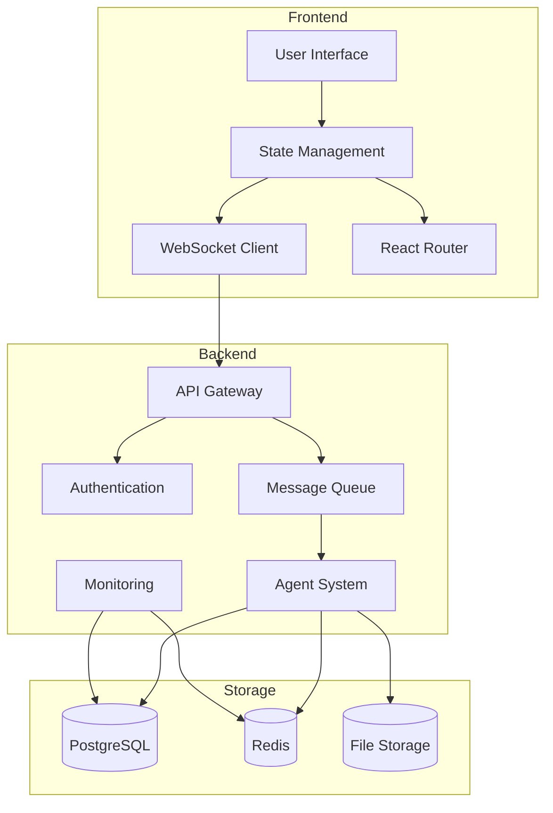
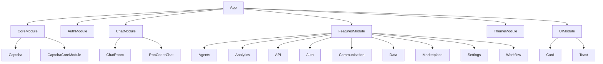
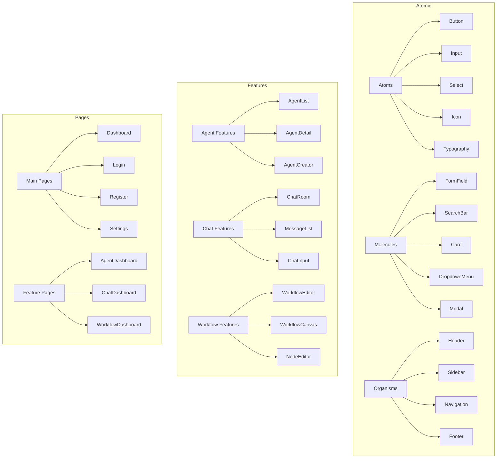

# The New Fuse Architecture

This document provides a comprehensive overview of the architecture of The New Fuse inter-LLM communication framework.

## Table of Contents

1. [System Architecture](#system-architecture)
2. [Component Architecture](#component-architecture)
3. [Service and System Integration](#service-and-system-integration)
4. [UI Architecture](#ui-architecture)
5. [Model Context Protocol (MCP) Integration](#model-context-protocol-mcp-integration)
6. [Security Architecture](#security-architecture)
7. [Technical Specifications](#technical-specifications)

## System Architecture

The New Fuse is built for the age of AI emergence, incorporating both automated processes ("Tools") and intelligent agents ("Agents") that combine AI, LLM systems, and human-in-the-loop interactions. This document outlines the core architectural principles and implementation patterns.

### High-Level System Architecture

### A2A Protocol Layer
- Distributed Communication Protocol
- State Management and Synchronization
- Transaction Handling and Consistency
- Load Balancing and Resource Management

### Agent Integration Layer
- AI Agent Coordination
- Human-in-the-Loop Integration
- Workflow Management
- State Synchronization

## Component Architecture

### Core Components
- **Agent Identity**: Unique identification and metadata
- **Capability Registry**: Declaration of agent capabilities and actions
- **Request Handler**: Processing of incoming requests and messages
- **Context Manager**: Management of conversational and operational context
- **Communication Interface**: Integration with MCP and A2A protocols
- **Security Layer**: Authentication, authorization, and encryption

### Component Hierarchy

## Service and System Integration

### Service Communication
Services communicate through:
- Redis PubSub for real-time events
- gRPC for synchronous operations
- REST APIs for administrative tasks

### Integration Patterns
1. **Service Discovery**
   - Automatic registration
   - Health monitoring
   - Capability advertisement

2. **State Management**
   - Distributed state
   - Consistency protocols
   - Recovery mechanisms

3. **Resource Orchestration**
   - Dynamic allocation
   - Load balancing
   - Scaling policies

## UI Architecture

### UI Reorganization Plan
- **Component Consolidation**: Move atomic components to `/packages/ui-components/` and consolidate feature components.
- **Page Organization**: Restructure the `pages` directory for better organization.

### UI Structure Map

## Model Context Protocol (MCP) Integration

The Model Context Protocol (MCP) integration in The New Fuse follows a modular architecture that enables seamless communication between AI agents and tools.

### Key Components
- **Agent WebSocket Service**: Real-time agent communication
- **Workflow MCP Integration**: Workflow execution and tool management
- **A2A Communication Protocol**: Agent-to-agent communication with multiple protocol versions
- **Workflow Builder**: Visual editor for creating and executing workflows
- **Analytics Integration**: Performance tracking and metrics
- **Schema Validation**: Dynamic validation and migration
- **Workflow Monitoring**: Real-time status tracking
- **Agent Capability Discovery**: Dynamic capability management

## Security Architecture

The New Fuse implements a comprehensive security architecture that covers authentication, authorization, data protection, and secure communication.

### Agent Verification
- **Token-based Verification**: Agents are verified using secure tokens
- **Expiration**: Verification can expire after a configurable period
- **Revocation**: Verification can be revoked at any time
- **Status Tracking**: Agent verification status is tracked and can be queried

### Message Security
- **Message Signing**: Messages can be signed to ensure authenticity
- **Signature Verification**: Message signatures can be verified
- **Payload Encryption**: Message payloads can be encrypted for confidentiality
- **Payload Decryption**: Encrypted payloads can be decrypted
- **Configurable Options**: Security options can be configured

### Permission System
- **Resource-based Permissions**: Permissions are defined for specific resource types
- **Permission Levels**: Different levels of access can be granted (none, read, write, admin)
- **Default Permissions**: Default permissions can be defined for resource types
- **Temporary Permissions**: Permissions can be granted temporarily
- **Permission Checking**: Permissions can be checked before allowing access

## Technical Specifications

### Core Components
- **MCP (Model Context Protocol)**
- **Agent Registration**
- **Workflow Definition**

### Implementation Priorities
- **Phase 1: Foundation** (MCP Core, Basic Agent System, Workflow Engine)
- **Phase 2: Integration** (Analytics, UI Components, VS Code Extension)
- **Phase 3: Enhancement** (Security, Performance, Developer Tools)

### API Endpoints
- **Agent Management**: `POST /agents/register`, `GET /agents/discover`, `PUT /agents/{id}/capabilities`
- **Workflow Management**: `POST /workflows`, `GET /workflows/{id}`, `PUT /workflows/{id}/execute`
- **Analytics**: `GET /analytics/performance`, `GET /analytics/usage`, `GET /analytics/errors`
