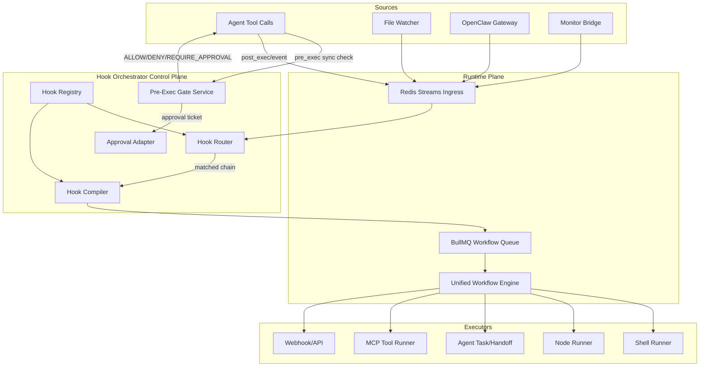

# TNF Hook Orchestrator Specification (v2)

## 1. Executive Summary

The **TNF Hook Orchestrator** remains the right direction, but implementation
must avoid a second execution runtime.

**Architectural decision:**

- The Hook Orchestrator is a **Hook DSL + policy/gating layer + event adapters**
  that compiles and dispatches into the existing
  **`@the-new-fuse/workflow-engine`** runtime.
- We do **not** introduce a separate DAG engine.

This preserves one execution plane for retries, queueing, telemetry, and agent
integration while enabling Hook Chains for:

- Post-edit validation/remediation
- Pre-execution security/governance gates
- Turn-start context frontloading
- Cross-agent handoff review
- Failure archeology and guided remediation

## 2. Scope

### 2.1 In Scope

- Hook chain definitions in YAML/JSON
- Event-to-chain routing and compilation to workflow-engine graphs
- Synchronous gate decisions for `pre_exec` control points
- Durable async chain execution with retries/DLQ
- Deterministic context propagation and merge semantics
- Approval workflows for high-risk actions

### 2.2 Out of Scope

- Replacing workflow-engine internals
- Building an independent scheduler/executor
- Unrestricted expression runtimes (no raw JS `new Function` in policies)

## 3. Reuse-First Architecture

### 3.1 Existing Runtime to Reuse

1. **Workflow Engine** for node execution, branching, retry policy, and state
   handling.
2. **Workflow Queue (BullMQ)** for durable execution jobs and retry behavior.
3. **TNF Router + Redis backbone** for ecosystem event flow.
4. **Telemetry service** for traces and execution logs.

### 3.2 New Hook-Orchestrator Components

1. **Hook Registry**

- Stores `HookChain` definitions, versions, owner metadata, and policy
  references.

2. **Hook Compiler**

- Compiles `HookChain` definitions into workflow-engine compatible definitions.
- Performs static validation (schema, policy refs, forbidden runners, missing
  approvals).

3. **Hook Router**

- Matches incoming events to eligible chains.
- Handles dedupe and rate-limits before execution dispatch.

4. **Gate Service (Synchronous)**

- Executes pre-exec policy checks and returns `ALLOW | DENY | REQUIRE_APPROVAL`
  within strict timeout budgets.

5. **Approval Service Adapter**

- Creates approval tickets and resumes suspended chains after approval/denial.

6. **Hook Observability API/CLI**

- `tnf hooks logs`, `tnf hooks run`, `tnf hooks test`, `tnf hooks replay`.

## 4. Architecture Overview



## 5. Event and Delivery Model

### 5.1 Event Envelope

All events use a versioned envelope:

```json
{
  "event_id": "evt_...",
  "event_type": "agent.command.pre_exec",
  "event_version": "1.0",
  "source": "codex-cli",
  "timestamp": "2026-05-17T12:00:00Z",
  "workspace_id": "...",
  "actor": { "agent_id": "...", "user_id": "..." },
  "payload": {},
  "trace_id": "...",
  "idempotency_key": "..."
}
```

### 5.2 Transport and Guarantees

- **Synchronous gates:** request/response API (not Pub/Sub).
- **Asynchronous chains:** Redis **Streams** + consumer groups for durable
  delivery.
- Delivery guarantee: **at-least-once** with idempotency enforcement.
- Failures route to DLQ after retry budget exhaustion.

### 5.3 Idempotency

- `chain_run_id = hash(chain_version + idempotency_key)`
- Duplicate events within dedupe window return existing run metadata, not new
  execution.

## 6. Chain Definition Schema (v2)

```yaml
apiVersion: tnf.hooks/v2
kind: HookChain
metadata:
  name: typescript-validation-chain
  version: 1
  owner: platform-tooling
  labels: [code-quality, post-edit]

spec:
  trigger:
    event: file.edit.post_save
    mode: async # async | sync_gate
    match:
      path_regex: "\\.tsx?$"
    dedupe:
      key: '{{event.filepath}}:{{event.content_hash}}'
      window_ms: 30000

  execution:
    max_run_time_ms: 600000
    concurrency: single_per_key # unbounded | single_per_key | fixed
    on_chain_error: fail # fail | continue

  context:
    model: immutable # immutable | mutable (mutable disabled by default)
    write_root: steps

  steps:
    - id: format
      runner: shell
      command: 'pnpm prettier --write {{event.filepath}}'
      timeout_ms: 30000
      retry:
        max_attempts: 1
        backoff_ms: 0
      if: 'true'
      on_failure: continue # stop | continue | branch

    - id: lint
      runner: shell
      command: 'pnpm eslint --fix {{event.filepath}}'
      timeout_ms: 60000
      retry:
        max_attempts: 1
        backoff_ms: 0
      if: 'steps.format.success == true'
      on_failure: stop

    - id: typecheck
      runner: shell
      command: 'pnpm tsc --noEmit'
      timeout_ms: 180000
      retry:
        max_attempts: 0
      if: 'steps.lint.success == true'
      on_failure: stop

    - id: notify
      runner: agent
      agent_selector:
        type: role
        value: ux-reviewer
      prompt: 'Review changes in {{event.filepath}} for pattern regressions.'
      timeout_ms: 120000
      if: 'steps.typecheck.success == true'
      on_failure: continue

  security:
    policy_pack: default-dev
    approval_policy: none # none | on_high_risk | always
```

## 7. Synchronous Pre-Execution Gate Contract

### 7.1 Request

```json
{
  "request_id": "gate_...",
  "event": {
    "event_type": "agent.command.pre_exec",
    "payload": { "command": "rm -rf /" }
  },
  "environment": { "tier": "prod", "workspace": "..." },
  "trace_id": "..."
}
```

### 7.2 Response

```json
{
  "decision": "DENY",
  "reason": "Dangerous command in production without backup checkpoint",
  "policy_hits": ["dangerous-command", "prod-protection"],
  "approval_ticket_id": null,
  "expires_at": "2026-05-17T12:00:02Z"
}
```

### 7.3 Decision Types

- `ALLOW`: execution may continue.
- `DENY`: execution blocked.
- `REQUIRE_APPROVAL`: execution suspended pending human approval.

### 7.4 SLO and Failure Mode

- Gate timeout budget: default `<= 200ms` local, `<= 500ms` remote.
- **Prod default:** fail closed on gate timeout/error.
- **Dev default:** fail open with mandatory audit log.

## 8. Deterministic Context Semantics

### 8.1 Context Model

- Base context is immutable event snapshot.
- Step outputs are appended under `steps.<step_id>.output`.
- Step status lives under `steps.<step_id>.success|error|timing`.

### 8.2 Parallel/Fan-In Rules

- Parallel branches cannot write to same path.
- Fan-in requires explicit merge strategy:
  - `object_merge`
  - `array_concat`
  - `prefer_left`
  - `prefer_right`
- Missing merge strategy on converging writes is a compile-time error.

## 9. Policy and Security Model

### 9.1 Expression Runtime

- Policies and `if` conditions use constrained expression runtime
  (CEL/JMESPath-style).
- No unrestricted JS evaluation in hook policy paths.

### 9.2 Runner Guardrails

- `shell` runner:
  - command allow/deny patterns
  - workspace boundary enforcement
  - env var redaction in logs
  - optional network restrictions
- `agent` runner:
  - allowlisted agent roles
  - max fan-out
- `mcp` runner:
  - tool allowlist by chain/policy

### 9.3 Approval and Governance

- Risk score from policy pack decides whether approval is mandatory.
- Approval records include approver, timestamp, reason, and chain run linkage.

## 10. Reliability and Error Handling

### 10.1 Retry

- Per-step retry policy with capped backoff.
- Chain-level retry only for transient infrastructure failures.

### 10.2 DLQ

- Exhausted runs pushed to `tnf.hooks.dlq` with replay metadata.
- Replay command: `tnf hooks replay --run <id>`.

### 10.3 Compensation

- Optional `compensate` steps for side-effect rollback where feasible.

## 11. Observability and Auditability

### 11.1 Required Telemetry

- `chain_run_started`, `step_started`, `step_completed`, `step_failed`,
  `chain_run_completed`
- Gate decisions with policy hits
- Approval lifecycle events

### 11.2 Correlation

- Every chain run carries `trace_id`, `event_id`, `chain_name`, `chain_version`.

### 11.3 CLI

- `tnf hooks logs --run <id>`
- `tnf hooks test --chain <name> --event <file.json>`
- `tnf hooks explain --run <id>`

## 12. Integration Points

1. **Agent Environments (`.gemini`, `.claude`, `.hermes`, `.codex`)**

- Emit `pre_exec`/`post_exec` events with canonical envelope.
- Enforce gate decision contract before dangerous tool execution.

2. **OpenClaw Gateway**

- Trigger frontloading chains for channel-specific preprocessing.

3. **Monitor Bridge**

- Trigger remediation chains from threshold events.

4. **n8n/External Workflows**

- Supported as runner/action target, but external side effects must remain
  idempotent.

## 13. Phased Implementation

### Phase 0: Alignment (Week 1)

- Publish ADR: Hook Orchestrator is workflow-engine-native.
- Finalize event envelope and gate API contracts.

### Phase 1: Gate MVP (Weeks 2-3)

- Implement synchronous `pre_exec` gate service.
- Ship policy pack for dangerous command + prod protection.
- Add audit logging and approval ticket skeleton.

### Phase 2: Async Chain Runtime (Weeks 4-6)

- Implement Hook Registry + Compiler + Router.
- Dispatch compiled chains to workflow-engine via BullMQ.
- Add dedupe/idempotency and DLQ.

### Phase 3: Context and Policy Hardening (Weeks 7-8)

- Enforce immutable context semantics and merge rules.
- Replace unrestricted expression paths with constrained evaluator.
- Add security policies per runner type.

### Phase 4: Observability and DX (Weeks 9-10)

- Dashboard views for chain runs, gate decisions, approvals.
- CLI tooling: logs/test/replay/explain.

## 14. Success Criteria

- No second execution engine introduced.
- `pre_exec` gates enforce policy with deterministic decisions and bounded
  latency.
- Async chains survive restarts and support replay.
- Parallel chains produce deterministic context outputs.
- Audit trail exists for every deny/approval/safety override.

## 15. Workflow Cross-Check

Hook-chain governance must stay aligned with repo workflow gates:

1. **Session + security strict checks**
   - `.github/workflows/privacy-security-gate.yml`
2. **Gitlink safety for nested execution surfaces**
   - `.github/workflows/gitlink-integrity.yml`
3. **Mainline promotion model**
   - `.github/workflows/integration-train-gate.yml`

This keeps Hook Orchestrator policy decisions and repository-level workflow
policy in one enforceable control plane.
