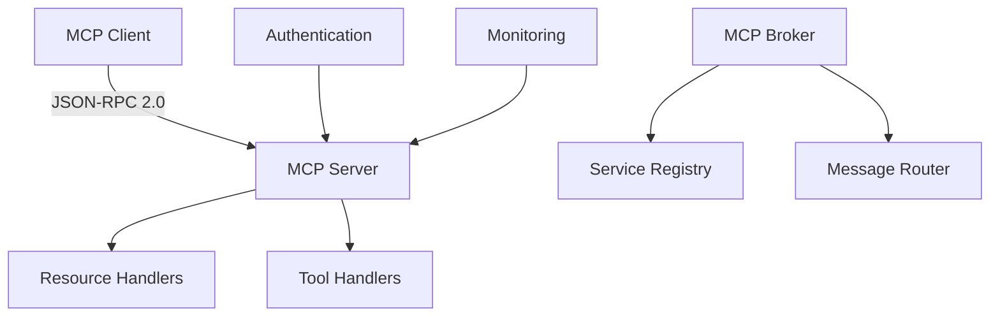

# MCP Core Developer Onboarding Guide

Welcome to MCP Core development! This guide will help you get started with the Model Context Protocol system and become productive quickly.

## Table of Contents

- [Prerequisites](#prerequisites)
- [Understanding MCP](#understanding-mcp)
- [Development Environment Setup](#development-environment-setup)
- [Your First MCP Application](#your-first-mcp-application)
- [Core Concepts Deep Dive](#core-concepts-deep-dive)
- [Common Development Patterns](#common-development-patterns)
- [Debugging and Troubleshooting](#debugging-and-troubleshooting)
- [Testing Your Code](#testing-your-code)
- [Contributing Guidelines](#contributing-guidelines)
- [Resources and Next Steps](#resources-and-next-steps)

## Prerequisites

### Required Knowledge
- **TypeScript/JavaScript**: Intermediate to advanced level
- **Node.js**: Understanding of async/await, event loops, and modules
- **JSON-RPC 2.0**: Basic understanding of the protocol
- **WebSockets**: Basic understanding of real-time communication
- **Design Patterns**: Factory, Observer, Strategy patterns

### Required Tools
- **Node.js 18+** or **Bun runtime**
- **TypeScript 5.0+**
- **Git** for version control
- **VS Code** (recommended) with TypeScript extensions

### Recommended Background
- Experience with API design
- Understanding of microservices architecture
- Familiarity with testing frameworks (Jest/Vitest)
- Basic knowledge of authentication/authorization

## Understanding MCP

### What is MCP?

The Model Context Protocol (MCP) is a standardized communication protocol that enables:
- **AI agents** to interact with external tools and services
- **Resource sharing** between different systems
- **Tool execution** in a secure, controlled environment
- **Service discovery** and capability advertisement

### Key Components



### Protocol Flow

1. **Connection**: Client connects to server via WebSocket
2. **Capability Exchange**: Server advertises available resources and tools
3. **Authentication**: Client authenticates if required
4. **Request/Response**: Client makes requests, server responds
5. **Subscriptions**: Client can subscribe to resource changes
6. **Cleanup**: Graceful disconnection and resource cleanup

## Development Environment Setup

### 1. Clone and Install

```bash
# Clone the repository
git clone https://github.com/the-new-fuse/mcp-core.git
cd mcp-core

# Install dependencies
npm install
# or
bun install

# Build the project
npm run build

# Run tests to verify setup
npm test
```

### 2. IDE Configuration

**VS Code Settings** (`.vscode/settings.json`):
```json
{
  "typescript.preferences.importModuleSpecifier": "relative",
  "editor.formatOnSave": true,
  "editor.codeActionsOnSave": {
    "source.organizeImports": true,
    "source.fixAll.eslint": true
  },
  "typescript.preferences.includePackageJsonAutoImports": "on"
}
```

**Recommended Extensions**:
- TypeScript Importer
- ESLint
- Prettier
- Jest Test Explorer
- Error Lens

### 3. Environment Variables

Create `.env` file:
```bash
# Development configuration
NODE_ENV=development
LOG_LEVEL=debug
MCP_SERVER_PORT=8080
MCP_CLIENT_TIMEOUT=10000

# Testing configuration
TEST_DATABASE_URL=sqlite://test.db
TEST_SERVER_PORT=8081
```

## Your First MCP Application

Let's build a simple calculator service to understand the basics.

### Step 1: Create a Calculator Tool

```typescript
// src/tools/CalculatorTool.ts
import { ToolHandler, MCPError, MCPErrorCode } from '@the-new-fuse/mcp-core';

export class CalculatorTool extends ToolHandler {
  name = 'calculator';

  async execute(params: {
    operation: 'add' | 'subtract' | 'multiply' | 'divide';
    a: number;
    b: number;
  }): Promise<any> {
    const { operation, a, b } = params;

    // Validate inputs
    if (typeof a !== 'number' || typeof b !== 'number') {
      throw new MCPError(
        MCPErrorCode.INVALID_PARAMS,
        'Both a and b must be numbers'
      );
    }

    let result: number;
    
    switch (operation) {
      case 'add':
        result = a + b;
        break;
      case 'subtract':
        result = a - b;
        break;
      case 'multiply':
        result = a * b;
        break;
      case 'divide':
        if (b === 0) {
          throw new MCPError(
            MCPErrorCode.INVALID_PARAMS,
            'Division by zero is not allowed'
          );
        }
        result = a / b;
        break;
      default:
        throw new MCPError(
          MCPErrorCode.INVALID_PARAMS,
          `Unknown operation: ${operation}`
        );
    }

    return {
      operation,
      operands: { a, b },
      result,
      timestamp: new Date().toISOString()
    };
  }

  async validate(params: any): Promise<boolean> {
    return (
      typeof params === 'object' &&
      ['add', 'subtract', 'multiply', 'divide'].includes(params.operation) &&
      typeof params.a === 'number' &&
      typeof params.b === 'number'
    );
  }

  getInputSchema(): object {
    return {
      type: 'object',
      properties: {
        operation: {
          type: 'string',
          enum: ['add', 'subtract', 'multiply', 'divide'],
          description: 'Mathematical operation to perform'
        },
        a: {
          type: 'number',
          description: 'First operand'
        },
        b: {
          type: 'number',
          description: 'Second operand'
        }
      },
      required: ['operation', 'a', 'b']
    };
  }
}
```

### Step 2: Create the Server

```typescript
// src/server.ts
import { MCPSystemFactory } from '@the-new-fuse/mcp-core';
import { CalculatorTool } from './tools/CalculatorTool';

async function createCalculatorServer() {
  // Create server instance
  const server = MCPSystemFactory.createServer({
    name: 'calculator-server',
    version: '1.0.0',
    description: 'A simple calculator MCP server',
    port: 8080,
    maxConnections: 100,
    logging: {
      level: 'debug',
      format: 'text'
    }
  });

  // Register the calculator tool
  await server.registerTool({
    name: 'calculator',
    description: 'Performs basic mathematical operations',
    inputSchema: new CalculatorTool().getInputSchema()
  }, new CalculatorTool());

  // Register server capability
  await server.registerCapability({
    name: 'mathematical-operations',
    version: '1.0.0',
    description: 'Basic mathematical operations capability',
    methods: ['tools/call']
  });

  // Start the server
  await server.start();
  console.log('Calculator server running on port 8080');
  
  return server;
}

// Handle graceful shutdown
process.on('SIGTERM', async () => {
  console.log('Shutting down gracefully...');
  process.exit(0);
});

// Start the server
createCalculatorServer().catch(console.error);
```

### Step 3: Create a Client

```typescript
// src/client.ts
import { MCPSystemFactory } from '@the-new-fuse/mcp-core';

async function createCalculatorClient() {
  const client = MCPSystemFactory.createClient({
    serverUrl: 'ws://localhost:8080',
    connectionTimeout: 5000,
    maxRetries: 3
  });

  try {
    // Connect to server
    await client.connect();
    console.log('Connected to calculator server');

    // List available tools
    const tools = await client.listTools();
    console.log('Available tools:', tools.map(t => t.name));

    // Perform calculations
    const addResult = await client.callTool('calculator', {
      operation: 'add',
      a: 10,
      b: 5
    });
    console.log('10 + 5 =', addResult.result);

    const divideResult = await client.callTool('calculator', {
      operation: 'divide',
      a: 20,
      b: 4
    });
    console.log('20 / 4 =', divideResult.result);

    // Test error handling
    try {
      await client.callTool('calculator', {
        operation: 'divide',
        a: 10,
        b: 0
      });
    } catch (error) {
      console.log('Expected error:', error.message);
    }

  } finally {
    await client.disconnect();
    console.log('Disconnected from server');
  }
}

createCalculatorClient().catch(console.error);
```

### Step 4: Run Your Application

```bash
# Terminal 1: Start the server
npm run build
node dist/server.js

# Terminal 2: Run the client
node dist/client.js
```

## Core Concepts Deep Dive

### 1. Resource Handlers

Resources represent data or services that can be accessed through MCP.

```typescript
import { ResourceHandler } from '@the-new-fuse/mcp-core';

export class ConfigResourceHandler extends ResourceHandler {
  private config = new Map<string, any>();

  async read(uri: string): Promise<any> {
    const key = this.extractKey(uri);
    
    if (!this.config.has(key)) {
      throw new MCPError(MCPErrorCode.RESOURCE_NOT_FOUND, `Config key not found: ${key}`);
    }

    return {
      key,
      value: this.config.get(key),
      lastModified: new Date().toISOString()
    };
  }

  async list(pattern?: string): Promise<any[]> {
    const keys = Array.from(this.config.keys());
    const filteredKeys = pattern 
      ? keys.filter(key => key.includes(pattern))
      : keys;

    return filteredKeys.map(key => ({
      uri: `config://${key}`,
      name: key,
      mimeType: 'application/json'
    }));
  }

  async write(uri: string, data: any): Promise<void> {
    const key = this.extractKey(uri);
    this.config.set(key, data.value);
    
    // Notify subscribers of change
    this.emit('change', { uri, key, value: data.value });
  }

  private extractKey(uri: string): string {
    const url = new URL(uri);
    return url.pathname.slice(1); // Remove leading slash
  }
}
```

### 2. Tool Handlers

Tools represent operations that can be executed.

```typescript
import { ToolHandler } from '@the-new-fuse/mcp-core';

export class FileProcessorTool extends ToolHandler {
  name = 'file-processor';

  async execute(params: {
    operation: 'read' | 'write' | 'delete';
    path: string;
    content?: string;
  }): Promise<any> {
    const { operation, path, content } = params;

    // Security check - ensure path is safe
    if (path.includes('..') || path.startsWith('/')) {
      throw new MCPError(
        MCPErrorCode.AUTHORIZATION_FAILED,
        'Invalid file path'
      );
    }

    switch (operation) {
      case 'read':
        return this.readFile(path);
      case 'write':
        return this.writeFile(path, content!);
      case 'delete':
        return this.deleteFile(path);
      default:
        throw new MCPError(
          MCPErrorCode.INVALID_PARAMS,
          `Unknown operation: ${operation}`
        );
    }
  }

  private async readFile(path: string): Promise<any> {
    const fs = await import('fs/promises');
    try {
      const content = await fs.readFile(path, 'utf-8');
      const stats = await fs.stat(path);
      
      return {
        path,
        content,
        size: stats.size,
        lastModified: stats.mtime.toISOString()
      };
    } catch (error) {
      throw new MCPError(
        MCPErrorCode.RESOURCE_NOT_FOUND,
        `File not found: ${path}`
      );
    }
  }

  // ... other methods
}
```

### 3. Error Handling

Always use structured error handling with appropriate MCP error codes.

```typescript
import { MCPError, MCPErrorCode } from '@the-new-fuse/mcp-core';

export class RobustToolHandler extends ToolHandler {
  async execute(params: any): Promise<any> {
    try {
      // Validate input
      await this.validateInput(params);
      
      // Perform operation
      return await this.performOperation(params);
      
    } catch (error) {
      // Transform errors to appropriate MCP errors
      if (error instanceof ValidationError) {
        throw new MCPError(
          MCPErrorCode.INVALID_PARAMS,
          `Validation failed: ${error.message}`,
          { field: error.field, value: error.value }
        );
      } else if (error instanceof TimeoutError) {
        throw new MCPError(
          MCPErrorCode.TOOL_TIMEOUT,
          'Operation timed out',
          { timeout: error.timeout }
        );
      } else if (error instanceof MCPError) {
        // Re-throw MCP errors as-is
        throw error;
      } else {
        // Wrap unknown errors
        throw new MCPError(
          MCPErrorCode.INTERNAL_ERROR,
          'Internal server error',
          { originalError: error.message }
        );
      }
    }
  }
}
```

## Common Development Patterns

### 1. Factory Pattern for Tool Creation

```typescript
export class ToolFactory {
  static createTool(type: string, config: any): ToolHandler {
    switch (type) {
      case 'calculator':
        return new CalculatorTool();
      case 'file-processor':
        return new FileProcessorTool(config.basePath);
      case 'database-query':
        return new DatabaseQueryTool(config.connectionString);
      default:
        throw new Error(`Unknown tool type: ${type}`);
    }
  }
}
```

### 2. Middleware Pattern for Request Processing

```typescript
interface MCPMiddleware {
  handle(request: MCPRequest, next: () => Promise<MCPResponse>): Promise<MCPResponse>;
}

export class ValidationMiddleware implements MCPMiddleware {
  async handle(request: MCPRequest, next: () => Promise<MCPResponse>): Promise<MCPResponse> {
    // Validate request format
    if (!this.isValidRequest(request)) {
      throw new MCPError(MCPErrorCode.INVALID_REQUEST, 'Invalid request format');
    }
    
    return next();
  }
}

export class LoggingMiddleware implements MCPMiddleware {
  async handle(request: MCPRequest, next: () => Promise<MCPResponse>): Promise<MCPResponse> {
    console.log(`[${new Date().toISOString()}] ${request.method}`);
    
    const start = Date.now();
    try {
      const response = await next();
      console.log(`[${new Date().toISOString()}] ${request.method} - ${Date.now() - start}ms`);
      return response;
    } catch (error) {
      console.error(`[${new Date().toISOString()}] ${request.method} - ERROR: ${error.message}`);
      throw error;
    }
  }
}
```

### 3. Observer Pattern for Event Handling

```typescript
import { EventEmitter } from 'events';

export class MCPEventBus extends EventEmitter {
  private static instance: MCPEventBus;
  
  static getInstance(): MCPEventBus {
    if (!MCPEventBus.instance) {
      MCPEventBus.instance = new MCPEventBus();
    }
    return MCPEventBus.instance;
  }
  
  publishResourceChange(uri: string, change: any): void {
    this.emit('resource:changed', { uri, change });
  }
  
  publishToolExecution(toolName: string, result: any): void {
    this.emit('tool:executed', { toolName, result });
  }
  
  subscribeToResourceChanges(callback: (event: any) => void): () => void {
    this.on('resource:changed', callback);
    return () => this.off('resource:changed', callback);
  }
}
```

## Debugging and Troubleshooting

### 1. Enable Debug Logging

```typescript
import { Logger } from '@the-new-fuse/mcp-core';

const logger = new Logger({
  level: 'debug',
  format: 'json',
  includeStackTrace: true
});

// Use throughout your application
logger.debug('Processing request', { requestId, method: request.method });
logger.info('Tool executed successfully', { toolName, duration });
logger.error('Tool execution failed', { toolName, error: error.message });
```

### 2. Request/Response Tracing

```typescript
export class TracingServer extends MCPServer {
  async handleRequest(request: MCPRequest): Promise<MCPResponse> {
    const traceId = this.generateTraceId();
    
    console.log(`[TRACE:${traceId}] Request:`, {
      method: request.method,
      id: request.id,
      params: this.sanitizeParams(request.params)
    });
    
    try {
      const response = await super.handleRequest(request);
      
      console.log(`[TRACE:${traceId}] Response:`, {
        id: response.id,
        success: !response.error
      });
      
      return response;
    } catch (error) {
      console.error(`[TRACE:${traceId}] Error:`, error.message);
      throw error;
    }
  }
}
```

### 3. Common Issues and Solutions

**Connection Issues:**
```typescript
// Add connection retry logic
const client = MCPSystemFactory.createClient({
  serverUrl: 'ws://localhost:8080',
  connectionTimeout: 10000,
  maxRetries: 5,
  retryDelay: 1000
});

client.on('disconnect', (reason) => {
  console.warn('Disconnected:', reason);
  // Implement reconnection logic
});
```

**Memory Leaks:**
```typescript
// Always clean up resources
export class CleanupAwareHandler extends ResourceHandler {
  private subscriptions: Set<() => void> = new Set();
  
  async subscribe(uri: string, callback: Function): Promise<() => void> {
    const unsubscribe = await super.subscribe(uri, callback);
    this.subscriptions.add(unsubscribe);
    
    return () => {
      unsubscribe();
      this.subscriptions.delete(unsubscribe);
    };
  }
  
  async dispose(): Promise<void> {
    // Clean up all subscriptions
    for (const unsubscribe of this.subscriptions) {
      unsubscribe();
    }
    this.subscriptions.clear();
  }
}
```

## Testing Your Code

### 1. Unit Testing Tools

```typescript
// tests/tools/CalculatorTool.test.ts
import { CalculatorTool } from '../../src/tools/CalculatorTool';
import { MCPError, MCPErrorCode } from '@the-new-fuse/mcp-core';

describe('CalculatorTool', () => {
  let tool: CalculatorTool;
  
  beforeEach(() => {
    tool = new CalculatorTool();
  });
  
  describe('execute', () => {
    it('should add two numbers correctly', async () => {
      const result = await tool.execute({
        operation: 'add',
        a: 5,
        b: 3
      });
      
      expect(result.result).toBe(8);
      expect(result.operation).toBe('add');
      expect(result.operands).toEqual({ a: 5, b: 3 });
    });
    
    it('should throw error for division by zero', async () => {
      await expect(tool.execute({
        operation: 'divide',
        a: 10,
        b: 0
      })).rejects.toThrow(MCPError);
    });
  });
  
  describe('validate', () => {
    it('should validate correct parameters', async () => {
      const valid = await tool.validate({
        operation: 'add',
        a: 5,
        b: 3
      });
      
      expect(valid).toBe(true);
    });
    
    it('should reject invalid operation', async () => {
      const valid = await tool.validate({
        operation: 'invalid',
        a: 5,
        b: 3
      });
      
      expect(valid).toBe(false);
    });
  });
});
```

### 2. Integration Testing

```typescript
// tests/integration/server-client.test.ts
import { MCPSystemFactory } from '@the-new-fuse/mcp-core';
import { CalculatorTool } from '../../src/tools/CalculatorTool';

describe('Server-Client Integration', () => {
  let server: MCPServer;
  let client: MCPClient;
  
  beforeAll(async () => {
    // Start test server
    server = MCPSystemFactory.createServer({
      name: 'test-server',
      version: '1.0.0',
      port: 8082
    });
    
    await server.registerTool({
      name: 'calculator',
      description: 'Calculator tool',
      inputSchema: new CalculatorTool().getInputSchema()
    }, new CalculatorTool());
    
    await server.start();
    
    // Connect client
    client = MCPSystemFactory.createClient({
      serverUrl: 'ws://localhost:8082'
    });
    
    await client.connect();
  });
  
  afterAll(async () => {
    await client.disconnect();
    await server.stop();
  });
  
  it('should execute calculator tool end-to-end', async () => {
    const result = await client.callTool('calculator', {
      operation: 'multiply',
      a: 6,
      b: 7
    });
    
    expect(result.result).toBe(42);
  });
});
```

## Contributing Guidelines

### 1. Code Style

- Use TypeScript strict mode
- Follow ESLint and Prettier configurations
- Write comprehensive JSDoc comments
- Use meaningful variable and function names

### 2. Pull Request Process

1. Fork the repository
2. Create a feature branch: `git checkout -b feature/your-feature`
3. Write tests for your changes
4. Ensure all tests pass: `npm test`
5. Update documentation if needed
6. Submit a pull request with clear description

### 3. Commit Message Format

```
feat(server): add support for batch requests
fix(client): handle connection timeout properly
docs(api): update ResourceHandler documentation
test(integration): add broker service tests
```

## Resources and Next Steps

### Documentation
- [API Reference](./API_REFERENCE.md) - Complete API documentation
- [Best Practices](./BEST_PRACTICES.md) - Development best practices
- [Troubleshooting](./TROUBLESHOOTING.md) - Common issues and solutions
- [Usage Examples](./USAGE_EXAMPLES.md) - Real-world examples

### Example Projects
- [Basic File Server](../examples/file-server.ts)
- [Database Integration](../examples/database-integration.ts)
- [Authentication Server](../examples/auth-server.ts)
- [Monitoring Dashboard](../examples/monitoring-dashboard.ts)

### Community
- GitHub Issues: Report bugs and request features
- Discussions: Ask questions and share ideas
- Discord: Real-time community support

### Advanced Topics
- Custom transport implementations
- Plugin development
- Performance optimization
- Security hardening
- Deployment strategies

Congratulations! You now have a solid foundation for developing with MCP Core. Start with the simple examples and gradually work your way up to more complex scenarios. Remember to refer to the documentation and don't hesitate to ask for help in the community channels.

Happy coding! 🚀