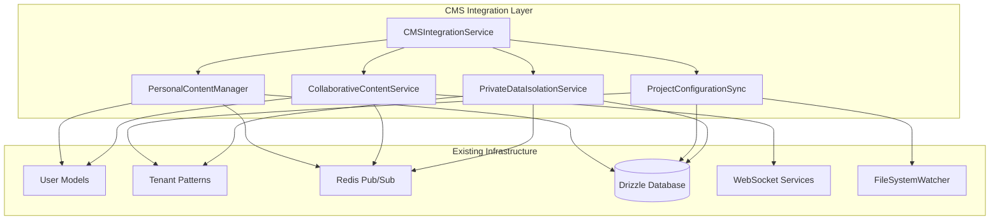

# CMS Integration with Existing User and Tenant Systems

## Overview

The CMS Integration module provides comprehensive content management system functionality that seamlessly integrates with The New Fuse's existing user and tenant systems. It implements personal content management, project configuration synchronization, collaborative content sharing, and private data isolation while maintaining security and audit trails.

## Key Features

### 1. Personal Content Management
- **User-centric content storage** using existing User models
- **Tenant isolation** with proper privacy boundaries
- **Real-time synchronization** across user's active sessions
- **Version control** and conflict resolution
- **Content metadata** and tagging system

### 2. Project Configuration Sync
- **File-based configuration monitoring** with chokidar
- **Privacy boundary enforcement** using existing tenant patterns
- **Collaborative configuration management** with role-based access
- **Conflict resolution strategies** for concurrent updates
- **Real-time propagation** across environments

### 3. Collaborative Content Sharing
- **Role-based access control** using existing UserRole enum
- **Permission management** with granular controls
- **Expiration-based sharing** with automatic cleanup
- **Real-time notifications** for collaboration events
- **Audit trails** for all sharing activities

### 4. Private Data Isolation
- **Tenant-level data segregation** using existing patterns
- **Privacy boundary enforcement** with configurable restrictions
- **Encryption** for sensitive data at rest and in transit
- **Compliance auditing** with detailed reporting
- **Access logging** for security monitoring

## Architecture



## Core Components

### CMSIntegrationService

Main orchestration service that coordinates all CMS functionality.

```typescript
import { CMSIntegrationService } from '@sync-core/cms';

const cmsService = new CMSIntegrationService(
  drizzle,
  redis,
  syncOrchestrator,
  fileWatcher,
  {
    enablePersonalContent: true,
    enableProjectSync: true,
    enableCollaboration: true,
    defaultPrivacy: PrivacyLevel.PRIVATE,
    maxContentSize: 10 * 1024 * 1024, // 10MB
    allowedContentTypes: [ContentType.DOCUMENT, ContentType.TEMPLATE],
    syncInterval: 30000 // 30 seconds
  }
);

await cmsService.initialize();
```

### PersonalContentManager

Manages user's personal content with tenant isolation.

```typescript
// Create personal content
const content = await cmsService.createPersonalContent(userId, {
  type: ContentType.DOCUMENT,
  title: 'My Personal Notes',
  content: 'Private content...',
  metadata: { tags: ['personal', 'notes'] },
  privacy: PrivacyLevel.PRIVATE,
  sharingSettings: {
    isPublic: false,
    allowedUsers: [],
    allowedRoles: [],
    permissions: []
  }
});

// List user's content
const userContent = await cmsService.getUserContent(userId, {
  includePersonal: true,
  contentType: ContentType.DOCUMENT,
  limit: 10
});
```

### ProjectConfigurationSync

Synchronizes project configurations with file watching.

```typescript
// Create project configuration
const project = await cmsService.createProjectConfiguration(userId, {
  name: 'My Development Project',
  description: 'Project configuration',
  config: {
    database: { host: 'localhost', port: 5432 },
    api: { baseUrl: 'http://localhost:3000' }
  },
  privacy: PrivacyLevel.PRIVATE,
  collaborators: [],
  syncSettings: {
    enabled: true,
    frequency: SyncFrequency.REAL_TIME,
    conflictResolution: ConflictResolutionStrategy.LAST_WRITE_WINS,
    backupEnabled: true,
    versionHistory: true
  }
});
```

### CollaborativeContentService

Manages content sharing and collaboration.

```typescript
// Share content with another user
await cmsService.shareContent(
  ownerId,
  contentId,
  targetUserId,
  [Permission.READ, Permission.WRITE],
  new Date(Date.now() + 7 * 24 * 60 * 60 * 1000) // 7 days
);

// Add project collaborator
await cmsService.addProjectCollaborator(
  ownerId,
  projectId,
  collaboratorUserId,
  UserRole.AGENCY_MANAGER,
  [Permission.READ, Permission.WRITE, Permission.SHARE]
);
```

### PrivateDataIsolationService

Ensures data privacy and compliance.

```typescript
// Create privacy boundary
const boundary = await privateDataService.createPrivacyBoundary(
  userId,
  tenantId,
  ['personal_content', 'project_config'],
  [
    { type: RestrictionType.ROLE_BASED, value: 'ADMIN' },
    { type: RestrictionType.TIME_WINDOW, value: '09:00-17:00' }
  ]
);

// Audit privacy compliance
const audit = await cmsService.auditPrivacyCompliance(tenantId);
console.log(`Compliant: ${audit.compliant}`);
console.log(`Violations: ${audit.violations.length}`);
```

## Data Models

### Content Item
```typescript
interface ContentItem {
  id: string;
  type: ContentType;
  title: string;
  content: string;
  metadata: ContentMetadata;
  ownerId: string;
  tenantId?: string;
  privacy: PrivacyLevel;
  sharingSettings: SharingSettings;
  createdAt: Date;
  updatedAt: Date;
  version: number;
  checksum: string;
}
```

### Project Configuration
```typescript
interface ProjectConfiguration {
  id: string;
  name: string;
  description?: string;
  config: Record<string, any>;
  ownerId: string;
  tenantId?: string;
  privacy: PrivacyLevel;
  collaborators: Collaborator[];
  syncSettings: SyncSettings;
  createdAt: Date;
  updatedAt: Date;
  version: number;
}
```

### Privacy Boundary
```typescript
interface PrivacyBoundary {
  tenantId: string;
  userId: string;
  dataTypes: string[];
  restrictions: Restriction[];
  auditRequired: boolean;
}
```

## Database Schema

The CMS integration extends the existing database with these tables:

```sql
-- Personal content storage
CREATE TABLE personal_content (
  id VARCHAR(255) PRIMARY KEY,
  type VARCHAR(50) NOT NULL,
  title VARCHAR(500) NOT NULL,
  content TEXT,
  metadata JSON,
  owner_id VARCHAR(255) NOT NULL,
  tenant_id VARCHAR(255),
  privacy VARCHAR(20) NOT NULL DEFAULT 'private',
  sharing_settings JSON,
  created_at TIMESTAMP DEFAULT CURRENT_TIMESTAMP,
  updated_at TIMESTAMP DEFAULT CURRENT_TIMESTAMP ON UPDATE CURRENT_TIMESTAMP,
  deleted_at TIMESTAMP NULL,
  version INT DEFAULT 1,
  checksum VARCHAR(64)
);

-- Project configurations
CREATE TABLE project_configurations (
  id VARCHAR(255) PRIMARY KEY,
  name VARCHAR(500) NOT NULL,
  description TEXT,
  config JSON,
  owner_id VARCHAR(255) NOT NULL,
  tenant_id VARCHAR(255),
  privacy VARCHAR(20) NOT NULL DEFAULT 'private',
  collaborators JSON,
  sync_settings JSON,
  created_at TIMESTAMP DEFAULT CURRENT_TIMESTAMP,
  updated_at TIMESTAMP DEFAULT CURRENT_TIMESTAMP ON UPDATE CURRENT_TIMESTAMP,
  deleted_at TIMESTAMP NULL,
  version INT DEFAULT 1
);

-- Content sharing permissions
CREATE TABLE content_sharing_permissions (
  id VARCHAR(255) PRIMARY KEY DEFAULT (UUID()),
  content_id VARCHAR(255) NOT NULL,
  user_id VARCHAR(255) NOT NULL,
  role VARCHAR(50) NOT NULL,
  permissions JSON,
  granted_by VARCHAR(255) NOT NULL,
  granted_at TIMESTAMP DEFAULT CURRENT_TIMESTAMP,
  expires_at TIMESTAMP NULL,
  UNIQUE KEY unique_content_user (content_id, user_id)
);

-- Privacy boundaries
CREATE TABLE privacy_boundaries (
  id VARCHAR(255) PRIMARY KEY DEFAULT (UUID()),
  tenant_id VARCHAR(255) NOT NULL UNIQUE,
  user_id VARCHAR(255) NOT NULL,
  data_types JSON,
  restrictions JSON,
  audit_required BOOLEAN DEFAULT TRUE,
  created_at TIMESTAMP DEFAULT CURRENT_TIMESTAMP,
  updated_at TIMESTAMP DEFAULT CURRENT_TIMESTAMP ON UPDATE CURRENT_TIMESTAMP
);
```

## Integration with Existing Systems

### User and Tenant Models
- Uses existing `User` model for ownership and permissions
- Leverages existing `UserRole` enum for access control
- Implements tenant isolation using established patterns
- Integrates with existing `AuthEvent` logging for audit trails

### Redis and WebSocket Services
- Uses existing Redis pub/sub infrastructure for real-time updates
- Integrates with `AgentWebSocketService` for live notifications
- Leverages existing Redis keyspace patterns for tenant isolation
- Uses established Redis caching strategies

### File System Monitoring
- Extends existing `EnhancedFileSystemWatcher` for configuration files
- Integrates with existing file synchronization patterns
- Uses established chokidar configuration and event handling
- Maintains compatibility with existing file watching infrastructure

### Database Integration
- Uses existing Drizzle client and connection patterns
- Leverages established database transaction patterns
- Integrates with existing database versioning and conflict resolution
- Uses existing database-level tenant isolation

## Security and Privacy

### Data Isolation
- **Tenant-level isolation** using existing patterns
- **User-specific data segregation** with proper access controls
- **Privacy boundary enforcement** with configurable restrictions
- **Encryption** for sensitive data using tenant-specific keys

### Access Control
- **Role-based permissions** using existing UserRole hierarchy
- **Granular permission system** with read/write/share/admin levels
- **Time-based access** with expiration and automatic cleanup
- **Audit logging** for all access attempts and permission changes

### Compliance
- **Privacy compliance auditing** with detailed reporting
- **Data retention policies** with automatic cleanup
- **Access pattern monitoring** for anomaly detection
- **Regulatory compliance** support with audit trails

## Performance Considerations

### Caching Strategy
- **Redis caching** for frequently accessed content
- **Tenant-specific cache keys** for isolation
- **Cache invalidation** on content updates
- **LRU eviction** for memory management

### Synchronization Optimization
- **Batched updates** for high-volume changes
- **Debounced file watching** to prevent excessive events
- **Conflict resolution** with minimal data transfer
- **Incremental synchronization** for large content

### Scalability
- **Horizontal scaling** with Redis clustering
- **Database sharding** support for large datasets
- **Load balancing** for file watching across instances
- **Async processing** for non-critical operations

## Monitoring and Observability

### Metrics Collection
- **Content creation/update rates** per tenant
- **Collaboration activity** and sharing patterns
- **Privacy compliance** metrics and violations
- **Synchronization performance** and error rates

### Health Monitoring
- **Service availability** and response times
- **Database connection** health and performance
- **Redis connectivity** and pub/sub latency
- **File system** monitoring and disk usage

### Alerting
- **Privacy violations** and compliance issues
- **Synchronization failures** and conflicts
- **Performance degradation** and resource limits
- **Security incidents** and unauthorized access

## Best Practices

### Content Management
1. **Use appropriate privacy levels** for different content types
2. **Implement proper metadata** for searchability and organization
3. **Regular content cleanup** to manage storage usage
4. **Version control** for important configurations

### Collaboration
1. **Principle of least privilege** for permission assignment
2. **Regular permission audits** and cleanup
3. **Clear expiration policies** for temporary access
4. **Proper role hierarchy** enforcement

### Privacy and Security
1. **Regular privacy audits** and compliance checks
2. **Encryption for sensitive data** at rest and in transit
3. **Proper tenant isolation** and boundary enforcement
4. **Comprehensive audit logging** for all operations

### Performance
1. **Efficient caching strategies** with proper invalidation
2. **Optimized database queries** with proper indexing
3. **Batched operations** for bulk updates
4. **Resource monitoring** and capacity planning

## Troubleshooting

### Common Issues

#### Content Not Syncing
- Check Redis connectivity and pub/sub channels
- Verify tenant isolation and permissions
- Review file watcher configuration and patterns
- Check database transaction logs for conflicts

#### Permission Denied Errors
- Verify user roles and permission hierarchy
- Check privacy boundaries and restrictions
- Review sharing permissions and expiration
- Validate tenant isolation configuration

#### Performance Issues
- Monitor Redis memory usage and eviction
- Check database query performance and indexing
- Review file watcher event volume and debouncing
- Analyze synchronization batch sizes and frequency

#### Privacy Compliance Violations
- Run privacy audit and review violations
- Check data access patterns and unauthorized attempts
- Verify encryption and data isolation
- Review audit logs for security incidents

### Debugging Tools

#### CMS Event Monitoring
```typescript
// Subscribe to CMS events for debugging
redis.subscribe('cms_events', (message) => {
  const event = JSON.parse(message);
  console.log(`CMS Event: ${event.type}`, event);
});
```

#### Privacy Audit
```typescript
// Run comprehensive privacy audit
const audit = await cmsService.auditPrivacyCompliance(tenantId);
console.log('Privacy Audit Results:', audit);
```

#### Sync Status Check
```typescript
// Check synchronization status
await cmsService.syncUserCMSData(userId);
console.log('Sync completed successfully');
```

## Migration Guide

### From Existing Content Systems
1. **Export existing content** in compatible format
2. **Map user permissions** to new role-based system
3. **Migrate configurations** with proper privacy settings
4. **Validate data integrity** after migration
5. **Update client applications** to use new APIs

### Database Migration
```sql
-- Add CMS tables to existing database
-- Run the table creation scripts provided above
-- Migrate existing data with proper tenant isolation
-- Update indexes for performance optimization
```

### Configuration Updates
```typescript
// Update application configuration
const cmsConfig = {
  enablePersonalContent: true,
  enableProjectSync: true,
  enableCollaboration: true,
  defaultPrivacy: PrivacyLevel.PRIVATE,
  maxContentSize: 10 * 1024 * 1024,
  allowedContentTypes: [ContentType.DOCUMENT, ContentType.TEMPLATE],
  syncInterval: 30000
};
```

## API Reference

See the [API Reference](../README.md) for detailed documentation of all CMS integration methods and interfaces.

## Examples

See the [Usage Examples](../examples/README.md) for comprehensive examples of CMS integration usage patterns and best practices.