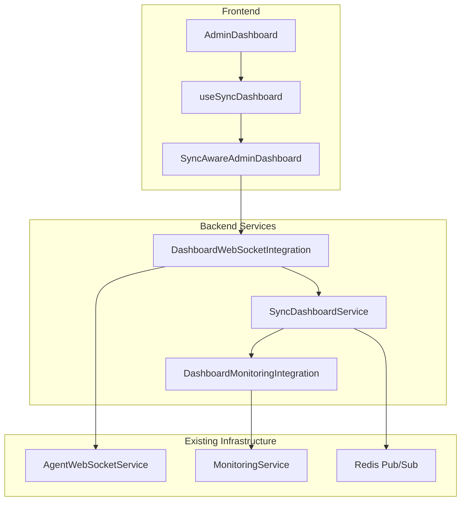

# Dashboard Integration

This document describes how to integrate the sync-aware dashboard system with
existing AdminDashboard and user interfaces to provide real-time sync updates.

## Overview

The dashboard integration extends existing user control panels with real-time
synchronization updates, including:

- **Sync Metrics**: Real-time performance and operation statistics
- **System Health**: Service status and clock synchronization monitoring
- **System Alerts**: Automated alerts for sync issues and thresholds
- **Operation Tracking**: Live sync operations and conflict resolution
- **Multi-Session Sync**: Synchronized state across multiple user sessions

## Architecture



## Components

### SyncDashboardService

Core service that manages dashboard data and real-time updates.

**Key Features:**

- Subscribes to sync events from Redis channels
- Caches dashboard data (metrics, health, alerts, operations)
- Broadcasts updates via WebSocket integration
- Integrates with existing monitoring systems

**Usage:**

```typescript
import { SyncDashboardService } from '@the-new-fuse/sync-core/dashboard';

@Injectable()
export class MyService {
  constructor(private dashboardService: SyncDashboardService) {}

  async createAlert() {
    await this.dashboardService.createAlert({
      level: 'warning',
      message: 'High sync latency detected',
      component: 'sync_monitor',
      tenantId: 'tenant-123',
    });
  }
}
```

### React Integration

#### useSyncDashboard Hook

React hook for integrating sync updates with existing dashboard components.

```typescript
import { useSyncDashboard } from '@the-new-fuse/sync-core/dashboard';

export const MyDashboard: React.FC = () => {
  const {
    data,
    isConnected,
    isLoading,
    error,
    refresh,
    clearAlerts,
    acknowledgeAlert
  } = useSyncDashboard({
    tenantId: 'current-tenant',
    userId: 'current-user',
    autoConnect: true
  });

  return (
    <div>
      <div>Status: {isConnected ? 'Connected' : 'Disconnected'}</div>
      {data.metrics && (
        <div>Sync Operations: {data.metrics.operations.sync}</div>
      )}
      {data.alerts.map(alert => (
        <div key={alert.id}>
          {alert.message}
          <button onClick={() => acknowledgeAlert(alert.id)}>
            Acknowledge
          </button>
        </div>
      ))}
    </div>
  );
};
```

#### SyncAwareAdminDashboard Component

Drop-in replacement for existing AdminDashboard with sync features.

```typescript
import { SyncAwareAdminDashboard } from '@the-new-fuse/sync-core/dashboard';

export const EnhancedAdminDashboard: React.FC = () => {
  return (
    <SyncAwareAdminDashboard
      tenantId="current-tenant"
      userId="current-user"
      showSyncMetrics={true}
      showHealthStatus={true}
      showAlerts={true}
      showOperations={true}
      autoRefresh={true}
      refreshInterval={30000}
    />
  );
};
```

### WebSocket Integration

The `DashboardWebSocketIntegration` extends existing WebSocket infrastructure to
support dashboard clients.

**Features:**

- Multi-session synchronization for users
- Tenant-aware message broadcasting
- Real-time dashboard data delivery
- Maintenance notifications

### Monitoring Integration

The `DashboardMonitoringIntegration` connects with existing monitoring systems
to create alerts and track metrics.

**Alert Thresholds:**

- Sync error rate > 10% (warning) / 25% (critical)
- Agent disconnect rate > 20% (warning)
- Sync latency > 5 seconds (warning)
- Conflict rate > 5% (info)

## Integration Steps

### 1. Backend Integration

Add dashboard services to your existing module:

```typescript
import {
  SyncDashboardService,
  DashboardWebSocketIntegration,
  DashboardMonitoringIntegration,
} from '@the-new-fuse/sync-core/dashboard';

@Module({
  providers: [
    SyncDashboardService,
    DashboardWebSocketIntegration,
    DashboardMonitoringIntegration,
    {
      provide: 'IAgentWebSocketService',
      useExisting: YourExistingWebSocketService,
    },
    {
      provide: 'IMonitoringService',
      useExisting: YourExistingMonitoringService,
    },
  ],
})
export class YourModule {}
```

### 2. Frontend Integration

Replace or enhance existing dashboard components:

```typescript
// Option 1: Replace existing AdminDashboard
import { SyncAwareAdminDashboard } from '@the-new-fuse/sync-core/dashboard';

// Option 2: Enhance existing component with hook
import { useSyncDashboard } from '@the-new-fuse/sync-core/dashboard';

export const ExistingDashboard: React.FC = () => {
  const { data, isConnected } = useSyncDashboard({
    tenantId: getCurrentTenantId(),
    userId: getCurrentUserId()
  });

  // Merge sync data with existing dashboard data
  return (
    <div>
      {/* Existing dashboard content */}

      {/* Add sync status */}
      <div>Sync Status: {isConnected ? 'Connected' : 'Disconnected'}</div>

      {/* Add sync metrics */}
      {data.metrics && (
        <SyncMetricsWidget metrics={data.metrics} />
      )}

      {/* Add alerts */}
      {data.alerts.length > 0 && (
        <AlertsWidget alerts={data.alerts} />
      )}
    </div>
  );
};
```

### 3. WebSocket Configuration

Configure WebSocket namespaces for dashboard clients:

```typescript
// In your WebSocket gateway
@WebSocketGateway({
  namespace: '/dashboard',
  cors: { origin: '*' },
})
export class DashboardGateway {
  // Dashboard-specific WebSocket handling
}
```

### 4. Monitoring Integration

Connect with existing monitoring systems:

```typescript
@Injectable()
export class ExistingMonitoringAdapter implements IMonitoringService {
  constructor(private existingMonitoring: YourMonitoringService) {}

  async recordMetric(
    name: string,
    value: number,
    tags?: Record<string, string>
  ) {
    return this.existingMonitoring.recordMetric(name, value, tags);
  }

  async getSystemHealth() {
    return this.existingMonitoring.getSystemHealth();
  }

  async createAlert(alert: any) {
    return this.existingMonitoring.createAlert(alert);
  }
}
```

## Configuration

### Environment Variables

```bash
# Dashboard update intervals
SYNC_DASHBOARD_UPDATE_INTERVAL=1000
SYNC_DASHBOARD_METRICS_RETENTION=86400000
SYNC_DASHBOARD_ALERTS_RETENTION=604800000

# Multi-session support
SYNC_DASHBOARD_ENABLE_MULTI_SESSION=true
SYNC_DASHBOARD_ENABLE_CROSS_TENANT=false

# Alert thresholds
ALERT_THRESHOLD_SYNC_ERROR_RATE=0.1
ALERT_THRESHOLD_SYNC_LATENCY=5000
ALERT_THRESHOLD_AGENT_DISCONNECT_RATE=0.2
```

### Redis Channels

The dashboard service subscribes to these Redis channels:

- `sync:sync:operations` - Sync operation updates
- `sync:sync:conflicts` - Conflict detection events
- `sync:sync:health` - System health changes
- `sync:agent:status` - Agent status changes
- `sync:task:updates` - Task progress updates
- `sync:file:changes` - File change notifications

## Data Structures

### Dashboard Data

```typescript
interface DashboardData {
  metrics: SyncMetrics | null;
  health: SyncHealth | null;
  alerts: SystemAlert[];
  operations: SyncOperation[];
  lastUpdated: Date | null;
}
```

### Sync Metrics

```typescript
interface SyncMetrics {
  operations: {
    sync: number;
    conflicts: number;
    fileChanges: number;
  };
  performance: {
    avgSyncTime: number;
    successRate: number;
    throughput: number;
  };
  errors: {
    networkErrors: number;
    conflictErrors: number;
    validationErrors: number;
  };
}
```

### System Health

```typescript
interface SyncHealth {
  status: 'healthy' | 'degraded' | 'unhealthy';
  clockSync: {
    status: 'synced' | 'drifted' | 'failed';
    lastSync: Date;
    drift: number;
  };
  services: {
    redis: string;
    database: string;
    fileSystem: string;
    webSocket: string;
  };
  lastCheck: Date;
}
```

### System Alert

```typescript
interface SystemAlert {
  id: string;
  level: 'info' | 'warning' | 'error' | 'critical';
  message: string;
  component: string;
  tenantId?: string;
  metadata?: Record<string, any>;
  timestamp: Date;
}
```

## Real-Time Updates

### Update Types

- `sync_metrics` - Performance and operation statistics
- `sync_health` - System health status changes
- `agent_status` - Agent connection/disconnection events
- `task_progress` - Task completion and progress updates
- `system_alert` - New alerts and notifications
- `file_change` - File system change events
- `conflict_detected` - Sync conflict notifications
- `sync_operation` - Individual sync operation status

### Broadcasting Rules

1. **User-specific updates** → Send to all user sessions
2. **Tenant-specific updates** → Send to all tenant users
3. **Global updates** → Send to all dashboard clients (if enabled)

### Multi-Session Synchronization

The system maintains synchronized state across multiple browser sessions for the
same user:

- Dashboard data is cached per tenant/user
- Updates are broadcast to all active sessions
- Session reconnection automatically syncs latest state
- Offline sessions receive updates when reconnected

## Performance Considerations

### Caching Strategy

- **Metrics Cache**: Latest metrics per tenant (24h retention)
- **Health Cache**: Current health status per tenant
- **Alerts Cache**: Recent alerts per tenant (max 100, 7d retention)
- **Operations Cache**: Recent operations per tenant (max 50)

### Update Throttling

- Metrics collection: Every 1 second
- Health checks: Every 5 seconds
- Alert threshold checks: Every 30 seconds
- Cache cleanup: Every 5 minutes

### Scalability

- Horizontal scaling via Redis coordination
- WebSocket connection pooling
- Tenant-isolated data structures
- Configurable retention policies

## Testing

### Unit Tests

```typescript
import { Test } from '@nestjs/testing';
import { SyncDashboardService } from './SyncDashboardService';

describe('SyncDashboardService', () => {
  let service: SyncDashboardService;

  beforeEach(async () => {
    const module = await Test.createTestingModule({
      providers: [
        SyncDashboardService,
        // Mock providers
      ],
    }).compile();

    service = module.get<SyncDashboardService>(SyncDashboardService);
  });

  it('should process dashboard updates', async () => {
    // Test implementation
  });
});
```

### Integration Tests

```typescript
describe('Dashboard Integration', () => {
  it('should handle end-to-end sync updates', async () => {
    // Test complete flow from sync event to dashboard update
  });
});
```

### Frontend Tests

```typescript
import { renderHook } from '@testing-library/react-hooks';
import { useSyncDashboard } from './useSyncDashboard';

describe('useSyncDashboard', () => {
  it('should connect and receive updates', async () => {
    const { result } = renderHook(() =>
      useSyncDashboard({
        tenantId: 'test-tenant',
      })
    );

    // Test hook behavior
  });
});
```

## Troubleshooting

### Common Issues

1. **Dashboard not updating**
   - Check WebSocket connection status
   - Verify Redis channel subscriptions
   - Check tenant ID configuration

2. **High memory usage**
   - Review cache retention settings
   - Check for memory leaks in event handlers
   - Monitor Redis memory usage

3. **Slow dashboard performance**
   - Reduce update frequency
   - Optimize cache size limits
   - Check network latency

### Debug Commands

```typescript
// Get dashboard service status
const status = await dashboardService.getDashboardData('tenant-id');

// Check connected clients
const clientCount = wsIntegration.getConnectedClientsCount();

// Get metrics summary
const metrics = monitoringIntegration.getMetricsSummary();
```

## Migration Guide

### From Existing AdminDashboard

1. **Gradual Migration**: Use `useSyncDashboard` hook in existing components
2. **Full Replacement**: Replace with `SyncAwareAdminDashboard`
3. **Hybrid Approach**: Combine existing and sync-aware components

### Backward Compatibility

The sync-aware dashboard maintains compatibility with existing:

- AdminDashboard component structure
- WebSocket service interfaces
- Monitoring system APIs
- Database schemas

## Best Practices

1. **Performance**
   - Use appropriate update intervals
   - Implement proper caching strategies
   - Monitor resource usage

2. **Security**
   - Validate tenant isolation
   - Implement proper authentication
   - Sanitize alert messages

3. **User Experience**
   - Provide connection status indicators
   - Handle offline scenarios gracefully
   - Implement proper error messaging

4. **Monitoring**
   - Track dashboard performance metrics
   - Monitor WebSocket connection health
   - Alert on system degradation

## Future Enhancements

- Dashboard customization and layouts
- Advanced filtering and search
- Historical data visualization
- Mobile-responsive design
- Offline support with sync on reconnect
