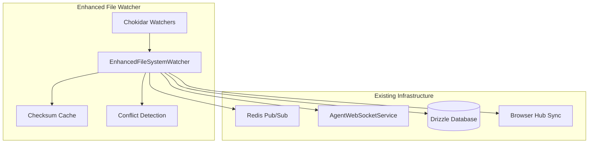

# Enhanced File System Watcher

The Enhanced File System Watcher extends The New Fuse's existing file
synchronization capabilities with comprehensive chokidar-based monitoring,
multi-tenant support, and conflict detection.

## Overview

This component builds upon the existing browser hub sync patterns
(`scripts/sync-browser-hub-global.cjs`) and the basic `FileSystemWatcher` in
`packages/core/src/utils/FileSystemWatcher.ts` to provide:

- **Multi-tenant file watching** with proper isolation
- **Checksum-based conflict detection** to prevent data loss
- **Real-time synchronization** with existing Redis and WebSocket infrastructure
- **Database integration** for sync state tracking
- **Comprehensive error handling** and monitoring

## Architecture Integration

The Enhanced File System Watcher integrates seamlessly with existing
infrastructure:



## Key Features

### 1. Multi-Tenant File Watching

```typescript
// Watch tenant-specific files
await watcher.watchTenantFiles('tenant-1', [
  './data/tenants/tenant-1/**/*',
  './apps/*/tenant-configs/tenant-1/**/*',
]);

// Watch global files (cross-tenant)
await watcher.watchGlobalFiles([
  './apps/browser-hub/**/*',
  './packages/*/templates/**/*',
]);
```

### 2. Conflict Detection

The watcher automatically detects conflicts based on:

- **Checksum mismatches** between local and remote versions
- **Concurrent modifications** from multiple sources
- **Version conflicts** in database sync state

```typescript
watcher.on('conflict', (conflict) => {
  console.log('Conflict detected:', {
    file: conflict.filePath,
    type: conflict.conflictType, // 'checksum' | 'concurrent' | 'version'
    localChecksum: conflict.localChecksum,
    remoteChecksum: conflict.remoteChecksum,
  });
});
```

### 3. Real-time File Change Events

```typescript
watcher.on('fileChange', (event) => {
  console.log(`File ${event.type}: ${event.filePath}`, {
    tenant: event.tenantId,
    checksum: event.checksum,
    timestamp: event.timestamp,
  });
});
```

### 4. Database Integration

All file changes are tracked in the database using the existing Drizzle schema:

```sql
-- Sync state tracking
CREATE TABLE sync_states (
  id TEXT PRIMARY KEY,
  resource_type TEXT NOT NULL,
  resource_id TEXT NOT NULL,
  tenant_id TEXT,
  version INTEGER DEFAULT 1,
  checksum TEXT NOT NULL,
  last_sync TIMESTAMP DEFAULT CURRENT_TIMESTAMP,
  synced_by TEXT NOT NULL,
  metadata JSON
);

-- Conflict tracking
CREATE TABLE sync_conflicts (
  id TEXT PRIMARY KEY,
  resource_type TEXT NOT NULL,
  resource_id TEXT NOT NULL,
  tenant_id TEXT,
  conflict_type TEXT NOT NULL,
  local_version JSON NOT NULL,
  remote_version JSON NOT NULL,
  resolved_at TIMESTAMP,
  resolved_by TEXT,
  resolution JSON,
  created_at TIMESTAMP DEFAULT CURRENT_TIMESTAMP
);
```

## Usage Examples

### Basic Setup

```typescript
import { EnhancedFileSystemWatcher } from '@the-new-fuse/sync-core';

// Initialize with dependencies
const watcher = new EnhancedFileSystemWatcher(redisConfig, dbService);

// Configure watching
const config = {
  paths: ['./apps/browser-hub/**/*'],
  enableChecksumValidation: true,
  enableConflictDetection: true,
  debounceMs: 200,
};

await watcher.initialize(config);
```

### Integration with Browser Hub Sync

```typescript
// Watch browser hub files
await watcher.watchGlobalFiles([
  './apps/browser-hub/**/*.html',
  './apps/browser-hub/**/*.js',
  './apps/browser-hub/**/*.css',
]);

// Integrate with existing sync system
watcher.on('fileChange', async (event) => {
  if (event.filePath.includes('browser-hub')) {
    // Trigger existing browser hub sync
    const {
      BrowserHubSyncManager,
    } = require('../../scripts/sync-browser-hub-global.cjs');
    const syncManager = new BrowserHubSyncManager();
    await syncManager.copyToTargets(event.filePath);
  }
});
```

### Multi-Tenant Configuration

```typescript
// Set up tenant-specific watching
const tenants = ['tenant-1', 'tenant-2', 'tenant-3'];

for (const tenantId of tenants) {
  await watcher.watchTenantFiles(tenantId, [
    `./data/tenants/${tenantId}/**/*`,
    `./apps/*/tenant-configs/${tenantId}/**/*`,
  ]);
}
```

## Configuration Options

### WatcherConfig Interface

```typescript
interface WatcherConfig {
  paths: string[]; // Paths to watch
  ignored?: string[]; // Patterns to ignore
  depth?: number; // Maximum directory depth
  tenantId?: string; // Tenant context
  debounceMs?: number; // Debounce delay (default: 200ms)
  enableChecksumValidation?: boolean; // Enable checksum validation
  enableConflictDetection?: boolean; // Enable conflict detection
  batchSize?: number; // Batch size for operations
}
```

### Default Ignored Patterns

- `node_modules/**`
- `.git/**`
- `.DS_Store`
- `*.tmp`, `*.temp`
- `**/dist/**`, `**/build/**`

## Event Types

### FileChangeEvent

```typescript
interface FileChangeEvent {
  type: 'create' | 'update' | 'delete';
  filePath: string;
  tenantId?: string;
  timestamp: Date;
  checksum: string;
  metadata?: {
    size?: number;
    mode?: number;
    mtime?: Date;
    isDirectory?: boolean;
    extension: string;
    relativePath: string;
  };
}
```

### FileConflict

```typescript
interface FileConflict {
  filePath: string;
  conflictType: 'checksum' | 'concurrent' | 'version';
  localChecksum: string;
  remoteChecksum: string;
  localModified: Date;
  remoteModified: Date;
  metadata?: Record<string, any>;
}
```

## Performance Considerations

### Debouncing

File changes are debounced to prevent excessive processing:

- Default debounce: 200ms
- Configurable per watcher instance
- Prevents duplicate events for rapid file changes

### Checksum Caching

- File checksums are cached in memory
- SHA-256 hashing for reliable conflict detection
- Automatic cache invalidation on file changes

### Batch Processing

- File operations can be batched for efficiency
- Configurable batch size (default: 50)
- Reduces database and Redis load

## Monitoring and Health Checks

### Health Status

```typescript
const health = await watcher.healthCheck();
console.log(health);
// {
//   status: 'healthy' | 'degraded' | 'unhealthy',
//   details: {
//     initialized: boolean,
//     activeWatchers: number,
//     watchedFiles: number,
//     errors: number
//   }
// }
```

### Watcher Status

```typescript
const status = watcher.getWatcherStatus();
console.log(status);
// {
//   initialized: boolean,
//   activeWatchers: number,
//   watchedFiles: number,
//   pendingChanges: number,
//   watchers: Array<{ id: string; ready: boolean }>
// }
```

## Error Handling

### Graceful Degradation

- Continues operation if individual watchers fail
- Queues operations when database is unavailable
- Automatic retry with exponential backoff

### Error Events

```typescript
watcher.on('error', (error) => {
  console.error('Watcher error:', error);
  // Integrate with existing error handling
});
```

## Integration with Multi-Tenant Browser Hub Sync

The Enhanced File System Watcher works alongside the new multi-tenant browser
hub sync script:

### Script Features

- **Multi-tenant support** with tenant discovery
- **Checksum validation** for conflict detection
- **Debounced file processing** for performance
- **Comprehensive logging** with emojis and timestamps
- **Graceful error handling** and recovery

### Usage

```bash
# Show configuration
node scripts/sync-browser-hub-multi-tenant.cjs --config

# One-time sync
node scripts/sync-browser-hub-multi-tenant.cjs --once

# Watch for changes (default)
node scripts/sync-browser-hub-multi-tenant.cjs --watch

# List discovered tenants
node scripts/sync-browser-hub-multi-tenant.cjs --tenants
```

## Testing

### Integration Tests

The package includes comprehensive integration tests:

```bash
# Run integration tests
pnpm test src/watchers/EnhancedFileSystemWatcher.integration.test.ts
```

### Test Coverage

- Watcher initialization and configuration
- File change detection and processing
- Checksum calculation and caching
- Health monitoring and status reporting
- Tenant ID validation
- Error handling and recovery

## Migration from Existing FileSystemWatcher

### Compatibility

The Enhanced File System Watcher is designed to be a drop-in replacement for the
existing `FileSystemWatcher`:

```typescript
// Old way
import { FileSystemWatcher } from '@the-new-fuse/core';

// New way
import { EnhancedFileSystemWatcher } from '@the-new-fuse/sync-core';
```

### Additional Features

- Multi-tenant support
- Conflict detection
- Database integration
- Redis integration
- Comprehensive monitoring

## Best Practices

### 1. Tenant Isolation

Always validate tenant IDs and use proper isolation patterns:

```typescript
// Validate tenant ID format
if (!redisConfig.validateTenantId(tenantId)) {
  throw new Error(`Invalid tenant ID: ${tenantId}`);
}
```

### 2. Resource Management

Properly clean up watchers to prevent memory leaks:

```typescript
// Graceful shutdown
process.on('SIGINT', async () => {
  await watcher.stopAllWatchers();
  process.exit(0);
});
```

### 3. Error Monitoring

Integrate with existing monitoring systems:

```typescript
watcher.on('error', (error) => {
  // Send to monitoring system
  monitoringService.reportError(error);
});
```

### 4. Performance Tuning

Adjust configuration based on usage patterns:

```typescript
const config = {
  debounceMs: 500, // Increase for high-volume changes
  batchSize: 100, // Increase for better throughput
  depth: 5, // Limit depth for large directories
};
```

## Troubleshooting

### Common Issues

1. **High CPU usage**: Increase debounce time or reduce watch depth
2. **Memory leaks**: Ensure proper cleanup of watchers
3. **Conflict storms**: Review conflict resolution strategies
4. **Database locks**: Use proper transaction patterns

### Debug Logging

Enable debug logging for troubleshooting:

```typescript
// Set log level to debug
process.env.LOG_LEVEL = 'debug';
```

### Health Monitoring

Regular health checks help identify issues early:

```typescript
setInterval(async () => {
  const health = await watcher.healthCheck();
  if (health.status !== 'healthy') {
    console.warn('Watcher health issue:', health);
  }
}, 30000);
```

## Future Enhancements

### Planned Features

1. **Distributed watching** across multiple instances
2. **Advanced conflict resolution** with merge strategies
3. **Performance analytics** and optimization
4. **Real-time dashboard** for monitoring
5. **Plugin system** for custom file processors

### Integration Roadmap

1. **Phase 1**: Basic multi-tenant watching ✅
2. **Phase 2**: Conflict detection and resolution ✅
3. **Phase 3**: Advanced monitoring and analytics
4. **Phase 4**: Distributed coordination
5. **Phase 5**: AI-powered conflict resolution

## Conclusion

The Enhanced File System Watcher provides a robust foundation for multi-tenant
file synchronization in The New Fuse platform. It extends existing capabilities
while maintaining compatibility and adding essential features for
enterprise-scale deployments.

For more examples and advanced usage patterns, see the
`EnhancedFileSystemWatcher.example.ts` file in the package.
