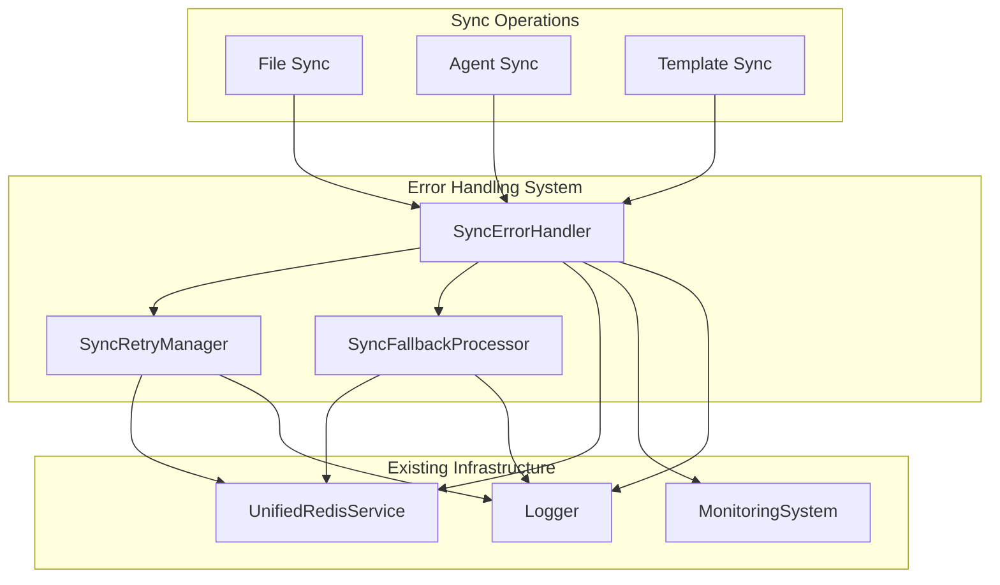

# Sync Error Handling System

The sync error handling system provides comprehensive error management, retry logic, and fallback mechanisms for the multi-tenant synchronization system. It integrates seamlessly with existing infrastructure including Redis, monitoring systems, and the core error handling framework.

## Overview

The error handling system consists of three main components:

1. **SyncErrorHandler** - Main error processing and classification
2. **SyncRetryManager** - Retry logic with circuit breaker patterns
3. **SyncFallbackProcessor** - Fallback strategies and graceful degradation

## Architecture



## Components

### SyncErrorHandler

The main error handler that processes sync errors and coordinates recovery efforts.

#### Features

- **Error Classification**: Automatically classifies errors by type, severity, and category
- **Statistics Tracking**: Maintains comprehensive error statistics by tenant, resource type, and operation
- **Metrics Integration**: Records metrics in the existing monitoring system
- **Fallback Queuing**: Queues failed operations for fallback processing using Redis
- **Alert Management**: Triggers alerts when error thresholds are exceeded
- **Critical Error Handling**: Special processing for critical errors requiring immediate attention

#### Configuration

```typescript
interface SyncErrorHandlerConfig {
  enableAutoRecovery: boolean;
  maxRecoveryAttempts: number;
  redisQueuePrefix: string;
  fallbackQueueName: string;
  enableMetricsCollection: boolean;
  enableAlerts: boolean;
  alertThresholds: {
    errorRate: number;
    criticalErrorCount: number;
    failedRecoveryRate: number;
  };
}
```

#### Usage

```typescript
const errorHandler = new SyncErrorHandler(
  redisService,
  config,
  monitoringSystem,
  logger
);

// Handle a sync error
const result = await errorHandler.handleSyncError(error, context, 'file-sync');

// Get statistics
const stats = errorHandler.getSyncStatistics();
```

### SyncRetryManager

Manages retry logic with exponential backoff and circuit breaker patterns.

#### Features

- **Exponential Backoff**: Configurable backoff strategy with jitter
- **Circuit Breaker**: Prevents cascading failures by temporarily stopping retries
- **Persistent Queues**: Uses Redis for persistent retry queues
- **Statistics**: Tracks retry success rates and performance metrics
- **Batch Processing**: Processes retries in configurable batches

#### Configuration

```typescript
interface RetryConfig {
  maxAttempts: number;
  baseDelay: number;
  maxDelay: number;
  backoffMultiplier: number;
  jitterEnabled: boolean;
  circuitBreakerEnabled: boolean;
  circuitBreakerThreshold: number;
  circuitBreakerTimeout: number;
}
```

#### Usage

```typescript
const retryManager = new SyncRetryManager(redisService, config, logger);

// Schedule a retry
const retryId = await retryManager.scheduleRetry(
  'sync-operation',
  data,
  context,
  error
);

// Process pending retries
await retryManager.processRetries(batchSize);
```

### SyncFallbackProcessor

Provides fallback strategies and graceful degradation when retries fail.

#### Features

- **Multiple Strategies**: Supports multiple fallback strategies with priority ordering
- **Custom Strategies**: Allows registration of custom fallback strategies
- **Alternative Actions**: Provides alternative actions when all strategies fail
- **Graceful Degradation**: Enables graceful degradation as a last resort
- **Performance Monitoring**: Tracks fallback performance and success rates

#### Configuration

```typescript
interface FallbackProcessorConfig {
  enabled: boolean;
  processingInterval: number;
  batchSize: number;
  maxConcurrentProcessing: number;
  enableMetrics: boolean;
  enableAlternativeActions: boolean;
  gracefulDegradationEnabled: boolean;
}
```

#### Built-in Strategies

1. **Cache Restore** - Attempts to restore from Redis cache
2. **Local Storage** - Falls back to local storage mechanisms
3. **Simplified Sync** - Performs simplified synchronization
4. **Read-Only Mode** - Switches to read-only mode
5. **Queue for Later** - Queues operation for later processing

#### Usage

```typescript
const fallbackProcessor = new SyncFallbackProcessor(
  redisService,
  config,
  metricsCollector,
  logger
);

// Register custom strategy
fallbackProcessor.registerStrategy({
  name: 'customStrategy',
  priority: 1,
  applicableOperations: ['custom-sync'],
  applicableResourceTypes: ['custom'],
  maxExecutionTime: 5000,
  enabled: true,
  execute: async (operation) => {
    // Custom fallback logic
    return { success: true, strategy: 'customStrategy', executionTime: 100, shouldRetry: false };
  }
});

// Process fallback operation
const result = await fallbackProcessor.processFallbackOperation(operation);
```

## Integration with Existing Infrastructure

### Redis Integration

The error handling system uses the existing `UnifiedRedisService` for:

- **Retry Queues**: Persistent retry queues using Redis sorted sets
- **Fallback Queues**: Fallback operation queues with priority scoring
- **Circuit Breaker State**: Persistent circuit breaker state storage
- **Statistics**: Error statistics persistence and aggregation

### Monitoring Integration

Integrates with the existing monitoring system via `IMonitoringSystem`:

- **Metrics Collection**: Records error metrics, retry rates, and fallback statistics
- **Performance Monitoring**: Tracks error handling performance
- **Health Monitoring**: Provides health status for error handling components

### Core Error Handling Integration

Extends the `BaseErrorHandler` from `@tnf/core-error-handling`:

- **Recovery Strategies**: Uses existing recovery strategy patterns
- **Error Classification**: Leverages existing error classification system
- **Event System**: Integrates with existing event emission patterns

## Error Types and Classification

### Sync Error Types

- **Network**: Connection timeouts, network failures
- **Conflict**: Data conflicts, version mismatches
- **Permission**: Authorization failures, access denied
- **Validation**: Data validation errors, format issues
- **Timeout**: Operation timeouts, slow responses
- **Resource**: Resource not found, unavailable resources

### Error Severity Levels

- **Low**: Minor issues that don't affect functionality
- **Medium**: Issues that may impact performance
- **High**: Significant issues requiring attention
- **Critical**: Critical failures requiring immediate action

### Error Categories

- **Network**: Network-related issues
- **Authentication**: Authentication failures
- **Authorization**: Permission and access issues
- **Validation**: Data validation problems
- **System**: System-level errors
- **Business**: Business logic errors

## Monitoring and Alerting

### Metrics

The system records the following metrics:

- `sync_errors_total` - Total number of sync errors
- `sync_retryable_errors_total` - Number of retryable errors
- `sync_critical_errors_total` - Number of critical errors
- `sync_fallback_success_total` - Successful fallback operations
- `sync_circuit_breaker_opened_total` - Circuit breaker activations

### Alerts

Configurable alert thresholds:

- **Error Rate**: Alerts when error rate exceeds threshold
- **Critical Errors**: Alerts when critical error count exceeds threshold
- **Recovery Failure Rate**: Alerts when recovery failure rate is too high

### Statistics

Comprehensive statistics tracking:

- Error counts by type, resource, tenant, and operation
- Retry success rates and average attempts
- Fallback strategy usage and success rates
- Circuit breaker activation history

## Best Practices

### Error Handling

1. **Classify Errors Properly**: Ensure errors are properly classified for appropriate handling
2. **Use Appropriate Retry Logic**: Configure retry parameters based on error types
3. **Monitor Circuit Breakers**: Keep track of circuit breaker states and reset when appropriate
4. **Implement Custom Strategies**: Create custom fallback strategies for specific use cases

### Performance

1. **Batch Processing**: Process retries and fallbacks in batches for better performance
2. **Limit Queue Sizes**: Configure appropriate queue size limits to prevent memory issues
3. **Monitor Metrics**: Regularly monitor error handling metrics and performance
4. **Optimize Timeouts**: Set appropriate timeouts for different operation types

### Reliability

1. **Graceful Degradation**: Always enable graceful degradation as a last resort
2. **Persistent Queues**: Use Redis for persistent retry and fallback queues
3. **Health Monitoring**: Implement health checks for error handling components
4. **Backup Strategies**: Have multiple fallback strategies for critical operations

## Examples

### Basic Error Handling

```typescript
// Handle a file sync error
const context: SyncContext = {
  syncId: 'file-sync-123',
  syncType: 'file',
  component: 'file-sync-service',
  operation: 'file-sync',
  tenantId: 'tenant-123',
  resourcePath: '/path/to/file.txt',
  timestamp: new Date()
};

try {
  await performFileSync('/path/to/file.txt');
} catch (error) {
  await errorHandler.handleSyncError(error, context, 'file-sync');
}
```

### Custom Fallback Strategy

```typescript
// Register a custom fallback strategy for database sync
fallbackProcessor.registerStrategy({
  name: 'databaseSyncFallback',
  priority: 1,
  applicableOperations: ['db-sync'],
  applicableResourceTypes: ['database'],
  maxExecutionTime: 10000,
  enabled: true,
  execute: async (operation) => {
    try {
      // Attempt to sync with backup database
      await syncWithBackupDatabase(operation.data);
      return {
        success: true,
        strategy: 'databaseSyncFallback',
        executionTime: 5000,
        shouldRetry: false,
        data: { usedBackup: true }
      };
    } catch (error) {
      return {
        success: false,
        strategy: 'databaseSyncFallback',
        executionTime: 5000,
        error,
        shouldRetry: false
      };
    }
  }
});
```

### Monitoring Error Health

```typescript
// Get comprehensive error handling health status
const health = {
  errorHandler: {
    statistics: errorHandler.getSyncStatistics(),
    isRunning: true
  },
  retryManager: {
    statistics: await retryManager.getStatistics(),
    circuitBreakers: Array.from(retryManager.getCircuitBreakerStates().entries())
  },
  fallbackProcessor: {
    statistics: fallbackProcessor.getStatistics(),
    strategies: fallbackProcessor.getStrategies()
  }
};

console.log('Error handling health:', health);
```

## Testing

The error handling system includes comprehensive tests:

- **Unit Tests**: Test individual components and methods
- **Integration Tests**: Test complete error handling workflows
- **Performance Tests**: Test system performance under load
- **Resilience Tests**: Test system behavior during failures

Run tests with:

```bash
npm test packages/sync-core/src/error
```

## Troubleshooting

### Common Issues

1. **High Error Rates**: Check network connectivity and system resources
2. **Circuit Breaker Stuck Open**: Manually reset circuit breakers if needed
3. **Queue Buildup**: Monitor queue sizes and processing rates
4. **Memory Usage**: Monitor memory usage with large error volumes

### Debugging

Enable debug logging:

```typescript
const logger = new Logger('SyncErrorHandler');
logger.setLevel('debug');
```

Monitor Redis queues:

```bash
redis-cli ZRANGE sync:retry:queue 0 -1 WITHSCORES
redis-cli ZRANGE sync:fallback:operations 0 -1 WITHSCORES
```

Check metrics in monitoring system:

```typescript
const metrics = monitoringSystem.getMetricsCollector().getCurrentMetrics();
console.log('Current metrics:', metrics);
```