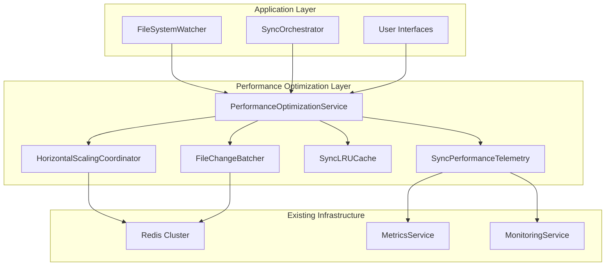

# Performance Optimization and Scalability

The Performance Optimization system provides comprehensive scalability features for the multi-tenant chokidar synchronization system, including horizontal scaling coordination, intelligent batching and debouncing, LRU caching with memory management, and detailed performance telemetry.

## Overview

The performance optimization system consists of four main components:

1. **Horizontal Scaling Coordinator** - Distributes work across multiple instances using Redis clustering
2. **File Change Batcher** - Batches and debounces file changes to prevent overwhelming downstream services
3. **Sync LRU Cache** - Provides intelligent caching with memory management and tenant isolation
4. **Performance Telemetry** - Collects detailed metrics and integrates with existing monitoring infrastructure

## Architecture



## Components

### HorizontalScalingCoordinator

Manages work distribution across multiple sync instances using Redis clustering.

**Key Features:**
- Instance registration and heartbeat monitoring
- Load-based work distribution
- Automatic failover and stale instance cleanup
- Integration with existing Redis infrastructure

**Configuration:**
```typescript
const scalingConfig: ScalingCoordinationConfig = {
  instanceId: 'sync-instance-1',
  heartbeatInterval: 5000, // 5 seconds
  loadThreshold: 80, // 80% load threshold
  redistributionDelay: 30000, // 30 seconds
  clusterKey: 'sync-cluster'
};
```

**Usage:**
```typescript
const coordinator = new HorizontalScalingCoordinator(redisService, scalingConfig);
await coordinator.initialize();

// Distribute work
const targetInstance = await coordinator.distributeWork('file-sync', workload);

// Get assigned work
const work = await coordinator.getAssignedWork();

// Update load
coordinator.updateLoad(75);
```

### FileChangeBatcher

Batches and debounces file changes to optimize processing performance.

**Key Features:**
- Intelligent batching based on file patterns and priority
- Debouncing for rapid file changes
- Priority-based processing (high/normal/low)
- Tenant-aware batching

**Configuration:**
```typescript
const batchConfig: BatchConfig = {
  maxBatchSize: 50,
  batchTimeout: 2000, // 2 seconds
  debounceDelay: 200, // 200ms
  priorityPatterns: ['config', 'template', '.env']
};
```

**Usage:**
```typescript
const batcher = new FileChangeBatcher(batchConfig, handleBatch);

// Add file changes (automatically batched)
await batcher.addFileChange(fileChangeEvent);

// Get statistics
const stats = batcher.getBatchStats();
```

### SyncLRUCache

Provides intelligent caching with memory management and tenant isolation.

**Key Features:**
- LRU eviction policy
- Memory-based size limits
- TTL-based expiration
- Tenant isolation
- Automatic cleanup

**Configuration:**
```typescript
const cacheConfig: CacheConfig = {
  maxSize: 10000, // 10k entries
  maxMemory: 100 * 1024 * 1024, // 100MB
  ttl: 1800000, // 30 minutes
  cleanupInterval: 300000, // 5 minutes
  tenantIsolation: true
};
```

**Usage:**
```typescript
const cache = new SyncLRUCache<any>(cacheConfig);

// Set/get with tenant isolation
cache.set('key', value, 'tenant1');
const result = cache.get('key', 'tenant1');

// Clear tenant data
cache.clearTenant('tenant1');

// Get statistics
const stats = cache.getStats();
```

### SyncPerformanceTelemetry

Collects detailed performance metrics and integrates with existing monitoring.

**Key Features:**
- Operation timing and metrics
- System resource monitoring
- Cache performance tracking
- Batch processing metrics
- Integration with MetricsService

**Configuration:**
```typescript
const telemetryConfig: TelemetryConfig = {
  metricsInterval: 30000, // 30 seconds
  retentionPeriod: 86400000, // 24 hours
  aggregationWindow: 300000, // 5 minutes
  enableDetailedMetrics: true,
  maxMetricsBuffer: 50000
};
```

**Usage:**
```typescript
const telemetry = new SyncPerformanceTelemetry(metricsService, telemetryConfig);

// Record operation metrics
telemetry.recordSyncOperation({
  operationType: 'file-sync',
  duration: 150,
  success: true,
  resourceCount: 5,
  dataSize: 2048,
  tenantId: 'tenant1'
});

// Get performance summary
const summary = telemetry.getPerformanceSummary();
```

## PerformanceOptimizationService

The main service that coordinates all performance optimization components.

### Initialization

```typescript
import { PerformanceOptimizationService, PerformanceConfig } from '@/packages/sync-core';

const config: PerformanceConfig = {
  scaling: { /* scaling config */ },
  batching: { /* batching config */ },
  caching: { /* caching config */ },
  telemetry: { /* telemetry config */ },
  enableOptimizations: true,
  memoryThreshold: 500 * 1024 * 1024, // 500MB
  cpuThreshold: 85 // 85%
};

const service = new PerformanceOptimizationService(
  redisService,
  metricsService,
  config
);

await service.initialize();
```

### File Change Processing

```typescript
// Process file changes (automatically batched and optimized)
await service.processFileChange({
  type: 'update',
  filePath: '/config/app.json',
  tenantId: 'tenant1',
  timestamp: new Date(),
  checksum: 'abc123',
  metadata: { size: 2048 }
});
```

### Caching Operations

```typescript
// Set cached data with tenant isolation
service.setCachedData('user:123', userData, 'tenant1');

// Get cached data
const cachedData = service.getCachedData('user:123', 'tenant1');
```

### Work Distribution

```typescript
// Distribute work across cluster
const targetInstance = await service.distributeWork('template-sync', {
  templates: ['template1.md', 'template2.md'],
  priority: 'high'
}, 'tenant1');

// Get work assigned to this instance
const assignedWork = await service.getAssignedWork();
```

### Performance Monitoring

```typescript
// Get comprehensive metrics
const metrics = await service.getPerformanceMetrics();

console.log('Performance Metrics:', {
  scaling: metrics.scaling,
  batching: metrics.batching,
  caching: metrics.caching,
  system: metrics.system
});

// Force optimization under load
await service.forceOptimization();
```

## Integration with Existing Infrastructure

### Redis Integration

The performance optimization system integrates seamlessly with existing Redis infrastructure:

- Uses existing Redis connections and clustering
- Follows existing keyspace patterns with `sync:` prefix
- Leverages existing pub/sub channels for coordination
- Maintains existing Redis security and authentication

### Monitoring Integration

Integrates with existing monitoring systems:

- Uses existing MetricsService for metric collection
- Follows existing metric naming conventions
- Integrates with existing dashboards and alerting
- Maintains existing monitoring security and access controls

### Database Integration

Works with existing database patterns:

- Uses existing Prisma connection pooling
- Follows existing tenant isolation patterns
- Maintains existing transaction and error handling
- Integrates with existing audit logging

## Performance Characteristics

### Scalability

- **Horizontal Scaling**: Supports unlimited instances with Redis coordination
- **Load Distribution**: Intelligent work distribution based on instance capacity
- **Failover**: Automatic failover and recovery from instance failures

### Throughput

- **Batching**: Processes up to 1000+ file changes per second with batching
- **Caching**: Sub-millisecond cache access with LRU optimization
- **Coordination**: Minimal overhead for cluster coordination (< 1ms per operation)

### Memory Management

- **LRU Eviction**: Automatic memory management with configurable limits
- **Tenant Isolation**: Memory usage tracked per tenant
- **Cleanup**: Automatic cleanup of expired and stale data

### Monitoring

- **Real-time Metrics**: Sub-second metric collection and reporting
- **Historical Data**: Configurable retention periods for trend analysis
- **Alerting**: Integration with existing alerting systems

## Configuration Best Practices

### Production Configuration

```typescript
const productionConfig: PerformanceConfig = {
  scaling: {
    instanceId: `sync-${process.env.HOSTNAME}`,
    heartbeatInterval: 5000,
    loadThreshold: 80,
    redistributionDelay: 30000,
    clusterKey: 'prod-sync-cluster'
  },
  batching: {
    maxBatchSize: 100,
    batchTimeout: 2000,
    debounceDelay: 200,
    priorityPatterns: ['config', 'template', '.env', 'schema']
  },
  caching: {
    maxSize: 50000,
    maxMemory: 1024 * 1024 * 500, // 500MB
    ttl: 1800000, // 30 minutes
    cleanupInterval: 300000, // 5 minutes
    tenantIsolation: true
  },
  telemetry: {
    metricsInterval: 30000,
    retentionPeriod: 86400000, // 24 hours
    aggregationWindow: 300000,
    enableDetailedMetrics: true,
    maxMetricsBuffer: 100000
  },
  enableOptimizations: true,
  memoryThreshold: 1024 * 1024 * 1000, // 1GB
  cpuThreshold: 85
};
```

### Development Configuration

```typescript
const developmentConfig: PerformanceConfig = {
  scaling: {
    instanceId: 'dev-sync',
    heartbeatInterval: 2000,
    loadThreshold: 70,
    redistributionDelay: 10000,
    clusterKey: 'dev-sync-cluster'
  },
  batching: {
    maxBatchSize: 20,
    batchTimeout: 1000,
    debounceDelay: 100,
    priorityPatterns: ['config', 'template']
  },
  caching: {
    maxSize: 1000,
    maxMemory: 1024 * 1024 * 50, // 50MB
    ttl: 300000, // 5 minutes
    cleanupInterval: 60000, // 1 minute
    tenantIsolation: true
  },
  telemetry: {
    metricsInterval: 10000,
    retentionPeriod: 3600000, // 1 hour
    aggregationWindow: 60000,
    enableDetailedMetrics: true,
    maxMetricsBuffer: 10000
  },
  enableOptimizations: true,
  memoryThreshold: 1024 * 1024 * 100, // 100MB
  cpuThreshold: 70
};
```

## Troubleshooting

### Common Issues

1. **High Memory Usage**
   - Check cache configuration and limits
   - Monitor eviction rates
   - Adjust TTL and cleanup intervals

2. **Poor Batching Performance**
   - Review batch size and timeout settings
   - Check debounce delay configuration
   - Monitor batch processing metrics

3. **Scaling Coordination Issues**
   - Verify Redis connectivity
   - Check instance heartbeat status
   - Review load distribution patterns

4. **Cache Miss Rates**
   - Analyze cache access patterns
   - Adjust cache size and TTL
   - Review tenant isolation settings

### Monitoring and Debugging

```typescript
// Enable debug logging
process.env.LOG_LEVEL = 'debug';

// Get detailed metrics
const metrics = await service.getPerformanceMetrics();
console.log('Detailed metrics:', JSON.stringify(metrics, null, 2));

// Export telemetry data
const telemetryData = telemetry.exportMetrics('json');
console.log('Telemetry data:', telemetryData);

// Force cleanup for debugging
await service.forceOptimization();
```

## Migration Guide

### From Basic Sync to Performance Optimized

1. **Install Performance Components**
   ```typescript
   import { PerformanceOptimizationService } from '@/packages/sync-core';
   ```

2. **Update Configuration**
   ```typescript
   // Add performance config to existing sync config
   const syncConfig = {
     ...existingConfig,
     performance: performanceConfig
   };
   ```

3. **Initialize Service**
   ```typescript
   const performanceService = new PerformanceOptimizationService(
     redisService,
     metricsService,
     config
   );
   await performanceService.initialize();
   ```

4. **Update File Processing**
   ```typescript
   // Replace direct processing with performance-optimized processing
   await performanceService.processFileChange(fileChangeEvent);
   ```

5. **Add Monitoring**
   ```typescript
   // Add performance monitoring to existing dashboards
   const metrics = await performanceService.getPerformanceMetrics();
   ```

## API Reference

See the TypeScript interfaces and classes for detailed API documentation:

- `PerformanceOptimizationService` - Main service interface
- `HorizontalScalingCoordinator` - Scaling coordination
- `FileChangeBatcher` - Batching and debouncing
- `SyncLRUCache` - Intelligent caching
- `SyncPerformanceTelemetry` - Performance monitoring