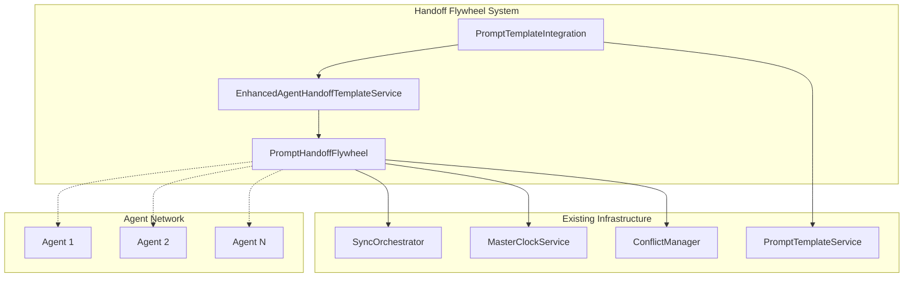

# Prompt Handoff Flywheel System

The Prompt Handoff Flywheel System provides seamless prompt handoff capabilities
that maintain context and execution state as prompts move between agents,
integrating with existing template and orchestration systems.

## Overview

The system addresses the critical need for maintaining context continuity when
tasks are handed off between different agents in a multi-agent environment. It
provides:

- **Complete Context Preservation**: Maintains full execution history and
  context across handoffs
- **Template Versioning**: Automatic updates and synchronization of prompt
  templates
- **Load Balancing**: Intelligent agent selection based on capabilities and
  current load
- **Backpressure Management**: Prevents system overload through queue management
- **Unified Analytics**: Comprehensive metrics and performance tracking

## Architecture



## Core Components

### PromptHandoffFlywheel

The main orchestration engine that manages handoff contexts, queues, and agent
coordination.

**Key Features:**

- Context lifecycle management
- Agent capability matching
- Load balancing algorithms
- Backpressure control
- Metrics collection

### EnhancedAgentHandoffTemplateService

Extends existing template services with flywheel protocol integration, providing
versioning, analytics, and real-time synchronization.

**Key Features:**

- Template versioning and history
- Session management
- Performance analytics
- Integration with existing services

### PromptTemplateIntegration

Bridges the flywheel system with existing PromptTemplateServiceImpl for unified
template management.

**Key Features:**

- Bidirectional synchronization
- Conflict resolution
- Unified execution
- Combined analytics

## Requirements Fulfilled

### Requirement 4.1: Complete Execution Context and History Preservation

```typescript
// Context includes full execution history
interface HandoffContext {
  executionHistory: HandoffExecution[];
  variables: Record<string, any>;
  metadata: Record<string, any>;
  // ... other fields
}

// Each execution preserves context
interface HandoffExecution {
  contextPreservation: number; // 0-100 percentage
  input: any;
  output: any;
  // ... other fields
}
```

**Implementation:**

- Complete execution history tracking
- Context preservation scoring
- Variable and metadata continuity
- Session-based context grouping

### Requirement 4.2: Latest Template Versions with Automatic Updates

```typescript
// Template versioning with automatic sync
await flywheel.updateHandoffTemplate(templateId, updates);
// Automatically syncs across all instances and updates active handoffs

// Version history tracking
interface TemplateVersion {
  version: string;
  changes: string[];
  createdAt: Date;
  isActive: boolean;
  metrics: VersionMetrics;
}
```

**Implementation:**

- Automatic version incrementing
- Cross-instance synchronization
- Active handoff updates
- Version history and rollback

### Requirement 4.3: Backpressure and Load Balancing

```typescript
// Load balancing based on agent capabilities and current load
const optimalAgent = await selectOptimalAgent(requiredCapabilities, priority);

// Backpressure management
if (await shouldApplyBackpressure(queue, context)) {
  await handleBackpressure(context, queue);
}
```

**Implementation:**

- Capability-based agent selection
- Load-aware distribution
- Queue size monitoring
- Automatic rebalancing

### Requirement 4.4: Exponential Backoff and Escalation

```typescript
// Retry with exponential backoff
const delay = Math.min(1000 * Math.pow(2, context.retryCount), 30000);

// Escalation after max retries
if (context.retryCount > context.maxRetries) {
  await escalateToHuman(context, error);
}
```

**Implementation:**

- Configurable retry limits
- Exponential backoff delays
- Human escalation triggers
- Error categorization

### Requirement 4.5: Unified Analytics and Metrics

```typescript
// Comprehensive metrics collection
interface TemplateAnalytics {
  totalExecutions: number;
  successRate: number;
  contextPreservationRate: number;
  agentUtilization: Record<string, number>;
  performanceTrends: TrendData[];
}
```

**Implementation:**

- Real-time metrics collection
- Performance trend analysis
- Agent utilization tracking
- Unified reporting

## Usage Examples

### Basic Handoff Setup

```typescript
import {
  PromptHandoffFlywheel,
  EnhancedAgentHandoffTemplateService,
} from '@the-new-fuse/sync-core';

// Initialize services
const flywheel = new PromptHandoffFlywheel(
  syncOrchestrator,
  masterClock,
  conflictManager
);

const handoffService = new EnhancedAgentHandoffTemplateService(
  flywheel,
  syncOrchestrator,
  masterClock
);

// Register agents
await flywheel.registerAgent('code-agent', ['coding', 'review']);
await flywheel.registerAgent('analysis-agent', ['analysis', 'research']);

// Create handoff template
const templateId = await handoffService.createEnhancedHandoffTemplate({
  name: 'Code Review Handoff',
  content: `# Code Review
  
Previous Context: {{execution_history}}
Code Changes: {{code_changes}}
Review Focus: {{review_focus}}

Please provide comprehensive code review.`,
  variables: {
    code_changes: '',
    review_focus: 'general',
  },
  contextRequirements: ['code_changes', 'execution_history'],
  agentCapabilities: ['coding', 'review'],
  successCriteria: ['code_reviewed', 'context_preserved'],
});

// Initiate handoff session
const sessionId = await handoffService.initiateHandoffSession(
  'analysis-agent',
  templateId,
  {
    code_changes: 'function example() { return "hello"; }',
    review_focus: 'security and performance',
  },
  {
    targetAgentId: 'code-agent',
    preserveContext: true,
  }
);
```

### Load Balancing Configuration

```typescript
// Create template with load balancing settings
const templateId = await handoffService.createEnhancedHandoffTemplate({
  name: 'Load Balanced Task',
  // ... other properties
  backpressureThreshold: 5,
  loadBalancingWeight: 2.0,
  agentCapabilities: ['general'],
});

// Update agent loads
await flywheel.updateAgentStatus('agent-1', 'available', 20);
await flywheel.updateAgentStatus('agent-2', 'available', 80);

// Get optimal target (will select agent-1 with lower load)
const target = await handoffService.getOptimalHandoffTarget(
  templateId,
  { 'agent-1': 20, 'agent-2': 80 },
  { 'agent-1': ['general'], 'agent-2': ['general'] }
);
```

### Template Integration

```typescript
import { PromptTemplateIntegration } from '@the-new-fuse/sync-core';

// Create integration service
const integration = new PromptTemplateIntegration(
  handoffService,
  flywheel,
  syncOrchestrator,
  existingPromptTemplateService
);

// Integrate handoff template with existing service
await integration.integrateTemplate(templateId, {
  createBaseTemplate: true,
  autoSync: true,
  conflictResolution: 'merge',
});

// Execute via different methods
const handoffResult = await integration.executeIntegratedTemplate(
  templateId,
  variables,
  { executionType: 'handoff', targetAgentId: 'agent-1' }
);

const directResult = await integration.executeIntegratedTemplate(
  templateId,
  variables,
  { executionType: 'direct' }
);
```

### Analytics and Monitoring

```typescript
// Get template analytics
const analytics = await handoffService.getTemplateAnalytics(templateId);
console.log(`Success rate: ${analytics.successRate}%`);
console.log(`Context preservation: ${analytics.contextPreservationRate}%`);

// Get session metrics
const metrics = await handoffService.getSessionMetrics(sessionId);
console.log(`Average handoff time: ${metrics.averageHandoffTime}ms`);

// Generate comprehensive report
const report = await handoffService.generateHandoffReport(templateId, {
  start: new Date(Date.now() - 24 * 60 * 60 * 1000),
  end: new Date(),
});

// Set up real-time monitoring
flywheel.on('handoffCompleted', (context, execution) => {
  console.log(`Handoff completed: ${execution.metrics.processingTime}ms`);
});

flywheel.on('backpressureApplied', (context, queue) => {
  console.log(`Backpressure applied on queue: ${queue.id}`);
});
```

## Configuration

### Template Configuration

```typescript
interface EnhancedHandoffTemplate {
  name: string;
  description: string;
  version: string;
  content: string; // Template content with variables
  variables: Record<string, any>; // Default variables
  contextRequirements: string[]; // Required context elements
  agentCapabilities: string[]; // Required agent capabilities
  successCriteria: string[]; // Success criteria for handoff
  backpressureThreshold: number; // Queue size threshold
  loadBalancingWeight: number; // Weight for load balancing
  integrationMetadata: {
    syncEnabled: boolean;
    conflictResolution: 'latest' | 'merge' | 'manual';
  };
}
```

### Agent Configuration

```typescript
interface AgentCapability {
  agentId: string;
  capabilities: string[]; // Agent capabilities
  currentLoad: number; // Current load (0-100)
  maxLoad: number; // Maximum load capacity
  averageProcessingTime: number; // Average processing time
  successRate: number; // Success rate percentage
  status: 'available' | 'busy' | 'offline' | 'error';
}
```

### Queue Configuration

```typescript
interface HandoffQueue {
  maxSize: number; // Maximum queue size
  priority: 'low' | 'normal' | 'high' | 'critical';
  backpressureEnabled: boolean;
  loadBalancingEnabled: boolean;
  metrics: {
    totalProcessed: number;
    averageProcessingTime: number;
    successRate: number;
    backpressureEvents: number;
  };
}
```

## Error Handling

### Retry Logic

```typescript
// Exponential backoff configuration
interface RetryConfig {
  maxRetries: number; // Default: 3
  baseDelay: number; // Default: 1000ms
  maxDelay: number; // Default: 30000ms
  backoffMultiplier: number; // Default: 2
}

// Error categorization
interface HandoffError {
  type: 'network' | 'agent_unavailable' | 'template_error' | 'timeout';
  retryable: boolean;
  escalationRequired: boolean;
}
```

### Conflict Resolution

```typescript
// Template conflict resolution strategies
type ConflictResolution =
  | 'handoff_wins' // Handoff template takes precedence
  | 'base_wins' // Base template takes precedence
  | 'merge' // Attempt to merge changes
  | 'manual'; // Require manual resolution

// Conflict detection
interface TemplateConflict {
  templateId: string;
  handoffVersion: string;
  baseVersion: string;
  conflictType: 'content' | 'variables' | 'metadata';
  resolution: ConflictResolution;
}
```

## Performance Considerations

### Scalability

- **Horizontal Scaling**: Flywheel instances can be distributed across multiple
  nodes
- **Queue Distribution**: Handoff queues are distributed based on agent
  capabilities
- **Load Balancing**: Automatic load distribution prevents bottlenecks
- **Caching**: Template compilation results are cached for performance

### Memory Management

- **Context Cleanup**: Completed contexts are archived after configurable
  retention period
- **Template Versioning**: Old template versions are cleaned up automatically
- **Metrics Aggregation**: Historical metrics are aggregated to reduce storage

### Monitoring

- **Real-time Metrics**: Performance metrics are collected in real-time
- **Health Checks**: Automatic health monitoring of agents and queues
- **Alerting**: Configurable alerts for performance degradation
- **Dashboards**: Integration with existing monitoring dashboards

## Integration Points

### Existing Services

- **SyncOrchestrator**: For cross-instance synchronization
- **MasterClockService**: For timestamp coordination
- **ConflictManager**: For conflict resolution
- **PromptTemplateService**: For template management
- **AgentWebSocketService**: For agent communication

### Database Schema

```sql
-- Additional tables for handoff system
CREATE TABLE handoff_contexts (
  id VARCHAR(255) PRIMARY KEY,
  session_id VARCHAR(255),
  source_agent_id VARCHAR(255),
  target_agent_id VARCHAR(255),
  template_id VARCHAR(255),
  template_version VARCHAR(50),
  variables JSON,
  metadata JSON,
  status VARCHAR(50),
  created_at TIMESTAMP,
  updated_at TIMESTAMP
);

CREATE TABLE handoff_executions (
  id VARCHAR(255) PRIMARY KEY,
  context_id VARCHAR(255),
  agent_id VARCHAR(255),
  start_time TIMESTAMP,
  end_time TIMESTAMP,
  input JSON,
  output JSON,
  metrics JSON,
  context_preservation DECIMAL(5,2)
);

CREATE TABLE handoff_templates (
  id VARCHAR(255) PRIMARY KEY,
  name VARCHAR(255),
  description TEXT,
  version VARCHAR(50),
  content TEXT,
  variables JSON,
  context_requirements JSON,
  agent_capabilities JSON,
  success_criteria JSON,
  backpressure_threshold INTEGER,
  load_balancing_weight DECIMAL(3,2),
  created_at TIMESTAMP,
  updated_at TIMESTAMP
);
```

## Best Practices

### Template Design

1. **Clear Context Requirements**: Specify exactly what context elements are
   needed
2. **Capability Matching**: Ensure agent capabilities align with template
   requirements
3. **Success Criteria**: Define clear, measurable success criteria
4. **Variable Defaults**: Provide sensible default values for all variables

### Agent Management

1. **Capability Registration**: Keep agent capabilities up-to-date
2. **Load Monitoring**: Regularly update agent load information
3. **Health Checks**: Implement regular health checks for agents
4. **Graceful Degradation**: Handle agent failures gracefully

### Performance Optimization

1. **Template Caching**: Cache compiled templates for reuse
2. **Queue Monitoring**: Monitor queue sizes and adjust thresholds
3. **Metrics Collection**: Collect metrics without impacting performance
4. **Resource Cleanup**: Regularly clean up completed contexts and old data

### Error Handling

1. **Retry Strategies**: Implement appropriate retry strategies for different
   error types
2. **Escalation Paths**: Define clear escalation paths for unresolvable errors
3. **Logging**: Comprehensive logging for debugging and monitoring
4. **Fallback Mechanisms**: Implement fallback mechanisms for critical failures

## Troubleshooting

### Common Issues

1. **Context Loss**: Check context requirements and template variables
2. **Load Imbalance**: Review agent capabilities and load balancing weights
3. **Queue Congestion**: Adjust backpressure thresholds and add more agents
4. **Template Conflicts**: Review conflict resolution strategies
5. **Performance Issues**: Check metrics and optimize templates

### Debugging Tools

1. **Context Inspection**: Tools to inspect handoff contexts and execution
   history
2. **Template Validation**: Validation tools for template syntax and
   requirements
3. **Agent Monitoring**: Real-time agent status and performance monitoring
4. **Queue Analysis**: Tools to analyze queue performance and bottlenecks
5. **Metrics Dashboard**: Comprehensive metrics and analytics dashboard

## Migration Guide

### From Existing Handoff System

1. **Template Migration**: Convert existing templates to enhanced format
2. **Agent Registration**: Register existing agents with capabilities
3. **Session Migration**: Migrate active sessions to new system
4. **Analytics Migration**: Import historical analytics data
5. **Configuration Update**: Update configuration for new system

### Rollback Strategy

1. **Feature Flags**: Use feature flags to control rollout
2. **Dual Operation**: Run both systems in parallel during transition
3. **Data Backup**: Backup all data before migration
4. **Rollback Scripts**: Prepare rollback scripts for quick recovery
5. **Monitoring**: Enhanced monitoring during migration period

## Future Enhancements

### Planned Features

1. **ML-based Context Preservation**: Use machine learning to improve context
   preservation
2. **Advanced Load Balancing**: More sophisticated load balancing algorithms
3. **Template Optimization**: Automatic template optimization based on
   performance
4. **Multi-tenant Isolation**: Enhanced multi-tenant support
5. **Integration Expansion**: Integration with more external services

### Extensibility

The system is designed to be extensible with:

- **Custom Load Balancing Strategies**: Implement custom load balancing
  algorithms
- **Custom Conflict Resolution**: Add custom conflict resolution strategies
- **Custom Metrics Collectors**: Implement custom metrics collection
- **Custom Template Processors**: Add custom template processing logic
- **Custom Agent Integrations**: Integrate with different agent types

## Conclusion

The Prompt Handoff Flywheel System provides a comprehensive solution for
maintaining context continuity in multi-agent environments. It integrates
seamlessly with existing infrastructure while providing advanced features for
load balancing, error handling, and analytics.

The system fulfills all requirements for context preservation, template
versioning, backpressure management, error handling, and unified analytics,
making it a robust foundation for complex multi-agent workflows.
