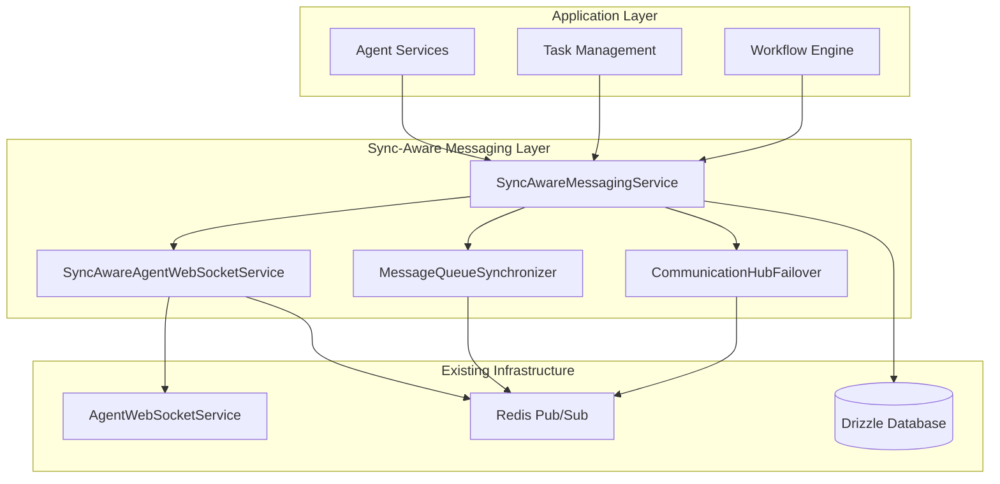

# Sync-Aware Messaging System

## Overview

The Sync-Aware Messaging System enhances The New Fuse's existing agent communication infrastructure with advanced synchronization capabilities, cross-tenant messaging, message queue synchronization, and failover mechanisms. This system integrates seamlessly with the existing `AgentWebSocketService` and Redis infrastructure while providing enterprise-grade reliability and scalability.

## Key Features

### 1. Enhanced A2A Message Protocols
- **Sync Metadata**: Every message includes comprehensive synchronization information
- **Tenant Isolation**: Built-in tenant boundaries with controlled cross-tenant communication
- **Conflict Resolution**: Automatic handling of message conflicts with configurable strategies
- **Delivery Tracking**: Complete message lifecycle tracking with acknowledgments

### 2. Cross-Tenant Messaging
- **Secure Routing**: Policy-based routing with security validation
- **Rate Limiting**: Configurable rate limits per tenant and message type
- **Encryption Support**: Optional message encryption for sensitive data
- **Audit Logging**: Complete audit trail for cross-tenant communications

### 3. Message Queue Synchronization
- **Multiple Sync Modes**: Immediate, batch, and scheduled synchronization
- **Conflict Detection**: Automatic detection and resolution of queue conflicts
- **Retention Policies**: Configurable message retention and cleanup
- **Performance Optimization**: Batching and debouncing for high-volume scenarios

### 4. Failover Mechanisms
- **Circuit Breakers**: Automatic failure detection and recovery
- **Health Monitoring**: Continuous health checks for communication nodes
- **Load Balancing**: Intelligent routing based on node capacity and health
- **Dead Letter Queues**: Handling of undeliverable messages

## Architecture



## Core Components

### SyncAwareMessagingService

The main service that orchestrates all sync-aware messaging operations.

```typescript
import { SyncAwareMessagingService } from '@the-new-fuse/sync-core';

// Send sync-aware message
const syncStatus = await messagingService.sendMessage(
  'target-agent-id',
  syncAwareMessage,
  {
    tenantId: 'tenant-1',
    priority: 'high',
    requiresAck: true,
    enableFailover: true
  }
);
```

### SyncAwareAgentWebSocketService

Extends existing WebSocket functionality with sync-aware capabilities.

```typescript
// Cross-tenant broadcast
const results = await syncAwareWebSocket.broadcastCrossTenant(
  ['tenant-1', 'tenant-2'],
  message,
  {
    sourceTenantId: 'tenant-source',
    priority: 'medium'
  }
);
```

### MessageQueueSynchronizer

Handles message queue synchronization across Redis instances.

```typescript
// Configure queue synchronization
await queueSynchronizer.configureQueueSync({
  queueName: 'high-priority-tasks',
  syncMode: 'immediate',
  conflictResolution: 'latest_wins'
});
```

### CommunicationHubFailover

Manages failover mechanisms and node health monitoring.

```typescript
// Configure failover
await failoverManager.configureFailover('tenant-1', {
  primaryNodes: ['node-1', 'node-2'],
  fallbackNodes: ['node-3', 'node-4'],
  circuitBreakerConfig: {
    enabled: true,
    failureThreshold: 5
  }
});
```

## Message Structure

### Sync-Aware A2A Message

```typescript
interface SyncAwareA2AMessage {
  id: string;
  type: string;
  timestamp: number;
  sender: string;
  recipient?: string;
  payload: any;
  metadata: {
    priority: 'low' | 'medium' | 'high' | 'critical';
    protocol_version: string;
    sync: SyncMetadata;
  };
}

interface SyncMetadata {
  syncId: string;
  syncVersion: number;
  syncTimestamp: number;
  tenantId?: string;
  crossTenantAllowed: boolean;
  routingKey: string;
  deliveryMode: 'direct' | 'broadcast' | 'multicast';
  requiresAck: boolean;
  conflictResolution: 'latest_wins' | 'merge' | 'manual' | 'rollback';
  maxRetries: number;
  priority: 'low' | 'medium' | 'high' | 'critical';
  syncState: 'pending' | 'in_progress' | 'completed' | 'failed' | 'conflicted';
}
```

## Configuration

### Cross-Tenant Routing

```typescript
const crossTenantConfig: CrossTenantRoutingConfig = {
  sourceTenantId: 'tenant-1',
  targetTenantIds: ['tenant-2', 'tenant-3'],
  routingRules: [
    {
      condition: 'message.type === "URGENT_ALERT"',
      action: 'allow'
    },
    {
      condition: 'message.payload.confidential === true',
      action: 'deny'
    }
  ],
  securityPolicy: {
    requireEncryption: true,
    allowedMessageTypes: ['TASK_REQUEST', 'STATUS_UPDATE'],
    maxMessageSize: 1024 * 1024,
    rateLimiting: {
      maxMessagesPerSecond: 10,
      maxMessagesPerMinute: 100
    }
  }
};
```

### Message Queue Synchronization

```typescript
const queueConfig: MessageQueueSyncConfig = {
  queueName: 'critical-tasks',
  tenantId: 'tenant-1',
  syncMode: 'batch',
  batchSize: 50,
  batchTimeout: 5000,
  conflictResolution: 'merge',
  retentionPolicy: {
    maxAge: 24 * 60 * 60 * 1000, // 24 hours
    maxSize: 1000,
    cleanupInterval: 60 * 60 * 1000 // 1 hour
  }
};
```

### Failover Configuration

```typescript
const failoverConfig: MessageFailoverConfig = {
  primaryNodes: ['primary-hub-1', 'primary-hub-2'],
  fallbackNodes: ['fallback-hub-1', 'fallback-hub-2'],
  healthCheckInterval: 30000,
  failoverThreshold: 3,
  recoveryThreshold: 5,
  circuitBreakerConfig: {
    enabled: true,
    failureThreshold: 5,
    recoveryTimeout: 60000,
    halfOpenMaxCalls: 3
  }
};
```

## Usage Examples

### Basic Message Sending

```typescript
import { 
  SyncAwareMessagingService,
  SyncAwareMessageUtils 
} from '@the-new-fuse/sync-core';

// Create sync-aware message
const message = {
  id: 'task-001',
  type: 'TASK_REQUEST',
  timestamp: Date.now(),
  sender: 'orchestrator',
  recipient: 'worker-agent',
  payload: {
    taskId: 'process-document',
    documentId: 'doc-123'
  },
  metadata: {
    priority: 'high',
    protocol_version: '1.0',
    sync: SyncAwareMessageUtils.createSyncMetadata({
      tenantId: 'tenant-1',
      priority: 'high',
      requiresAck: true
    })
  }
};

// Send message
const syncStatus = await messagingService.sendMessage(
  'worker-agent',
  message,
  {
    tenantId: 'tenant-1',
    priority: 'high',
    requiresAck: true,
    timeout: 30000
  }
);

console.log('Message status:', syncStatus.status);
```

### Cross-Tenant Broadcasting

```typescript
// Configure cross-tenant routing
await messagingService.configureCrossTenantMessaging({
  sourceTenantId: 'tenant-admin',
  targetTenantIds: ['tenant-1', 'tenant-2', 'tenant-3'],
  routingRules: [{ condition: 'always', action: 'allow' }],
  securityPolicy: {
    requireEncryption: false,
    allowedMessageTypes: ['SYSTEM_ANNOUNCEMENT'],
    maxMessageSize: 1024,
    rateLimiting: {
      maxMessagesPerSecond: 5,
      maxMessagesPerMinute: 50
    }
  }
});

// Broadcast system announcement
const announcement = {
  id: 'announcement-001',
  type: 'SYSTEM_ANNOUNCEMENT',
  payload: {
    title: 'Maintenance Window',
    message: 'System maintenance tonight 2-4 AM UTC'
  },
  metadata: {
    priority: 'medium',
    protocol_version: '1.0',
    sync: SyncAwareMessageUtils.createSyncMetadata({
      crossTenantAllowed: true,
      deliveryMode: 'broadcast'
    })
  }
};

const results = await messagingService.broadcastMessage(announcement, {
  tenantIds: ['tenant-1', 'tenant-2', 'tenant-3'],
  crossTenant: true,
  priority: 'medium'
});
```

### Queue Synchronization

```typescript
// Configure queue synchronization
await messagingService.configureQueueSynchronization({
  queueName: 'high-priority-tasks',
  tenantId: 'tenant-1',
  syncMode: 'immediate',
  conflictResolution: 'latest_wins',
  retentionPolicy: {
    maxAge: 24 * 60 * 60 * 1000,
    maxSize: 1000,
    cleanupInterval: 60 * 60 * 1000
  }
});

// Trigger synchronization
await messagingService.synchronizeQueues('tenant-1');

// Get sync metrics
const metrics = messagingService.getQueueSyncMetrics();
console.log('Sync metrics:', metrics);
```

### Failover Setup

```typescript
// Configure failover
await messagingService.configureFailover('tenant-1', {
  primaryNodes: ['node-1', 'node-2'],
  fallbackNodes: ['node-3', 'node-4'],
  healthCheckInterval: 30000,
  failoverThreshold: 3,
  recoveryThreshold: 5,
  circuitBreakerConfig: {
    enabled: true,
    failureThreshold: 5,
    recoveryTimeout: 60000,
    halfOpenMaxCalls: 3
  }
});

// Send message with failover protection
const criticalMessage = {
  id: 'critical-001',
  type: 'URGENT_ALERT',
  payload: { alertType: 'SYSTEM_FAILURE' },
  metadata: {
    priority: 'critical',
    protocol_version: '1.0',
    sync: SyncAwareMessageUtils.createSyncMetadata({
      priority: 'critical',
      maxRetries: 5,
      failoverNodes: ['node-3', 'node-4']
    })
  }
};

const syncStatus = await messagingService.sendMessage(
  'incident-response-agent',
  criticalMessage,
  {
    tenantId: 'tenant-1',
    enableFailover: true,
    priority: 'critical'
  }
);
```

## Monitoring and Metrics

### Message Delivery Metrics

```typescript
// Get overall messaging metrics
const metrics = messagingService.getMessagingMetrics();
console.log('Messaging Metrics:', {
  totalMessages: metrics.totalMessages,
  successRate: (metrics.successfulDeliveries / metrics.totalMessages * 100).toFixed(2) + '%',
  averageDeliveryTime: metrics.averageDeliveryTime + 'ms',
  crossTenantMessages: metrics.crossTenantMessages
});

// Get specific message metrics
const messageMetrics = await messagingService.getMessageMetrics('message-id');
console.log('Message Metrics:', messageMetrics);
```

### Failover Statistics

```typescript
const failoverStats = messagingService.getFailoverStats();
console.log('Failover Stats:', {
  totalNodes: failoverStats.totalNodes,
  healthyNodes: failoverStats.healthyNodes,
  failedNodes: failoverStats.failedNodes,
  circuitBreakersOpen: failoverStats.circuitBreakersOpen
});
```

### Queue Synchronization Metrics

```typescript
const queueMetrics = messagingService.getQueueSyncMetrics();
console.log('Queue Metrics:', {
  totalQueues: queueMetrics.totalQueues,
  syncedMessages: queueMetrics.syncedMessages,
  conflictCount: queueMetrics.conflictCount,
  averageSyncTime: queueMetrics.averageSyncTime
});
```

## Error Handling

### Message Delivery Failures

```typescript
try {
  const syncStatus = await messagingService.sendMessage(
    'unreliable-agent',
    message,
    { timeout: 5000 }
  );
} catch (error) {
  console.error('Message delivery failed:', error.message);
  
  // Check if it's a timeout error
  if (error.message.includes('timeout')) {
    // Handle timeout scenario
    console.log('Message timed out, checking failover options...');
  }
}
```

### Conflict Resolution

```typescript
// Configure automatic conflict resolution
const queueConfig = {
  queueName: 'conflict-prone-queue',
  conflictResolution: 'merge', // or 'latest_wins', 'manual', 'rollback'
  // ... other config
};

await messagingService.configureQueueSynchronization(queueConfig);

// Get active conflicts for manual resolution
const conflicts = messagingService.getQueueSyncMetrics();
if (conflicts.conflictCount > 0) {
  console.log(`${conflicts.conflictCount} conflicts require attention`);
}
```

### Circuit Breaker Handling

```typescript
// Monitor circuit breaker state
const failoverStats = messagingService.getFailoverStats();
if (failoverStats.circuitBreakersOpen > 0) {
  console.log('Some circuit breakers are open, checking node health...');
  
  // Trigger manual failover if needed
  await messagingService.triggerFailover(
    'tenant-1',
    'failed-node',
    'backup-node'
  );
}
```

## Integration with Existing Services

### AgentWebSocketService Integration

The sync-aware messaging system seamlessly integrates with the existing `AgentWebSocketService`:

```typescript
// The SyncAwareAgentWebSocketService wraps the existing service
// and adds sync-aware capabilities without breaking existing functionality

// Existing code continues to work:
await wsService.sendMessage(agentId, message);

// New sync-aware features are available:
await syncAwareWebSocket.sendSyncAwareMessage(agentId, syncAwareMessage, options);
```

### Redis Infrastructure Integration

The system uses existing Redis patterns and extends them:

```typescript
// Uses existing Redis keyspace patterns
const keyPatterns = redisConfig.getKeyspatterns();

// Extends with sync-specific patterns
const syncKey = keyPatterns.tenantSync.state(tenantId, 'message', messageId);
const conflictKey = keyPatterns.globalSync.conflicts;
```

### Database Integration

Integrates with existing Drizzle database models:

```typescript
// Uses existing Agent, Task, Workflow models
// Adds new SyncState and SyncConflict models for tracking

// Example: Update agent state with sync tracking
await dbService.agent.update({
  where: { id: agentId },
  data: { status: newStatus }
});

// Sync state is automatically tracked
await syncOrchestrator.syncAgentState(agentId, agentState);
```

## Performance Considerations

### Batching and Debouncing

```typescript
// Configure batching for high-volume scenarios
const batchConfig = {
  queueName: 'high-volume-queue',
  syncMode: 'batch',
  batchSize: 100,
  batchTimeout: 2000
};
```

### Connection Pooling

```typescript
// The system reuses existing Redis connections
// and WebSocket connections for efficiency
```

### Memory Management

```typescript
// Automatic cleanup of expired messages and metrics
// Configurable retention policies prevent memory leaks
```

## Security Considerations

### Tenant Isolation

- Messages are isolated by tenant ID
- Cross-tenant communication requires explicit configuration
- Security policies enforce message type and size limits

### Encryption

```typescript
// Configure encryption for sensitive messages
const securityPolicy = {
  requireEncryption: true,
  allowedMessageTypes: ['SENSITIVE_DATA'],
  maxMessageSize: 1024 * 1024
};
```

### Audit Logging

- All cross-tenant messages are logged
- Message delivery attempts are tracked
- Failover events are recorded

## Troubleshooting

### Common Issues

1. **Message Delivery Failures**
   - Check agent connectivity
   - Verify tenant configuration
   - Review failover node health

2. **Cross-Tenant Permission Denied**
   - Verify routing configuration
   - Check security policy settings
   - Ensure message type is allowed

3. **Queue Synchronization Conflicts**
   - Review conflict resolution strategy
   - Check message ordering
   - Verify checksum validation

4. **Circuit Breaker Open**
   - Check node health status
   - Review failure thresholds
   - Consider manual failover

### Debug Information

```typescript
// Enable detailed logging
const config = {
  enableMetrics: true,
  enableTracing: true
};

// Get detailed message status
const status = await messagingService.getMessageStatus(messageId);
const metrics = await messagingService.getMessageMetrics(messageId);

console.log('Debug Info:', { status, metrics });
```

## Migration Guide

### From Existing A2A Messages

```typescript
// Old way
const oldMessage = {
  type: 'TASK_REQUEST',
  payload: { taskId: '123' },
  metadata: { sender: 'agent-1' }
};

// New way - convert existing message
const syncAwareMessage = SyncAwareMessageUtils.toSyncAware(oldMessage, {
  tenantId: 'tenant-1',
  priority: 'medium'
});
```

### Gradual Rollout

1. Deploy sync-aware messaging alongside existing system
2. Configure for specific tenants or message types
3. Monitor metrics and performance
4. Gradually migrate all message flows
5. Remove legacy messaging code

## Best Practices

1. **Message Design**
   - Keep payloads small and focused
   - Use appropriate priority levels
   - Include necessary metadata for routing

2. **Tenant Configuration**
   - Set up cross-tenant rules carefully
   - Use least-privilege principle
   - Monitor cross-tenant traffic

3. **Failover Setup**
   - Configure multiple fallback nodes
   - Set appropriate health check intervals
   - Test failover scenarios regularly

4. **Performance Optimization**
   - Use batching for high-volume scenarios
   - Configure appropriate retention policies
   - Monitor and tune based on metrics

5. **Security**
   - Enable encryption for sensitive data
   - Regularly review access policies
   - Monitor audit logs for anomalies