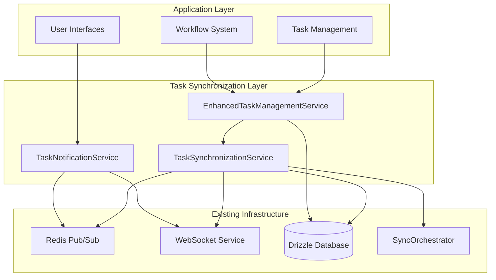

# Task Synchronization System

The Task Synchronization System provides real-time synchronization capabilities
for task management across multi-tenant environments. It extends the existing
Task and TaskExecution models with comprehensive sync capabilities, workflow
integration, and real-time notifications.

## Overview

The system consists of three main components:

1. **TaskSynchronizationService** - Core synchronization engine
2. **EnhancedTaskManagementService** - Enhanced task management with real-time
   features
3. **TaskNotificationService** - Real-time notification system

## Features

### Real-time Synchronization

- Automatic sync of task state changes across all instances
- Conflict resolution for simultaneous updates
- Multi-tenant isolation with controlled cross-tenant sharing
- Integration with existing Redis pub/sub and WebSocket infrastructure

### Enhanced Task Management

- Extended task models with sync tracking
- Progress tracking with real-time updates
- Dependency management with automatic workflow progression
- Integration with existing workflow systems

### Real-time Notifications

- Configurable notification rules per user
- Multiple delivery channels (WebSocket, email, push, webhook)
- Notification history and acknowledgment tracking
- Priority-based notification handling

### Conflict Resolution

- Automatic conflict detection and resolution
- Multiple resolution strategies (latest wins, merge, manual)
- Audit trail for all conflict resolutions
- Rollback capabilities

## Architecture



## Quick Start

### Basic Task Creation and Management

```typescript
import { EnhancedTaskManagementService } from '@the-new-fuse/sync-core';

// Create a new task with real-time sync
const task = await taskManagementService.createTask(
  {
    type: 'data_processing',
    status: 'PENDING',
    priority: 'HIGH',
    pipelineId: 'pipeline-123',
    userId: 'user-456',
    dependencies: ['task-001'],
    estimatedDuration: 300000,
    tags: ['urgent', 'processing'],
  },
  'tenant-789'
);

// Execute the task
const executionId = await taskManagementService.executeTask(
  task.id,
  {
    timeout: 600000,
    retryPolicy: {
      maxRetries: 3,
      backoffStrategy: 'exponential',
      baseDelay: 2000,
    },
  },
  'tenant-789'
);

// Update progress during execution
await taskManagementService.updateTaskProgress(
  task.id,
  50,
  { currentStep: 'processing_data' },
  'tenant-789'
);

// Complete the task
await taskManagementService.completeTaskExecution(
  executionId,
  { result: 'success', recordsProcessed: 10000 },
  undefined,
  'tenant-789'
);
```

### Setting Up Notifications

```typescript
import { TaskNotificationService } from '@the-new-fuse/sync-core';

// Create notification rule for urgent tasks
const rule = await notificationService.createNotificationRule({
  userId: 'user-123',
  tenantId: 'tenant-789',
  eventTypes: ['task_created', 'task_failed'],
  conditions: {
    priorities: ['URGENT'],
    taskTypes: ['critical_processing'],
  },
  channels: [
    {
      type: 'websocket',
      config: { realTime: true, persistent: true },
      priority: 'urgent',
    },
  ],
  isActive: true,
});
```

### Managing Dependencies

```typescript
import { TaskSynchronizationService } from '@the-new-fuse/sync-core';

// Set up task dependencies
await taskSyncService.updateTaskDependencies(
  'task-123',
  ['dependency-1', 'dependency-2'],
  'tenant-789'
);

// Get task relationships
const relationships =
  await taskManagementService.getTaskRelationships('task-123');
console.log('Dependencies:', relationships.dependencies);
console.log('Dependents:', relationships.dependents);
```

## Configuration

### Environment Variables

```bash
# Redis Configuration
REDIS_URL=redis://localhost:6379
REDIS_CLUSTER_ENABLED=false

# WebSocket Configuration
WEBSOCKET_PORT=3001
WEBSOCKET_CORS_ORIGIN=*

# Task Sync Configuration
TASK_SYNC_BATCH_SIZE=50
TASK_SYNC_TIMEOUT=30000
TASK_SYNC_RETRY_ATTEMPTS=3

# Notification Configuration
NOTIFICATION_BATCH_SIZE=100
NOTIFICATION_RETRY_DELAY=5000
NOTIFICATION_MAX_PENDING=1000
```

### Service Configuration

```typescript
// Task Synchronization Service Configuration
const taskSyncConfig = {
  taskChannelPrefix: 'task_sync:',
  executionChannelPrefix: 'task_execution:',
  dependencyChannelPrefix: 'task_dependency:',
  notificationChannelPrefix: 'task_notification:',
  conflictResolutionTimeout: 30000,
  batchSize: 50,
  maxRetries: 3,
};

// Notification Service Configuration
const notificationConfig = {
  notificationChannelPrefix: 'task_notifications:',
  historyChannelPrefix: 'notification_history:',
  batchSize: 100,
  retryAttempts: 3,
  retryDelay: 5000,
  maxPendingNotifications: 1000,
};
```

## API Reference

### TaskSynchronizationService

#### Methods

##### `syncTaskData(taskData: TaskSyncData, tenantId?: string): Promise<void>`

Synchronizes task data across all instances with real-time updates.

**Parameters:**

- `taskData`: Task data to synchronize
- `tenantId`: Optional tenant ID for multi-tenant isolation

**Example:**

```typescript
await taskSyncService.syncTaskData(
  {
    id: 'task-123',
    type: 'processing',
    status: 'IN_PROGRESS',
    priority: 'HIGH',
    pipelineId: 'pipeline-456',
    userId: 'user-789',
    version: 1,
    lastModified: new Date(),
    modifiedBy: 'user-789',
  },
  'tenant-123'
);
```

##### `syncTaskExecution(executionData: TaskExecutionSyncData, tenantId?: string): Promise<void>`

Synchronizes task execution data with real-time progress tracking.

##### `updateTaskDependencies(taskId: string, dependencies: string[], tenantId?: string): Promise<void>`

Updates task dependencies and synchronizes changes across all instances.

##### `resolveTaskConflict(taskId: string, localVersion: TaskSyncData, remoteVersion: TaskSyncData, tenantId?: string): Promise<ConflictResolution>`

Resolves conflicts between simultaneous task updates.

### EnhancedTaskManagementService

#### Methods

##### `createTask(taskData: Omit<EnhancedTaskData, 'id' | 'version' | 'lastModified' | 'modifiedBy'>, tenantId?: string): Promise<EnhancedTaskData>`

Creates a new task with real-time synchronization capabilities.

##### `updateTask(taskId: string, updates: Partial<EnhancedTaskData>, userId: string, tenantId?: string): Promise<EnhancedTaskData>`

Updates an existing task with real-time sync and conflict resolution.

##### `executeTask(taskId: string, executionContext?: Partial<TaskExecutionContext>, tenantId?: string): Promise<string>`

Executes a task with real-time progress tracking and monitoring.

##### `completeTaskExecution(executionId: string, result?: any, error?: string, tenantId?: string): Promise<void>`

Completes a task execution with results and real-time notifications.

##### `updateTaskProgress(taskId: string, progress: number, metadata?: Record<string, any>, tenantId?: string): Promise<void>`

Updates task progress with real-time synchronization.

### TaskNotificationService

#### Methods

##### `createNotificationRule(rule: Omit<TaskNotificationRule, 'id' | 'createdAt' | 'updatedAt'>): Promise<TaskNotificationRule>`

Creates a new notification rule for task events.

##### `processTaskNotification(notification: TaskNotification): Promise<void>`

Processes and delivers task notifications to relevant users.

##### `getNotificationHistory(userId: string, filters?: object): Promise<TaskNotificationHistory[]>`

Retrieves notification history for a user with optional filtering.

##### `acknowledgeNotification(notificationId: string, userId: string): Promise<void>`

Acknowledges a notification as read by the user.

## Data Models

### TaskSyncData

```typescript
interface TaskSyncData {
  id: string;
  type: string;
  status: string;
  priority: string;
  data?: any;
  result?: any;
  error?: string;
  startTime?: Date;
  endTime?: Date;
  pipelineId: string;
  agentId?: string;
  userId: string;
  dependencies?: string[];
  metadata?: Record<string, any>;
  version: number;
  lastModified: Date;
  modifiedBy: string;
}
```

### EnhancedTaskData

```typescript
interface EnhancedTaskData extends TaskSyncData {
  dependents?: string[];
  estimatedDuration?: number;
  actualDuration?: number;
  progress?: number;
  tags?: string[];
  syncStatus?: 'synced' | 'pending' | 'conflict';
}
```

### TaskNotificationRule

```typescript
interface TaskNotificationRule {
  id: string;
  userId: string;
  tenantId?: string;
  eventTypes: string[];
  conditions?: {
    taskTypes?: string[];
    priorities?: string[];
    statuses?: string[];
    agentIds?: string[];
    pipelineIds?: string[];
  };
  channels: NotificationChannel[];
  isActive: boolean;
  createdAt: Date;
  updatedAt: Date;
}
```

## Integration with Existing Systems

### Database Integration

The system extends the existing Drizzle schema with sync tracking:

```drizzle
model SyncState {
  id          String   @id @default(uuid())
  resourceType String
  resourceId   String
  tenantId     String?
  version      Int      @default(1)
  checksum     String
  lastSync     DateTime @default(now())
  syncedBy     String
  metadata     Json?

  @@unique([resourceType, resourceId, tenantId])
  @@map("sync_states")
}

model SyncConflict {
  id           String   @id @default(uuid())
  resourceType String
  resourceId   String
  tenantId     String?
  conflictType String
  localVersion Json
  remoteVersion Json
  resolvedAt   DateTime?
  resolvedBy   String?
  resolution   Json?
  createdAt    DateTime @default(now())

  @@map("sync_conflicts")
}
```

### Redis Integration

The system uses Redis pub/sub channels for real-time synchronization:

- `task_sync:{tenantId}` - Task synchronization events
- `task_execution:{tenantId}` - Task execution events
- `task_dependency:{tenantId}` - Dependency change events
- `task_notification:{tenantId}` - Notification events

### WebSocket Integration

Real-time updates are delivered via WebSocket connections:

```typescript
// Task update message
{
  id: 'msg_123',
  type: 'task_notification',
  payload: {
    notification: {
      type: 'task_completed',
      taskId: 'task-456',
      data: { ... }
    }
  },
  timestamp: 1640995200000,
  priority: 2
}
```

## Monitoring and Metrics

### Task Sync Metrics

```typescript
const metrics = await taskManagementService.getTaskSyncMetrics();
// Returns:
{
  cachedTasks: 150,
  activeExecutions: 12,
  workflowIntegrations: 45,
  syncStatuses: {
    synced: 140,
    pending: 8,
    conflict: 2
  }
}
```

### Notification Statistics

```typescript
const stats = await notificationService.getNotificationStats('user-123');
// Returns:
{
  totalRules: 5,
  activeRules: 4,
  totalNotifications: 234,
  recentNotifications: 12,
  deliveryStats: {
    sent: 230,
    delivered: 225,
    failed: 5,
    acknowledged: 180
  }
}
```

## Error Handling

### Conflict Resolution Strategies

1. **Latest Wins** - Use the version with the most recent timestamp
2. **Merge** - Combine non-conflicting fields from both versions
3. **Manual** - Queue for manual resolution by administrators
4. **Rollback** - Revert to a previous known good state

### Retry Logic

The system implements exponential backoff for failed operations:

```typescript
const retryPolicy = {
  maxRetries: 3,
  backoffStrategy: 'exponential',
  baseDelay: 1000,
};
```

### Error Recovery

- Failed sync operations are queued for retry
- WebSocket disconnections trigger automatic reconnection
- Database failures use existing Drizzle retry patterns
- Redis unavailability queues operations for later processing

## Performance Considerations

### Batching

- Notifications are batched to reduce WebSocket overhead
- Sync operations are processed in configurable batch sizes
- Database operations use bulk updates where possible

### Caching

- Task data is cached in memory for fast access
- Dependency graphs are maintained in memory
- Notification rules are cached per user

### Scaling

- Horizontal scaling via Redis clustering
- WebSocket connections distributed across instances
- Database sharding support via existing Drizzle patterns

## Security

### Tenant Isolation

- All sync operations respect tenant boundaries
- Cross-tenant data sharing requires explicit permissions
- Audit trails for all cross-tenant operations

### Access Control

- Integration with existing RBAC system
- User-specific notification rules
- Permission-based conflict resolution

### Data Protection

- Sensitive data encrypted in transit and at rest
- Audit logging for all sync operations
- Compliance with data retention policies

## Troubleshooting

### Common Issues

1. **Sync Delays**
   - Check Redis connectivity
   - Verify WebSocket connections
   - Monitor batch processing queues

2. **Notification Delivery Failures**
   - Check WebSocket service status
   - Verify notification rules configuration
   - Monitor delivery statistics

3. **Conflict Resolution Loops**
   - Check for circular dependencies
   - Verify conflict resolution strategies
   - Monitor conflict resolution metrics

### Debug Commands

```typescript
// Get sync status for a task
const status = await taskSyncService.getTaskSyncStatus('task-123');

// Get active operations
const operations = await syncOrchestrator.getActiveOperations();

// Get notification delivery stats
const stats = await notificationService.getNotificationStats('user-123');
```

## Migration Guide

### From Existing Task System

1. **Database Migration**

   ```bash
   npx drizzle migrate dev --name add-sync-tables
   ```

2. **Service Integration**

   ```typescript
   // Replace existing task service
   import { EnhancedTaskManagementService } from '@the-new-fuse/sync-core';

   // Update task creation calls
   const task = await enhancedTaskService.createTask(taskData, tenantId);
   ```

3. **Notification Setup**

   ```typescript
   // Add notification service
   import { TaskNotificationService } from '@the-new-fuse/sync-core';

   // Create default notification rules
   await notificationService.createNotificationRule(defaultRule);
   ```

### Backward Compatibility

- Existing task APIs remain functional
- Gradual migration path available
- Legacy task data automatically upgraded

## Best Practices

### Task Design

- Use descriptive task types and clear naming conventions
- Set appropriate priorities based on business requirements
- Include comprehensive metadata for debugging and monitoring

### Dependency Management

- Avoid circular dependencies
- Keep dependency chains reasonably short
- Use workflow integration for complex dependency patterns

### Notification Configuration

- Configure notification rules based on user roles and preferences
- Use appropriate priority levels to avoid notification fatigue
- Implement acknowledgment tracking for critical notifications

### Performance Optimization

- Use batching for bulk operations
- Implement appropriate caching strategies
- Monitor and tune batch sizes based on load

### Error Handling

- Implement comprehensive error logging
- Use appropriate retry strategies for different error types
- Monitor conflict resolution patterns and adjust strategies as needed

## Contributing

### Development Setup

1. Clone the repository
2. Install dependencies: `npm install`
3. Set up environment variables
4. Run tests: `npm test`
5. Start development server: `npm run dev`

### Testing

- Unit tests for all service methods
- Integration tests for cross-service interactions
- Performance tests for high-load scenarios
- End-to-end tests for complete workflows

### Code Style

- Follow existing TypeScript conventions
- Use comprehensive JSDoc comments
- Implement proper error handling
- Include performance considerations in design
